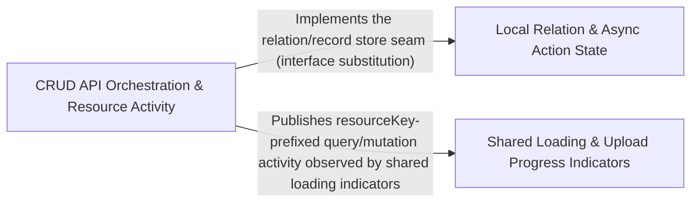

---
tags:
    - 2brain
    - 2brain/arch
    - project/vue-toolkit
type: architecture
component: Auxiliary_Operations
---

## Details

Supporting composables that manage cross-cutting operational state—async action execution, liveness probing, upload progress tracking, relation stores, and shared loading indicators—complementing the core CRUD flow.

### Local Relation & Async Action State

Manages local parent→child relation state and single-call async action execution. createLocalRelationStore builds a reactive dictionary (parent id → child ids) with addToParent/removeFromParent/removeDuplicateChildren, backed by idEquality.uniqueIds and recordLookup.recordListByIds for dedup and lookup. useAsyncAction wraps one async call in data/error/loading refs with a latest run wins sequence counter, and useLivenessProbe maintains a down flag with a single retry timer. This is the local, non-cached state layer that complements the server-state CRUD flow.

**Related Classes/Methods**:

- `src.composables.structureDataManagement.createLocalRelationStore`:133-154
- `src.composables.structureDataManagement.IRelationStore`:111-126
- `src.internal.recordLookup.recordListByIds`:36-39

**Source Files:**

- `src/composables/asyncAction.ts`
    - `src.composables.asyncAction.IAsyncActionSettings` (L34-L44) - Interface
    - `src.composables.asyncAction.run` (L99-L122) - Class
- `src/composables/livenessProbe.ts`
    - `src.composables.livenessProbe.useLivenessProbe.check.then() callback` (L122-L126) - Function
    - `src.composables.livenessProbe.useLivenessProbe.check.catch() callback` (L127-L132) - Function
- `src/composables/structureDataManagement.ts`
    - `src.composables.structureDataManagement.IRelationStore` (L111-L126) - Interface
    - `src.composables.structureDataManagement.IRelationStore.addToParent` (L119-L119) - Method
    - `src.composables.structureDataManagement.IRelationStore.removeFromParent` (L122-L122) - Method
    - `src.composables.structureDataManagement.IRelationStore.removeDuplicateChildren` (L125-L125) - Method
    - `src.composables.structureDataManagement.createLocalRelationStore` (L133-L154) - Class
    - `src.composables.structureDataManagement.createLocalRelationStore.addToParent` (L141-L144) - Method
    - `src.composables.structureDataManagement.createLocalRelationStore.addToParent.children.every() callback` (L143-L143) - Function
    - `src.composables.structureDataManagement.createLocalRelationStore.removeFromParent` (L145-L149) - Method
    - `src.composables.structureDataManagement.createLocalRelationStore.removeFromParent.filter() callback` (L147-L147) - Function
    - `src.composables.structureDataManagement.createLocalRelationStore.removeDuplicateChildren` (L150-L152) - Method
- `src/internal/idEquality.ts`
    - `src.internal.idEquality.uniqueIds` (L36-L44) - Class
    - `src.internal.idEquality.uniqueIds.ids.filter() callback` (L38-L43) - Function
- `src/internal/recordLookup.ts`
    - `src.internal.recordLookup.recordListByIds` (L36-L39) - Class
    - `src.internal.recordLookup.recordListByIds.filter() callback` (L39-L39) - Function
    - `src.internal.recordLookup.recordListByIds.ids.map() callback` (L39-L39) - Function

### CRUD API Orchestration & Resource Activity

The orchestration layer that ties the auxiliary state to the core CRUD composables. It spans the useStructureRestApi → useStructureSearchApi → useStructureCrudApi hierarchy and the internal coordination primitives that track per-resource activity: resourceActivity (isSaving, loading, isLoading.predicate, IActivityMeta), queryRemoval.dropQueries for cache invalidation, parentRelations.createQueryRelationStore.bucketsOf for relation bucketing, and restResource for resource key handling. This group is where the auxiliary loading/liveness signals are wired into the CRUD data flow and cross-resource invalidation.

**Related Classes/Methods**:

- `src.composables.structureCrudApi.IStructureCrudApiOptions`:83-86
- `src.internal.queryRemoval.dropQueries`:21-37
- `src.internal.parentRelations.createQueryRelationStore.bucketsOf`:61-66

**Source Files:**

- `src/composables/livenessProbe.ts`
    - `src.composables.livenessProbe.ILivenessProbeSettings` (L18-L40) - Interface
    - `src.composables.livenessProbe.check` (L114-L133) - Class
    - `src.composables.livenessProbe.useLivenessProbe.check.catch() callback.setTimeout() callback` (L131-L131) - Function
- `src/composables/structureCrudApi.ts`
    - `src.composables.structureCrudApi.IStructureCrudApiOptions` (L83-L86) - Interface
- `src/composables/structureRestApi.ts`
    - `src.composables.structureRestApi.IStructureRestApiOptions` (L116-L170) - Interface
- `src/composables/structureSearchApi.ts`
    - `src.composables.structureSearchApi.useStructureSearchApi.currentSearchQueryKey` (L273-L282) - Class
    - `src.composables.structureSearchApi.useStructureSearchApi.currentSearchQueryKey.computed() callback` (L273-L282) - Function
    - `src.composables.structureSearchApi.useStructureSearchApi.latestKnownEntry` (L316-L326) - Class
    - `src.composables.structureSearchApi.useStructureSearchApi.latestKnownEntry.computed() callback` (L316-L326) - Function
- `src/internal/parentRelations.ts`
    - `src.internal.parentRelations.createQueryRelationStore.bucketsOf` (L61-L66) - Class
    - `src.internal.parentRelations.createQueryRelationStore.bucketsOf.predicate` (L64-L64) - Method
- `src/internal/queryRemoval.ts`
    - `src.internal.queryRemoval.dropQueries` (L21-L37) - Class
- `src/internal/resourceActivity.ts`
    - `src.internal.resourceActivity.IActivityMeta` (L33-L36) - Interface
    - `src.internal.resourceActivity.isLoading.predicate` (L150-L151) - Method
    - `src.internal.resourceActivity.loading` (L162-L162) - Class
    - `src.internal.resourceActivity.isSaving` (L176-L182) - Class
- `src/internal/restResource.ts`
    - `src.internal.restResource.createRestResource.enforceMaxRecords` (L475-L514) - Class
    - `src.internal.restResource.createRestResource.enforceMaxRecords.dropQueries() callback` (L507-L512) - Function
    - `src.internal.restResource.createRestResource.dropIfEmpty` (L558-L565) - Class
    - `src.internal.restResource.createRestResource.dropIfEmpty.predicate` (L563-L563) - Method

### Shared Loading & Upload Progress Indicators

The UI-feedback state layer that aggregates operational signals into shared reactive indicators. useIsLoading derives a ComputedRef<boolean> from the TanStack Query client (useIsFetching/useIsMutating filtered by plainData.matchesAnyPrefix), useUploadProgress exposes a progress/isUploading pair driven by track/report/reset with a generation token, and both feed the shared core Pinia store (useCoreStore, defineStore('core')) so multiple components observe one consistent loading/upload state. This is the cross-cutting indicator surface consumed by the rest of the library.

**Related Classes/Methods**:

- `src.composables.isLoading.useIsLoading`:25-51
- `src.stores.core.useCoreStore`:22-73
- `src.internal.plainData.matchesAnyPrefix`:125-127

**Source Files:**

- `src/composables/asyncAction.ts`
    - `src.composables.asyncAction.useAsyncAction.run.promiseTry() callback` (L107-L107) - Function
    - `src.composables.asyncAction.useAsyncAction.run.then() callback` (L108-L112) - Function
    - `src.composables.asyncAction.useAsyncAction.run.catch() callback` (L113-L116) - Function
    - `src.composables.asyncAction.useAsyncAction.run.finally() callback` (L117-L121) - Function
- `src/composables/isLoading.ts`
    - `src.composables.isLoading.useIsLoading` (L25-L51) - Class
    - `src.composables.isLoading.useIsLoading.fetchingCount` (L39-L42) - Class
    - `src.composables.isLoading.useIsLoading.fetchingCount.predicate` (L40-L40) - Method
    - `src.composables.isLoading.useIsLoading.computed() callback` (L50-L50) - Function
- `src/composables/uploadProgress.ts`
    - `src.composables.uploadProgress.ITrackUploadSettings` (L27-L34) - Interface
    - `src.composables.uploadProgress.isUploading` (L53-L53) - Class
    - `src.composables.uploadProgress.useUploadProgress.isUploading.computed() callback` (L53-L53) - Function
    - `src.composables.uploadProgress.track` (L88-L116) - Class
    - `src.composables.uploadProgress.track.promiseTry() callback` (L94-L94) - Function
    - `src.composables.uploadProgress.useUploadProgress.track.promiseTry() callback` (L107-L112) - Function
    - `src.composables.uploadProgress.useUploadProgress.track.promiseTry() callback.buildOptions() callback` (L109-L111) - Function
    - `src.composables.uploadProgress.useUploadProgress.track.finally() callback` (L113-L115) - Function
- `src/internal/plainData.ts`
    - `src.internal.plainData.matchesAnyPrefix` (L125-L127) - Class
    - `src.internal.plainData.matchesAnyPrefix.prefixes.some() callback` (L127-L127) - Function
- `src/stores/core.ts`
    - `src.stores.core.useCoreStore` (L22-L73) - Class
    - `src.stores.core.useCoreStore.defineStore('core') callback` (L22-L73) - Function
    - `src.stores.core.defineStore('core') callback.isLoading` (L61-L64) - Class
    - `src.stores.core.useCoreStore.defineStore('core') callback.isLoading.some() callback` (L63-L63) - Function
