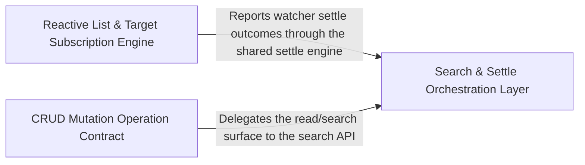

---
tags:
    - 2brain
    - 2brain/arch
    - project/vue-toolkit
type: architecture
component: CRUD_Operations
---

## Details

The top-level composable layer that orchestrates create, read, update, and delete operations over REST resources, including reactive watch/settle cycles for list and search subscriptions.

### Reactive List & Target Subscription Engine

The reactive subscription core that powers every watch* method. It owns the watcher contracts (IWatchHandle, IWatchCallbacks, IWatchListSettings) and the internal createRestResource watch machinery (watchList, watchByParent, watchTarget, runListQuery, itemsOf) that binds a TanStack useQuery to a reactive key/enabled source, stores results into the normalized record store, and exposes the uniform stop/refetch/suspense/error handle. This is the lowest reactive layer of the CRUD stack — the thing that turns a list/search call into a live, cache-backed subscription.

**Related Classes/Methods**:

- `src.composables.structureRestApi.IWatchHandle`:188-210
- `src.composables.structureRestApi.IWatchListSettings`:226-237
- `src.internal.restResource.createRestResource.watchList`:978-1000
- `src.internal.restResource.createRestResource.watchTarget`:886-967
- `src.internal.restResource.createRestResource.runListQuery`:711-728

**Source Files:**

- `src/composables/structureRestApi.ts`
    - `src.composables.structureRestApi.IWatchCallbacks` (L173-L182) - Interface
    - `src.composables.structureRestApi.IWatchHandle` (L188-L210) - Interface
    - `src.composables.structureRestApi.IWatchListSettings` (L226-L237) - Interface
- `src/composables/structureSearchApi.ts`
    - `src.composables.structureSearchApi.useStructureSearchApi.watchSearch.stop` (L677-L677) - Method
    - `src.composables.structureSearchApi.useStructureSearchApi.watchSearch.refetch` (L679-L680) - Method
    - `src.composables.structureSearchApi.useStructureSearchApi.watchSearch.suspense` (L681-L682) - Method
- `src/internal/restResource.ts`
    - `src.internal.restResource.createRestResource.itemsOf` (L573-L574) - Class
    - `src.internal.restResource.createRestResource.itemsOf.map() callback` (L574-L574) - Function
    - `src.internal.restResource.createRestResource.runListQuery` (L711-L728) - Class
    - `src.internal.restResource.createRestResource.runListQuery.settleRead() callback` (L726-L726) - Function
    - `src.internal.restResource.createRestResource.watchTarget` (L886-L967) - Class
    - `src.internal.restResource.createRestResource.watchTarget.scope.run() callback` (L918-L951) - Function
    - `src.internal.restResource.createRestResource.watchTarget.stop` (L954-L954) - Method
    - `src.internal.restResource.createRestResource.watchTarget.refetch` (L955-L958) - Method
    - `src.internal.restResource.createRestResource.watchTarget.refetch.then() callback` (L957-L957) - Function
    - `src.internal.restResource.createRestResource.watchTarget.suspense` (L959-L964) - Method
    - `src.internal.restResource.createRestResource.watchTarget.suspense.then() callback` (L963-L963) - Function
    - `src.internal.restResource.createRestResource.watchList` (L978-L1000) - Class
    - `src.internal.restResource.createRestResource.watchList.stop` (L995-L995) - Method
    - `src.internal.restResource.createRestResource.watchList.refetch` (L996-L996) - Method
    - `src.internal.restResource.createRestResource.watchList.refetch.then() callback` (L996-L996) - Function
    - `src.internal.restResource.createRestResource.watchList.suspense` (L997-L997) - Method
    - `src.internal.restResource.createRestResource.watchList.suspense.then() callback` (L997-L997) - Function
    - `src.internal.restResource.createRestResource.watchByParent` (L1027-L1055) - Class
    - `src.internal.restResource.createRestResource.watchByParent.handle` (L1034-L1047) - Class
    - `src.internal.restResource.createRestResource.watchByParent.handle.watchList() callback` (L1042-L1042) - Function
    - `src.internal.restResource.createRestResource.watchByParent.handle.enabled` (L1045-L1045) - Method
    - `src.internal.restResource.createRestResource.watchByParent.refetch` (L1052-L1053) - Method
    - `src.internal.restResource.createRestResource.watchAny.handle` (L1116-L1121) - Class
    - `src.internal.restResource.createRestResource.watchAny.handle.stop` (L1117-L1117) - Method
    - `src.internal.restResource.createRestResource.watchAny.handle.refetch` (L1118-L1118) - Method
    - `src.internal.restResource.createRestResource.watchAny.handle.refetch.then() callback` (L1118-L1118) - Function
    - `src.internal.restResource.createRestResource.watchAny.handle.suspense` (L1119-L1119) - Method
    - `src.internal.restResource.createRestResource.watchAny.handle.suspense.then() callback` (L1119-L1119) - Function

### Search & Settle Orchestration Layer

The orchestration layer that sits above the subscription engine and below the CRUD facade. It implements useStructureSearchApi — paginated, filtered search with watchSearch, asListCall, and the placeholder/keep-previous-data logic (shownEntry, pageItemList, totalItems, isPlaceholder) — and wires every watcher's outcome reporting through the internal watchSettled engine (ISettleReaders, succeed/fail/settleIfUnchanged). It also exposes the useStructureCrudApi.api surface that the CRUD facade delegates to. This is where 124 orders totals, page placeholders, and settle callbacks are produced.

**Related Classes/Methods**:

- `src.composables.structureSearchApi.useStructureSearchApi`:209-729
- `src.composables.structureSearchApi.IWatchSearchHandle`:74-81
- `src.internal.settleCallbacks.watchSettled`:40-123
- `src.internal.settleCallbacks.ISettleReaders`:18-30
- `src.composables.structureCrudApi.useStructureCrudApi.api`

**Source Files:**

- `src/composables/structureCrudApi.ts`
    - `src.composables.structureCrudApi.useStructureCrudApi.api` (L153-L153) - Class
    - `src.composables.structureCrudApi.useStructureCrudApi.api.useStructureSearchApi() callback` (L153-L153) - Function
    - `src.composables.structureCrudApi.useStructureCrudApi.fetchList.withOperation('list') callback` (L191-L191) - Function
    - `src.composables.structureCrudApi.useStructureCrudApi.fetchPage.withOperation('search') callback` (L203-L209) - Function
    - `src.composables.structureCrudApi.useStructureCrudApi.fetchPage.withOperation('search') callback.api.fetchPaginate() callback` (L205-L205) - Function
    - `src.composables.structureCrudApi.useStructureCrudApi.fetchPage.withOperation('search') callback.api.fetchPaginate() callback.then() callback` (L205-L205) - Function
    - `src.composables.structureCrudApi.useStructureCrudApi.watchList.api.watchSearch() callback` (L221-L224) - Function
    - `src.composables.structureCrudApi.useStructureCrudApi.watchList.api.watchSearch() callback.withOperation('search') callback` (L222-L223) - Function
    - `src.composables.structureCrudApi.useStructureCrudApi.searchNow.withOperation('search') callback` (L236-L246) - Function
    - `src.composables.structureCrudApi.useStructureCrudApi.searchNow.withOperation('search') callback.api.fetchSearch() callback` (L241-L241) - Function
    - `src.composables.structureCrudApi.useStructureCrudApi.fetchOne.withOperation('get') callback` (L275-L284) - Function
    - `src.composables.structureCrudApi.useStructureCrudApi.fetchOne.withOperation('get') callback.api.fetchTarget() callback` (L278-L278) - Function
    - `src.composables.structureCrudApi.useStructureCrudApi.fetchOne.withOperation('get') callback.catch() callback` (L279-L283) - Function
    - `src.composables.structureCrudApi.useStructureCrudApi.watchOne.api.watchTarget() callback` (L299-L299) - Function
    - `src.composables.structureCrudApi.useStructureCrudApi.watchOne.api.watchTarget() callback.withOperation('get') callback` (L299-L299) - Function
    - `src.composables.structureCrudApi.useStructureCrudApi.createOne.withOperation('create') callback` (L312-L315) - Function
    - `src.composables.structureCrudApi.useStructureCrudApi.createOne.withOperation('create') callback.api.createTarget() callback` (L313-L313) - Function
    - `src.composables.structureCrudApi.useStructureCrudApi.updateOne.withOperation('update') callback` (L327-L332) - Function
    - `src.composables.structureCrudApi.useStructureCrudApi.updateOne.withOperation('update') callback.api.updateTarget() callback` (L328-L328) - Function
    - `src.composables.structureCrudApi.useStructureCrudApi.deleteOne.withOperation('remove') callback` (L343-L344) - Function
    - `src.composables.structureCrudApi.useStructureCrudApi.deleteOne.withOperation('remove') callback.api.deleteTarget() callback` (L344-L344) - Function
- `src/composables/structureSearchApi.ts`
    - `src.composables.structureSearchApi.IWatchSearchHandle` (L74-L81) - Interface
    - `src.composables.structureSearchApi.useStructureSearchApi` (L209-L729) - Class
    - `src.composables.structureSearchApi.useStructureSearchApi.totalItems.computed() callback` (L390-L394) - Function
    - `src.composables.structureSearchApi.useStructureSearchApi.pageTotal.computed() callback` (L398-L398) - Function
    - `src.composables.structureSearchApi.useStructureSearchApi.pageItemList.computed() callback` (L405-L406) - Function
    - `src.composables.structureSearchApi.useStructureSearchApi.isPlaceholder.computed() callback` (L416-L416) - Function
    - `src.composables.structureSearchApi.useStructureSearchApi.asListCall` (L458-L482) - Class
    - `src.composables.structureSearchApi.useStructureSearchApi.asListCall.call` (L466-L479) - Method
    - `src.composables.structureSearchApi.useStructureSearchApi.asListCall.call.then() callback` (L476-L479) - Function
    - `src.composables.structureSearchApi.useStructureSearchApi.asListCall.extra` (L480-L480) - Method
    - `src.composables.structureSearchApi.useStructureSearchApi.fetchSearch.then() callback` (L517-L522) - Function
    - `src.composables.structureSearchApi.useStructureSearchApi.watchSearch.search.then() callback` (L673-L673) - Function
    - `src.composables.structureSearchApi.useStructureSearchApi.watch() callback` (L696-L698) - Function
- `src/internal/restResource.ts`
    - `src.internal.restResource.createRestResource.watchTarget.scope.run() callback.watch() callback` (L922-L924) - Function
    - `src.internal.restResource.createRestResource.watchTarget.scope.run() callback.isFresh` (L931-L934) - Method
    - `src.internal.restResource.createRestResource.watchTarget.scope.run() callback.result` (L935-L935) - Method
    - `src.internal.restResource.createRestResource.watchTarget.scope.run() callback.context` (L936-L936) - Method
    - `src.internal.restResource.createRestResource.watchTarget.scope.run() callback.onError` (L941-L948) - Method
- `src/internal/settleCallbacks.ts`
    - `src.internal.settleCallbacks.ISettleReaders` (L18-L30) - Interface
    - `src.internal.settleCallbacks.watchSettled` (L40-L123) - Class
    - `src.internal.settleCallbacks.watchSettled.succeed` (L63-L70) - Class
    - `src.internal.settleCallbacks.watchSettled.succeed.queueMicrotask() callback` (L66-L69) - Function
    - `src.internal.settleCallbacks.watchSettled.fail` (L77-L83) - Class
    - `src.internal.settleCallbacks.watchSettled.fail.queueMicrotask() callback` (L79-L82) - Function
    - `src.internal.settleCallbacks.watchSettled.stop` (L98-L104) - Class
    - `src.internal.settleCallbacks.watchSettled.stop.subscribe() callback` (L98-L104) - Function
    - `src.internal.settleCallbacks.watchSettled.watch() callback` (L110-L113) - Function
    - `src.internal.settleCallbacks.watchSettled.settleIfUnchanged` (L119-L121) - Method

### CRUD Mutation Operation Contract

The top-level CRUD facade contract that defines the create/read/update/delete operation surface and its per-operation settings. It declares IStructureCrudOperations (list/search/get/create/update/remove + optimisticPatch), the per-mutation settings (ICreateOneSettings, IUpdateOneSettings, IDeleteOneSettings), and the full IStructureCrudApi return type. This is the public API boundary that screen authors consume — it composes the search layer (Group 2) and adds the mutation operations (createOne/updateOne/deleteOne) with optimistic-update and rollback semantics.

**Related Classes/Methods**:

- `src.composables.structureCrudApi.IStructureCrudOperations`:39-80
- `src.composables.structureCrudApi.ICreateOneSettings`:89-98
- `src.composables.structureCrudApi.IUpdateOneSettings`:101-107
- `src.composables.structureCrudApi.IDeleteOneSettings`:110-116
- `src.composables.structureCrudApi.IStructureCrudApi`:368-420

**Source Files:**

- `src/composables/structureCrudApi.ts`
    - `src.composables.structureCrudApi.IStructureCrudOperations` (L39-L80) - Interface
    - `src.composables.structureCrudApi.ICreateOneSettings` (L89-L98) - Interface
    - `src.composables.structureCrudApi.IUpdateOneSettings` (L101-L107) - Interface
    - `src.composables.structureCrudApi.IDeleteOneSettings` (L110-L116) - Interface
    - `src.composables.structureCrudApi.IStructureCrudApi` (L368-L420) - Interface
