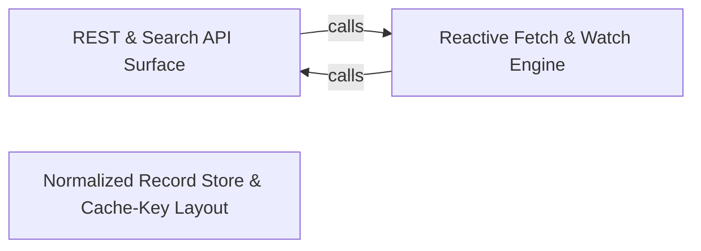

---
tags:
    - 2brain
    - 2brain/arch
    - project/vue-toolkit
type: architecture
component: REST_API
---

## Details

The foundational data-fetching layer that wraps TanStack Query to provide reactive resource fetching, watching, and search-result streaming, with freshness checks and parent-relation resolution; search is built directly on this REST API surface.

### REST & Search API Surface

The public contract and top-level orchestration of the REST API. It defines the resource options, per-call fetch settings, watcher shapes, and the useStructureRestApi entry point, and layers filtered, server-paginated search (useStructureSearchApi) directly on the same REST surface. It also owns freshness checks, the mutation settings surface, and the live-scope registry that decides whether a late answer may still be stored. This is the facade the application code touches; it delegates all actual fetching and storage to the engine and record store below.

**Related Classes/Methods**:

- `src.composables.structureRestApi.IStructureRestApi`:258-492
- `src.composables.structureSearchApi.IStructureSearchApi`:127-198
- `src.composables.structureRestApi.IFetchSettings`:69-103
- `src.composables.structureRestApi.IWatchTargetSettings`:213-219

**Source Files:**

- `src/composables/structureRestApi.ts`
    - `src.composables.structureRestApi.ITanStackQueryOptions` (L28-L46) - Interface
    - `src.composables.structureRestApi.IFetchContext` (L54-L57) - Interface
    - `src.composables.structureRestApi.IFetchSettings` (L69-L103) - Interface
    - `src.composables.structureRestApi.IUpdateTargetSettings` (L106-L113) - Interface
    - `src.composables.structureRestApi.IWatchTargetSettings` (L213-L219) - Interface
    - `src.composables.structureRestApi.IWatchAnySettings` (L243-L252) - Interface
    - `src.composables.structureRestApi.IStructureRestApi` (L258-L492) - Interface
- `src/composables/structureSearchApi.ts`
    - `src.composables.structureSearchApi.ISearchResult` (L31-L37) - Interface
    - `src.composables.structureSearchApi.ISearchFetchContext` (L48-L57) - Interface
    - `src.composables.structureSearchApi.IWatchSearchSettings` (L60-L71) - Interface
    - `src.composables.structureSearchApi.IAppliedSearch` (L90-L96) - Interface
    - `src.composables.structureSearchApi.IShownEntry` (L104-L110) - Interface
    - `src.composables.structureSearchApi.IStructureSearchApi` (L127-L198) - Interface
    - `src.composables.structureSearchApi.watch() callback` (L355-L361) - Function
    - `src.composables.structureSearchApi.useStructureSearchApi.asListCall.call.signal` (L470-L472) - Method
    - `src.composables.structureSearchApi.watchSearch.search` (L664-L674) - Class
- `src/internal/freshnessChecks.ts`
    - `src.internal.freshnessChecks.IFreshnessContext` (L13-L25) - Interface
    - `src.internal.freshnessChecks.createFreshnessChecks.classifyMultiple.cachedIds.ids.filter() callback` (L123-L123) - Function
    - `src.internal.freshnessChecks.createFreshnessChecks.classifyMultiple.expiredIds.ids.filter() callback` (L124-L124) - Function
- `src/internal/resourceMutations.ts`
    - `src.internal.resourceMutations.IRecordOperations` (L48-L67) - Interface
    - `src.internal.resourceMutations.IResourceMutationsContext` (L70-L107) - Interface
- `src/internal/restResource.ts`
    - `src.internal.restResource.IRunningQuery` (L99-L111) - Interface
    - `src.internal.restResource.runningQueryOf` (L123-L134) - Class
    - `src.internal.restResource.runningQueryOf.isCancelled` (L130-L130) - Method
    - `src.internal.restResource.runningQueryOf.signal` (L131-L133) - Method
    - `src.internal.restResource.readContextOf` (L145-L149) - Class
    - `src.internal.restResource.readContextOf.signal` (L146-L148) - Method
    - `src.internal.restResource.IWatchQueryOptions` (L164-L188) - Interface
    - `src.internal.restResource.createRestResource` (L196-L1264) - Class
    - `src.internal.restResource.createRestResource.mutations.records.markInserted` (L433-L435) - Method
    - `src.internal.restResource.createRestResource.runThrowaway.queryFn` (L622-L622) - Method
    - `src.internal.restResource.createRestResource.runListQuery.queryFn` (L720-L721) - Method
    - `src.internal.restResource.createRestResource.watchQuery.query.scope.run() callback` (L748-L764) - Function
    - `src.internal.restResource.createRestResource.watchQuery.query.scope.run() callback.queryFn` (L756-L756) - Method
    - `src.internal.restResource.createRestResource.watchQuery.query.scope.run() callback.enabled.computed() callback` (L757-L757) - Function
    - `src.internal.restResource.createRestResource.watchQuery.query.scope.run() callback.meta.computed() callback` (L760-L760) - Function
    - `src.internal.restResource.createRestResource.fetchTarget.runThrowaway() callback` (L845-L849) - Function
    - `src.internal.restResource.createRestResource.fetchTarget.queryFn` (L866-L867) - Method
    - `src.internal.restResource.createRestResource.fetchTarget.settleRead() callback` (L871-L871) - Function
    - `src.internal.restResource.createRestResource.watchAny.data.computed() callback` (L1122-L1122) - Function
    - `src.internal.restResource.createRestResource.watch() callback.then() callback` (L1177-L1177) - Function
- `src/internal/scopeRegistry.ts`
    - `src.internal.scopeRegistry.IScopeRegistry` (L38-L54) - Interface
    - `src.internal.scopeRegistry.scopeRegistryFor.claim.<function>` (L70-L76) - Function

### Reactive Fetch & Watch Engine

The implementation core behind useStructureRestApi: createRestResource. It wires the key layout, in-flight activity, record store, and relation store together over one QueryClient, and implements the three operation kinds — one-shot reads (fetchQuery), active reads (useQuery), and mutations — including fetchAny, fetchMultiple, fetchTarget, listQueryFunction, runThrowaway, and peekIdentifier. It owns the scope rule, cancellation handling, and the engine object that the search layer reuses. This is where reactive data fetching and watching actually happen.

**Related Classes/Methods**:

- `src.internal.restResource.createRestResource.fetchTarget`:832-874
- `src.internal.restResource.createRestResource.listQueryFunction`:638-650
- `src.internal.identifierJoin.joinIdentifiers`:60-64

**Source Files:**

- `src/internal/identifierJoin.ts`
    - `src.internal.identifierJoin.escapeSegment` (L46-L49) - Class
    - `src.internal.identifierJoin.escapeSegment.map() callback` (L48-L48) - Function
    - `src.internal.identifierJoin.joinIdentifiers` (L60-L64) - Class
    - `src.internal.identifierJoin.values.map() callback` (L61-L61) - Function
    - `src.internal.identifierJoin.joinIdentifiers.values.map() callback` (L63-L63) - Function
- `src/internal/restResource.ts`
    - `src.internal.restResource.createRestResource.onScopeDispose() callback` (L254-L254) - Function
    - `src.internal.restResource.createRestResource.dropQueries() callback` (L261-L263) - Function
    - `src.internal.restResource.createRestResource.storeItem` (L345-L356) - Class
    - `src.internal.restResource.storeItem.store.asFetched() callback` (L354-L354) - Function
    - `src.internal.restResource.createRestResource.storeItem.store.asFetched() callback` (L355-L355) - Function
    - `src.internal.restResource.createRestResource.peekIdentifier` (L368-L373) - Class
    - `src.internal.restResource.createRestResource.storeItems` (L451-L463) - Class
    - `src.internal.restResource.createRestResource.storeItems.items.filter() callback` (L458-L458) - Function
    - `src.internal.restResource.createRestResource.storeItems.map() callback` (L459-L463) - Function
    - `src.internal.restResource.createRestResource.storeBatch` (L529-L548) - Class
    - `src.internal.restResource.createRestResource.storeBatch.store.forScope() callback` (L537-L547) - Function
    - `src.internal.restResource.createRestResource.settleRead` (L596-L606) - Class
    - `src.internal.restResource.createRestResource.settleRead.read.then() callback` (L602-L606) - Function
    - `src.internal.restResource.createRestResource.runThrowaway` (L616-L624) - Class
    - `src.internal.restResource.createRestResource.listQueryFunction` (L638-L650) - Class
    - `src.internal.restResource.createRestResource.listQueryFunction.then() callback` (L646-L649) - Function
    - `src.internal.restResource.createRestResource.targetQueryFunction` (L663-L700) - Class
    - `src.internal.restResource.createRestResource.targetQueryFunction.then() callback` (L671-L699) - Function
    - `src.internal.restResource.createRestResource.targetQueryFunction.then() callback.store.forScope() callback` (L687-L698) - Function
    - `src.internal.restResource.watchQuery.query` (L748-L765) - Class
    - `src.internal.restResource.createRestResource.fetchTarget` (L832-L874) - Class
    - `src.internal.restResource.createRestResource.fetchTarget.runThrowaway() callback.then() callback` (L846-L849) - Function
    - `src.internal.restResource.fetchTarget.settleRead() callback` (L851-L858) - Function
    - `src.internal.restResource.createRestResource.fetchTarget.settleRead() callback.store.forScope() callback` (L854-L857) - Function
    - `src.internal.restResource.createRestResource.watchAll` (L1009-L1015) - Class
    - `src.internal.restResource.watchAll.watchList() callback` (L1011-L1011) - Function
    - `src.internal.restResource.createRestResource.watchAll.watchList() callback` (L1013-L1013) - Function
    - `src.internal.restResource.watchByParent.handle.watchList() callback` (L1035-L1040) - Function
    - `src.internal.restResource.createRestResource.fetchAny` (L1066-L1092) - Class
    - `src.internal.restResource.createRestResource.fetchAny.wrapped` (L1072-L1073) - Class
    - `src.internal.restResource.createRestResource.fetchAny.wrapped.then() callback` (L1073-L1073) - Function
    - `src.internal.restResource.fetchAny.settleRead() callback` (L1077-L1077) - Function
    - `src.internal.restResource.createRestResource.fetchAny.settleRead() callback` (L1089-L1089) - Function
    - `src.internal.restResource.createRestResource.fetchMultiple` (L1141-L1161) - Class
    - `src.internal.restResource.createRestResource.fetchMultiple.collect` (L1148-L1148) - Class
    - `src.internal.restResource.createRestResource.fetchMultiple.collect.map() callback` (L1148-L1148) - Function
    - `src.internal.restResource.createRestResource.fetchMultiple.runThrowaway() callback` (L1153-L1156) - Function
    - `src.internal.restResource.createRestResource.fetchMultiple.runThrowaway() callback.then() callback` (L1154-L1155) - Function
    - `src.internal.restResource.createRestResource.watch() callback` (L1166-L1178) - Function

### Normalized Record Store & Cache-Key Layout

The low-level engine that holds and addresses all data. It defines the cache-key layout and scope predicates (resourceKeys), stores records as one TanStack query per record behind the IRecordStore seam (queryRecordStore) with alias/deduplication, derives belongsTo parent relations as a view over the cache (parentRelations), and provides the TanStack option picking and plain-data primitives the rest of the layer relies on. Every server-returned record passes through this store, and every write/removal/invalidation resolves aliases to the canonical entry. This is the shared cache that makes cross-resource invalidation and optimistic rollback possible.

**Related Classes/Methods**:

- `src.internal.tanstackQueryOptions.pickQueryOptions`:31-34
- `src.internal.queryRecordStore.IQueryRecordStoreContext`:26-38
- `src.internal.resourceKeys.IKeyed`:54-57

**Source Files:**

- `src/internal/parentRelations.ts`
    - `src.internal.parentRelations.IParentRelationsContext` (L20-L32) - Interface
    - `src.internal.parentRelations.createQueryRelationStore.dictionary.computed() callback` (L80-L90) - Function
    - `src.internal.parentRelations.dictionary` (L80-L90) - Class
    - `src.internal.parentRelations.addToParent` (L98-L103) - Class
    - `src.internal.parentRelations.createQueryRelationStore.addToParent.some() callback` (L99-L99) - Function
    - `src.internal.parentRelations.removeFromParent` (L111-L117) - Class
    - `src.internal.parentRelations.createQueryRelationStore.removeFromParent.filter() callback` (L115-L115) - Function
- `src/internal/plainData.ts`
    - `src.internal.plainData.items` (L50-L50) - Class
    - `src.internal.plainData.entries` (L55-L58) - Class
    - `src.internal.plainData.map() callback` (L107-L107) - Function
- `src/internal/queryRecordStore.ts`
    - `src.internal.queryRecordStore.IQueryRecordStoreContext` (L26-L38) - Interface
    - `src.internal.queryRecordStore.IRecordSnapshot` (L41-L50) - Interface
    - `src.internal.queryRecordStore.createQueryRecordStore.dictionary.computed() callback` (L108-L118) - Function
    - `src.internal.queryRecordStore.dictionary` (L108-L118) - Class
- `src/internal/resourceKeys.ts`
    - `src.internal.resourceKeys.ITargetEntry` (L36-L42) - Interface
    - `src.internal.resourceKeys.IKeyed` (L54-L57) - Interface
- `src/internal/resourceMutations.ts`
    - `src.internal.resourceMutations.createResourceMutations.runMutation` (L140-L153) - Class
    - `src.internal.resourceMutations.createResourceMutations.runMutation.finally() callback` (L152-L152) - Function
    - `src.internal.resourceMutations.createResourceMutations.IOptimisticContext` (L230-L233) - Interface
    - `src.internal.resourceMutations.createResourceMutations.createTarget.store.forScope() callback` (L354-L354) - Function
    - `src.internal.resourceMutations.createResourceMutations.createTarget.then() callback` (L370-L373) - Function
    - `src.internal.resourceMutations.createResourceMutations.createTarget.then() callback.store.forScope() callback` (L371-L371) - Function
    - `src.internal.resourceMutations.createResourceMutations.updateTarget.runOptimistic('update') callback` (L428-L428) - Function
    - `src.internal.resourceMutations.createResourceMutations.deleteTarget.runOptimistic('delete') callback` (L447-L447) - Function
- `src/internal/restResource.ts`
    - `src.internal.restResource.createRestResource.storeBatch.store.forScope() callback.added` (L544-L544) - Class
    - `src.internal.restResource.createRestResource.storeBatch.store.forScope() callback.added.items.filter() callback` (L544-L544) - Function
- `src/internal/tanstackQueryOptions.ts`
    - `src.internal.tanstackQueryOptions.pickQueryOptions` (L31-L34) - Class
    - `src.internal.tanstackQueryOptions.pickQueryOptions.filter() callback` (L33-L33) - Function
