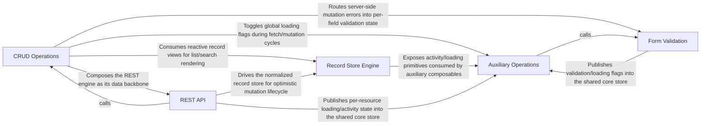

---
tags:
    - 2brain
    - 2brain/arch
    - project/vue-toolkit
type: architecture
component: overview
---

## Details

This architecture represents a Vue composable-based REST API client library that provides a full-featured data management layer for CRUD operations. The main flow starts at the foundational REST API layer (wrapping TanStack Query for reactive fetching, watching, and search streaming), which feeds into a normalized Record Store Engine that caches entities and tracks optimistic mutations. The top-level CRUD Operations composable orchestrates create/read/update/delete actions and reactive watch/settle cycles over these resources. Form Validation binds Zod schemas to form state and normalizes server errors for UI binding, while Auxiliary Operations provide cross-cutting concerns such as async action execution, liveness probing, upload progress, and shared loading indicators. Together these components form a cohesive, reactive data-access and form-management toolkit for Vue applications.

### CRUD Operations [[Expand]](./CRUD_Operations.md)

The top-level composable layer that orchestrates create, read, update, and delete operations over REST resources, including reactive watch/settle cycles for list and search subscriptions.

**Related Classes/Methods**:

- `src.composables.structureRestApi.IWatchHandle`:188-210
- `src.composables.structureSearchApi.useStructureSearchApi`:209-729
- `src.internal.settleCallbacks.watchSettled`:40-123

**Source Files:**

- `src/composables/structureCrudApi.ts`
    - `src.composables.structureCrudApi.IStructureCrudOperations` (L39-L80) - Interface
    - `src.composables.structureCrudApi.ICreateOneSettings` (L89-L98) - Interface
    - `src.composables.structureCrudApi.IUpdateOneSettings` (L101-L107) - Interface
    - `src.composables.structureCrudApi.IDeleteOneSettings` (L110-L116) - Interface
    - `src.composables.structureCrudApi.useStructureCrudApi.api` (L153-L153) - Class
    - `src.composables.structureCrudApi.useStructureCrudApi.api.useStructureSearchApi() callback` (L153-L153) - Function
    - `src.composables.structureCrudApi.useStructureCrudApi.fetchList.withOperation('list') callback` (L191-L191) - Function
    - `src.composables.structureCrudApi.useStructureCrudApi.fetchPage.withOperation('search') callback` (L203-L209) - Function
    - `src.composables.structureCrudApi.useStructureCrudApi.fetchPage.withOperation('search') callback.api.fetchPaginate() callback` (L205-L205) - Function
    - `src.composables.structureCrudApi.useStructureCrudApi.fetchPage.withOperation('search') callback.api.fetchPaginate() callback.then() callback` (L205-L205) - Function
    - `src.composables.structureCrudApi.useStructureCrudApi.watchList.api.watchSearch() callback` (L221-L224) - Function
    - `src.composables.structureCrudApi.useStructureCrudApi.watchList.api.watchSearch() callback.withOperation('search') callback` (L222-L223) - Function
    - `src.composables.structureCrudApi.useStructureCrudApi.searchNow.withOperation('search') callback` (L236-L246) - Function
    - `src.composables.structureCrudApi.useStructureCrudApi.searchNow.withOperation('search') callback.api.fetchSearch() callback` (L241-L241) - Function
    - `src.composables.structureCrudApi.useStructureCrudApi.fetchOne.withOperation('get') callback` (L275-L284) - Function
    - `src.composables.structureCrudApi.useStructureCrudApi.fetchOne.withOperation('get') callback.api.fetchTarget() callback` (L278-L278) - Function
    - `src.composables.structureCrudApi.useStructureCrudApi.fetchOne.withOperation('get') callback.catch() callback` (L279-L283) - Function
    - `src.composables.structureCrudApi.useStructureCrudApi.watchOne.api.watchTarget() callback` (L299-L299) - Function
    - `src.composables.structureCrudApi.useStructureCrudApi.watchOne.api.watchTarget() callback.withOperation('get') callback` (L299-L299) - Function
    - `src.composables.structureCrudApi.useStructureCrudApi.createOne.withOperation('create') callback` (L312-L315) - Function
    - `src.composables.structureCrudApi.useStructureCrudApi.createOne.withOperation('create') callback.api.createTarget() callback` (L313-L313) - Function
    - `src.composables.structureCrudApi.useStructureCrudApi.updateOne.withOperation('update') callback` (L327-L332) - Function
    - `src.composables.structureCrudApi.useStructureCrudApi.updateOne.withOperation('update') callback.api.updateTarget() callback` (L328-L328) - Function
    - `src.composables.structureCrudApi.useStructureCrudApi.deleteOne.withOperation('remove') callback` (L343-L344) - Function
    - `src.composables.structureCrudApi.useStructureCrudApi.deleteOne.withOperation('remove') callback.api.deleteTarget() callback` (L344-L344) - Function
    - `src.composables.structureCrudApi.IStructureCrudApi` (L368-L420) - Interface
- `src/composables/structureRestApi.ts`
    - `src.composables.structureRestApi.IWatchCallbacks` (L173-L182) - Interface
    - `src.composables.structureRestApi.IWatchHandle` (L188-L210) - Interface
    - `src.composables.structureRestApi.IWatchListSettings` (L226-L237) - Interface
- `src/composables/structureSearchApi.ts`
    - `src.composables.structureSearchApi.IWatchSearchHandle` (L74-L81) - Interface
    - `src.composables.structureSearchApi.useStructureSearchApi` (L209-L729) - Class
    - `src.composables.structureSearchApi.useStructureSearchApi.totalItems.computed() callback` (L390-L394) - Function
    - `src.composables.structureSearchApi.useStructureSearchApi.pageTotal.computed() callback` (L398-L398) - Function
    - `src.composables.structureSearchApi.useStructureSearchApi.pageItemList.computed() callback` (L405-L406) - Function
    - `src.composables.structureSearchApi.useStructureSearchApi.isPlaceholder.computed() callback` (L416-L416) - Function
    - `src.composables.structureSearchApi.useStructureSearchApi.asListCall` (L458-L482) - Class
    - `src.composables.structureSearchApi.useStructureSearchApi.asListCall.call` (L466-L479) - Method
    - `src.composables.structureSearchApi.useStructureSearchApi.asListCall.call.then() callback` (L476-L479) - Function
    - `src.composables.structureSearchApi.useStructureSearchApi.asListCall.extra` (L480-L480) - Method
    - `src.composables.structureSearchApi.useStructureSearchApi.fetchSearch.then() callback` (L517-L522) - Function
    - `src.composables.structureSearchApi.useStructureSearchApi.watchSearch.search.then() callback` (L673-L673) - Function
    - `src.composables.structureSearchApi.useStructureSearchApi.watchSearch.stop` (L677-L677) - Method
    - `src.composables.structureSearchApi.useStructureSearchApi.watchSearch.refetch` (L679-L680) - Method
    - `src.composables.structureSearchApi.useStructureSearchApi.watchSearch.suspense` (L681-L682) - Method
    - `src.composables.structureSearchApi.useStructureSearchApi.watch() callback` (L696-L698) - Function
- `src/internal/restResource.ts`
    - `src.internal.restResource.createRestResource.itemsOf` (L573-L574) - Class
    - `src.internal.restResource.createRestResource.itemsOf.map() callback` (L574-L574) - Function
    - `src.internal.restResource.createRestResource.runListQuery` (L711-L728) - Class
    - `src.internal.restResource.createRestResource.runListQuery.settleRead() callback` (L726-L726) - Function
    - `src.internal.restResource.createRestResource.watchTarget` (L886-L967) - Class
    - `src.internal.restResource.createRestResource.watchTarget.scope.run() callback` (L918-L951) - Function
    - `src.internal.restResource.createRestResource.watchTarget.scope.run() callback.watch() callback` (L922-L924) - Function
    - `src.internal.restResource.createRestResource.watchTarget.scope.run() callback.isFresh` (L931-L934) - Method
    - `src.internal.restResource.createRestResource.watchTarget.scope.run() callback.result` (L935-L935) - Method
    - `src.internal.restResource.createRestResource.watchTarget.scope.run() callback.context` (L936-L936) - Method
    - `src.internal.restResource.createRestResource.watchTarget.scope.run() callback.onError` (L941-L948) - Method
    - `src.internal.restResource.createRestResource.watchTarget.stop` (L954-L954) - Method
    - `src.internal.restResource.createRestResource.watchTarget.refetch` (L955-L958) - Method
    - `src.internal.restResource.createRestResource.watchTarget.refetch.then() callback` (L957-L957) - Function
    - `src.internal.restResource.createRestResource.watchTarget.suspense` (L959-L964) - Method
    - `src.internal.restResource.createRestResource.watchTarget.suspense.then() callback` (L963-L963) - Function
    - `src.internal.restResource.createRestResource.watchList` (L978-L1000) - Class
    - `src.internal.restResource.createRestResource.watchList.stop` (L995-L995) - Method
    - `src.internal.restResource.createRestResource.watchList.refetch` (L996-L996) - Method
    - `src.internal.restResource.createRestResource.watchList.refetch.then() callback` (L996-L996) - Function
    - `src.internal.restResource.createRestResource.watchList.suspense` (L997-L997) - Method
    - `src.internal.restResource.createRestResource.watchList.suspense.then() callback` (L997-L997) - Function
    - `src.internal.restResource.createRestResource.watchByParent` (L1027-L1055) - Class
    - `src.internal.restResource.createRestResource.watchByParent.handle` (L1034-L1047) - Class
    - `src.internal.restResource.createRestResource.watchByParent.handle.watchList() callback` (L1042-L1042) - Function
    - `src.internal.restResource.createRestResource.watchByParent.handle.enabled` (L1045-L1045) - Method
    - `src.internal.restResource.createRestResource.watchByParent.refetch` (L1052-L1053) - Method
    - `src.internal.restResource.createRestResource.watchAny.handle` (L1116-L1121) - Class
    - `src.internal.restResource.createRestResource.watchAny.handle.stop` (L1117-L1117) - Method
    - `src.internal.restResource.createRestResource.watchAny.handle.refetch` (L1118-L1118) - Method
    - `src.internal.restResource.createRestResource.watchAny.handle.refetch.then() callback` (L1118-L1118) - Function
    - `src.internal.restResource.createRestResource.watchAny.handle.suspense` (L1119-L1119) - Method
    - `src.internal.restResource.createRestResource.watchAny.handle.suspense.then() callback` (L1119-L1119) - Function
- `src/internal/settleCallbacks.ts`
    - `src.internal.settleCallbacks.ISettleReaders` (L18-L30) - Interface
    - `src.internal.settleCallbacks.watchSettled` (L40-L123) - Class
    - `src.internal.settleCallbacks.watchSettled.succeed` (L63-L70) - Class
    - `src.internal.settleCallbacks.watchSettled.succeed.queueMicrotask() callback` (L66-L69) - Function
    - `src.internal.settleCallbacks.watchSettled.fail` (L77-L83) - Class
    - `src.internal.settleCallbacks.watchSettled.fail.queueMicrotask() callback` (L79-L82) - Function
    - `src.internal.settleCallbacks.watchSettled.stop` (L98-L104) - Class
    - `src.internal.settleCallbacks.watchSettled.stop.subscribe() callback` (L98-L104) - Function
    - `src.internal.settleCallbacks.watchSettled.watch() callback` (L110-L113) - Function
    - `src.internal.settleCallbacks.watchSettled.settleIfUnchanged` (L119-L121) - Method

### Record Store Engine

The internal normalized record store that caches entities by resource key, tracks pending mutations for optimistic updates and rollback, and exposes per-resource loading/activity state to consumers.

**Related Classes/Methods**:

- `src.composables.structureDataManagement.IRecordStore`:31-78
- `src.composables.structureDataManagement.createLocalRecordStore`:85-104
- `src.internal.queryRecordStore.IQueryRecordStore`:53-84
- `src.internal.recordMutations.recordMutationsOf`:40-56
- `src.internal.resourceActivity.useResourceActivity`:72-185

**Source Files:**

- `src/composables/isLoading.ts`
    - `src.composables.isLoading.useIsLoading.mutatingCount` (L45-L48) - Class
    - `src.composables.isLoading.useIsLoading.mutatingCount.predicate` (L46-L46) - Method
- `src/composables/structureDataManagement.ts`
    - `src.composables.structureDataManagement.IRecordStore` (L31-L78) - Interface
    - `src.composables.structureDataManagement.IRecordStore.write` (L43-L43) - Method
    - `src.composables.structureDataManagement.IRecordStore.remove` (L46-L46) - Method
    - `src.composables.structureDataManagement.IRecordStore.writeAll` (L49-L49) - Method
    - `src.composables.structureDataManagement.IRecordStore.clear` (L52-L52) - Method
    - `src.composables.structureDataManagement.IRecordStore.resolve` (L58-L58) - Method
    - `src.composables.structureDataManagement.IRecordStore.read` (L67-L67) - Method
    - `src.composables.structureDataManagement.IRecordStore.isFetching` (L77-L77) - Method
    - `src.composables.structureDataManagement.createLocalRecordStore` (L85-L104) - Class
    - `src.composables.structureDataManagement.createLocalRecordStore.write` (L98-L98) - Method
    - `src.composables.structureDataManagement.createLocalRecordStore.remove` (L99-L99) - Method
    - `src.composables.structureDataManagement.createLocalRecordStore.writeAll` (L100-L100) - Method
    - `src.composables.structureDataManagement.createLocalRecordStore.clear` (L101-L101) - Method
    - `src.composables.structureDataManagement.createLocalRecordStore.read` (L102-L102) - Method
    - `src.composables.structureDataManagement.IStructureDataManagementApi` (L161-L256) - Interface
    - `src.composables.structureDataManagement.useStructureDataManagement.createIdentifier.missingKeys` (L315-L315) - Class
    - `src.composables.structureDataManagement.useStructureDataManagement.createIdentifier.missingKeys._identifiers.filter() callback` (L315-L315) - Function
    - `src.composables.structureDataManagement.useStructureDataManagement.createIdentifier._identifiers.map() callback` (L319-L319) - Function
    - `src.composables.structureDataManagement.useStructureDataManagement.itemList.computed() callback` (L345-L345) - Function
    - `src.composables.structureDataManagement.useStructureDataManagement.getRecords.idsArray.map() callback` (L380-L380) - Function
    - `src.composables.structureDataManagement.useStructureDataManagement.lastInsertedRecord.computed() callback` (L399-L400) - Function
    - `src.composables.structureDataManagement.useStructureDataManagement.selectedRecord.computed() callback` (L513-L513) - Function
    - `src.composables.structureDataManagement.useStructureDataManagement.pageSize.customRef() callback` (L525-L541) - Function
    - `src.composables.structureDataManagement.useStructureDataManagement.pageSize.customRef() callback.get` (L528-L531) - Method
    - `src.composables.structureDataManagement.useStructureDataManagement.pageSize.customRef() callback.set` (L532-L539) - Method
    - `src.composables.structureDataManagement.useStructureDataManagement.pageTotal.computed() callback` (L544-L544) - Function
    - `src.composables.structureDataManagement.useStructureDataManagement.pageOffset.computed() callback` (L547-L547) - Function
    - `src.composables.structureDataManagement.useStructureDataManagement.pageItemList.computed() callback` (L550-L551) - Function
    - `src.composables.structureDataManagement.useStructureDataManagement.getRecordsByParent.recordsByIds() callback` (L599-L599) - Function
    - `src.composables.structureDataManagement.useStructureDataManagement.getListByParent.recordListByIds() callback` (L611-L611) - Function
- `src/composables/structureSearchApi.ts`
    - `src.composables.structureSearchApi.ISearchCacheEntry` (L84-L87) - Interface
    - `src.composables.structureSearchApi.useStructureSearchApi.shownEntry` (L373-L382) - Class
    - `src.composables.structureSearchApi.useStructureSearchApi.shownEntry.computed() callback` (L373-L382) - Function
- `src/internal/plainData.ts`
    - `src.internal.plainData.hasKeyPrefix` (L89-L92) - Class
    - `src.internal.plainData.hasKeyPrefix.prefix.every() callback` (L92-L92) - Function
- `src/internal/queryRecordStore.ts`
    - `src.internal.queryRecordStore.IQueryRecordStore` (L53-L84) - Interface
- `src/internal/recordMutations.ts`
    - `src.internal.recordMutations.IRecordMutationMeta` (L15-L28) - Interface
    - `src.internal.recordMutations.recordMutationsOf` (L40-L56) - Class
    - `src.internal.recordMutations.recordMutationsOf.predicate` (L47-L54) - Method
    - `src.internal.recordMutations.canWrite` (L72-L90) - Class
    - `src.internal.recordMutations.canWrite.filter() callback` (L82-L84) - Function
    - `src.internal.recordMutations.canWrite.every() callback` (L86-L89) - Function
- `src/internal/resourceActivity.ts`
    - `src.internal.resourceActivity.useResourceActivity` (L72-L185) - Class
    - `src.internal.resourceActivity.useResourceActivity.stopQueries` (L102-L108) - Class
    - `src.internal.resourceActivity.useResourceActivity.stopQueries.subscribe() callback` (L102-L108) - Function
    - `src.internal.resourceActivity.useResourceActivity.stopMutations` (L111-L118) - Class
    - `src.internal.resourceActivity.useResourceActivity.stopMutations.subscribe() callback` (L111-L118) - Function
    - `src.internal.resourceActivity.useResourceActivity.onScopeDispose() callback` (L123-L126) - Function
    - `src.internal.resourceActivity.isLoading` (L144-L159) - Class
    - `src.internal.resourceActivity.useResourceActivity.isLoading.predicate` (L154-L156) - Method
    - `src.internal.resourceActivity.useResourceActivity.loading.computed() callback` (L162-L162) - Function
    - `src.internal.resourceActivity.useResourceActivity.isSaving.some() callback` (L180-L180) - Function
- `src/internal/resourceKeys.ts`
    - `src.internal.resourceKeys.IListCacheEntry` (L45-L51) - Interface
- `src/internal/resourceMutations.ts`
    - `src.internal.resourceMutations.updateTarget` (L414-L430) - Class
    - `src.internal.resourceMutations.updateTarget.runOptimistic('update') callback` (L424-L424) - Function
    - `src.internal.resourceMutations.deleteTarget` (L441-L448) - Class
- `src/internal/restResource.ts`
    - `src.internal.restResource.createRestResource.activity` (L236-L236) - Class
    - `src.internal.restResource.createRestResource.activity.useResourceActivity() callback` (L236-L236) - Function
- `src/stores/notifications.ts`
    - `src.stores.notifications.EToastType` (L18-L24) - Enum
    - `src.stores.notifications.IToastMessage` (L29-L38) - Interface
    - `src.stores.notifications.useNotificationsStore` (L48-L136) - Class
    - `src.stores.notifications.useNotificationsStore.defineStore('notifications') callback` (L48-L136) - Function
    - `src.stores.notifications.defineStore('notifications') callback.messages` (L59-L59) - Class
    - `src.stores.notifications.useNotificationsStore.defineStore('notifications') callback.messages.computed() callback` (L59-L59) - Function
    - `src.stores.notifications.useNotificationsStore.defineStore('notifications') callback.messages.computed() callback.history.value.filter() callback` (L59-L59) - Function
    - `src.stores.notifications.defineStore('notifications') callback.addMessage` (L69-L82) - Class
    - `src.stores.notifications.useNotificationsStore.defineStore('notifications') callback.addMessage.setTimeout() callback` (L78-L80) - Function
    - `src.stores.notifications.defineStore('notifications') callback.findMessage` (L90-L90) - Class
    - `src.stores.notifications.useNotificationsStore.defineStore('notifications') callback.findMessage.history.value.find() callback` (L90-L90) - Function
    - `src.stores.notifications.defineStore('notifications') callback.removeMessage` (L124-L125) - Class
    - `src.stores.notifications.useNotificationsStore.defineStore('notifications') callback.removeMessage.history.value.filter() callback` (L125-L125) - Function

### Form Validation

Composable layer that binds Zod validation schemas to form state, normalizes server-side error payloads into per-field messages, and exposes reactive validation issues for UI binding.

**Related Classes/Methods**:

- `src.composables.structureFormValidation.useStructureFormValidation`:381-766
- `src.composables.structureFormValidation.normalizeServerErrors`:232-251
- `src.composables.structureFormValidation.IValidationSchema`:51-60
- `src.composables.structureFormValidation.asMessages`:169-176

**Source Files:**

- `src/composables/structureDataManagement.ts`
    - `src.composables.structureDataManagement.useStructureDataManagement.createIdentifier.values` (L314-L314) - Class
    - `src.composables.structureDataManagement.useStructureDataManagement.createIdentifier.values._identifiers.map() callback` (L314-L314) - Function
- `src/composables/structureFormValidation.ts`
    - `src.composables.structureFormValidation.IFieldContainer` (L28-L31) - Interface
    - `src.composables.structureFormValidation.IValidationIssue` (L37-L43) - Interface
    - `src.composables.structureFormValidation.IValidationSchema` (L51-L60) - Interface
    - `src.composables.structureFormValidation.IValidationSchema.safeParse` (L57-L59) - Method
    - `src.composables.structureFormValidation.IStructureFormValidationOptions` (L74-L110) - Interface
    - `src.composables.structureFormValidation.IApplyServerErrorsOptions` (L115-L131) - Interface
    - `src.composables.structureFormValidation.IServerErrorEntry` (L136-L141) - Interface
    - `src.composables.structureFormValidation.asMessages` (L169-L176) - Class
    - `src.composables.structureFormValidation.asMessages.value.filter() callback` (L173-L173) - Function
    - `src.composables.structureFormValidation.normalizeServerErrors` (L232-L251) - Class
    - `src.composables.structureFormValidation.normalizeServerErrors.collection.map() callback` (L235-L242) - Function
    - `src.composables.structureFormValidation.filter() callback` (L243-L243) - Function
    - `src.composables.structureFormValidation.normalizeServerErrors.map() callback` (L247-L247) - Function
    - `src.composables.structureFormValidation.normalizeServerErrors.filter() callback` (L248-L248) - Function
    - `src.composables.structureFormValidation.IStructureFormValidation` (L259-L366) - Interface
    - `src.composables.structureFormValidation.useStructureFormValidation` (L381-L766) - Class
    - `src.composables.structureFormValidation.useStructureFormValidation.isValid.computed() callback` (L459-L459) - Function
    - `src.composables.structureFormValidation.useStructureFormValidation.isDirty.computed() callback` (L467-L467) - Function
    - `src.composables.structureFormValidation.revealErrors.then() callback` (L613-L617) - Function
    - `src.composables.structureFormValidation.useStructureFormValidation.revealErrors.then() callback` (L618-L621) - Function
    - `src.composables.structureFormValidation.handleSubmit.then() callback` (L699-L699) - Function
    - `src.composables.structureFormValidation.useStructureFormValidation.handleSubmit.then() callback` (L708-L708) - Function
    - `src.composables.structureFormValidation.useStructureFormValidation.handleSubmit.finally() callback` (L709-L711) - Function
    - `src.composables.structureFormValidation.useStructureFormValidation.activateAutoHydrate.watch() callback` (L724-L728) - Function
    - `src.composables.structureFormValidation.useStructureFormValidation.watch() callback` (L739-L744) - Function
- `src/composables/structureSearchApi.ts`
    - `src.composables.structureSearchApi.useStructureSearchApi.currentSearchEntry` (L285-L290) - Class
    - `src.composables.structureSearchApi.useStructureSearchApi.currentSearchEntry.computed() callback` (L285-L290) - Function
    - `src.composables.structureSearchApi.useStructureSearchApi.isPageOf` (L298-L309) - Class
    - `src.composables.structureSearchApi.useStructureSearchApi.isPageOf.<function>` (L301-L308) - Function
- `src/internal/plainData.ts`
    - `src.internal.plainData.expandCollections` (L43-L68) - Class
    - `src.internal.plainData.expandCollections.value.map() callback` (L48-L48) - Function
    - `src.internal.plainData.expandCollections.items.map() callback` (L50-L50) - Function
    - `src.internal.plainData.expandCollections.items.sort() callback` (L51-L51) - Function
    - `src.internal.plainData.expandCollections.entries.map() callback` (L55-L58) - Function
    - `src.internal.plainData.expandCollections.entries.sort() callback` (L59-L59) - Function
    - `src.internal.plainData.expandCollections.map() callback` (L63-L63) - Function
    - `src.internal.plainData.detachedCopy` (L104-L115) - Class
    - `src.internal.plainData.detachedCopy.raw.map() callback` (L106-L106) - Function
    - `src.internal.plainData.detachedCopy.map() callback` (L113-L113) - Function
- `src/internal/resourceMutations.ts`
    - `src.internal.resourceMutations.createResourceMutations.runOptimistic.observer` (L266-L320) - Class
    - `src.internal.resourceMutations.createResourceMutations.runOptimistic.observer.onMutate` (L276-L290) - Method
    - `src.internal.resourceMutations.createResourceMutations.runOptimistic.observer.onMutate.then() callback` (L278-L288) - Function
    - `src.internal.resourceMutations.createResourceMutations.runOptimistic.observer.onMutate.then() callback.store.forScope() callback` (L279-L288) - Function
    - `src.internal.resourceMutations.createResourceMutations.runOptimistic.observer.onSuccess` (L291-L303) - Method
    - `src.internal.resourceMutations.createResourceMutations.runOptimistic.observer.onSuccess.store.forScope() callback` (L293-L301) - Function
    - `src.internal.resourceMutations.createResourceMutations.runOptimistic.observer.onError` (L304-L315) - Method
    - `src.internal.resourceMutations.createResourceMutations.runOptimistic.observer.onError.store.forScope() callback` (L306-L313) - Function
    - `src.internal.resourceMutations.createResourceMutations.runOptimistic.observer.onSettled` (L319-L319) - Method
    - `src.internal.resourceMutations.createTarget` (L347-L375) - Class
    - `src.internal.resourceMutations.createTarget.then() callback` (L356-L369) - Function
    - `src.internal.resourceMutations.createTarget.then() callback.store.forScope() callback` (L357-L357) - Function
- `src/internal/restResource.ts`
    - `src.internal.restResource.createRestResource.peekIdentifier.values` (L370-L370) - Class
    - `src.internal.restResource.createRestResource.peekIdentifier.values.fields.map() callback` (L370-L370) - Function
    - `src.internal.restResource.createRestResource.peekIdentifier.values.some() callback` (L371-L371) - Function
    - `src.internal.restResource.createRestResource.enforceMaxRecords.cached` (L479-L485) - Class
    - `src.internal.restResource.createRestResource.enforceMaxRecords.cached.scoped.filter() callback` (L480-L484) - Function

### Auxiliary Operations [[Expand]](./Auxiliary_Operations.md)

Supporting composables that manage cross-cutting operational state—async action execution, liveness probing, upload progress tracking, relation stores, and shared loading indicators—complementing the core CRUD flow.

**Related Classes/Methods**:

- `src.composables.structureDataManagement.createLocalRelationStore`:133-154
- `src.composables.isLoading.useIsLoading`:25-51

**Source Files:**

- `src/composables/asyncAction.ts`
    - `src.composables.asyncAction.IAsyncActionSettings` (L34-L44) - Interface
    - `src.composables.asyncAction.run` (L99-L122) - Class
    - `src.composables.asyncAction.useAsyncAction.run.promiseTry() callback` (L107-L107) - Function
    - `src.composables.asyncAction.useAsyncAction.run.then() callback` (L108-L112) - Function
    - `src.composables.asyncAction.useAsyncAction.run.catch() callback` (L113-L116) - Function
    - `src.composables.asyncAction.useAsyncAction.run.finally() callback` (L117-L121) - Function
- `src/composables/isLoading.ts`
    - `src.composables.isLoading.useIsLoading` (L25-L51) - Class
    - `src.composables.isLoading.useIsLoading.fetchingCount` (L39-L42) - Class
    - `src.composables.isLoading.useIsLoading.fetchingCount.predicate` (L40-L40) - Method
    - `src.composables.isLoading.useIsLoading.computed() callback` (L50-L50) - Function
- `src/composables/livenessProbe.ts`
    - `src.composables.livenessProbe.ILivenessProbeSettings` (L18-L40) - Interface
    - `src.composables.livenessProbe.check` (L114-L133) - Class
    - `src.composables.livenessProbe.useLivenessProbe.check.then() callback` (L122-L126) - Function
    - `src.composables.livenessProbe.useLivenessProbe.check.catch() callback` (L127-L132) - Function
    - `src.composables.livenessProbe.useLivenessProbe.check.catch() callback.setTimeout() callback` (L131-L131) - Function
- `src/composables/structureCrudApi.ts`
    - `src.composables.structureCrudApi.IStructureCrudApiOptions` (L83-L86) - Interface
- `src/composables/structureDataManagement.ts`
    - `src.composables.structureDataManagement.IRelationStore` (L111-L126) - Interface
    - `src.composables.structureDataManagement.IRelationStore.addToParent` (L119-L119) - Method
    - `src.composables.structureDataManagement.IRelationStore.removeFromParent` (L122-L122) - Method
    - `src.composables.structureDataManagement.IRelationStore.removeDuplicateChildren` (L125-L125) - Method
    - `src.composables.structureDataManagement.createLocalRelationStore` (L133-L154) - Class
    - `src.composables.structureDataManagement.createLocalRelationStore.addToParent` (L141-L144) - Method
    - `src.composables.structureDataManagement.createLocalRelationStore.addToParent.children.every() callback` (L143-L143) - Function
    - `src.composables.structureDataManagement.createLocalRelationStore.removeFromParent` (L145-L149) - Method
    - `src.composables.structureDataManagement.createLocalRelationStore.removeFromParent.filter() callback` (L147-L147) - Function
    - `src.composables.structureDataManagement.createLocalRelationStore.removeDuplicateChildren` (L150-L152) - Method
- `src/composables/structureRestApi.ts`
    - `src.composables.structureRestApi.IStructureRestApiOptions` (L116-L170) - Interface
- `src/composables/structureSearchApi.ts`
    - `src.composables.structureSearchApi.useStructureSearchApi.currentSearchQueryKey` (L273-L282) - Class
    - `src.composables.structureSearchApi.useStructureSearchApi.currentSearchQueryKey.computed() callback` (L273-L282) - Function
    - `src.composables.structureSearchApi.useStructureSearchApi.latestKnownEntry` (L316-L326) - Class
    - `src.composables.structureSearchApi.useStructureSearchApi.latestKnownEntry.computed() callback` (L316-L326) - Function
- `src/composables/uploadProgress.ts`
    - `src.composables.uploadProgress.ITrackUploadSettings` (L27-L34) - Interface
    - `src.composables.uploadProgress.isUploading` (L53-L53) - Class
    - `src.composables.uploadProgress.useUploadProgress.isUploading.computed() callback` (L53-L53) - Function
    - `src.composables.uploadProgress.track` (L88-L116) - Class
    - `src.composables.uploadProgress.track.promiseTry() callback` (L94-L94) - Function
    - `src.composables.uploadProgress.useUploadProgress.track.promiseTry() callback` (L107-L112) - Function
    - `src.composables.uploadProgress.useUploadProgress.track.promiseTry() callback.buildOptions() callback` (L109-L111) - Function
    - `src.composables.uploadProgress.useUploadProgress.track.finally() callback` (L113-L115) - Function
- `src/internal/idEquality.ts`
    - `src.internal.idEquality.uniqueIds` (L36-L44) - Class
    - `src.internal.idEquality.uniqueIds.ids.filter() callback` (L38-L43) - Function
- `src/internal/parentRelations.ts`
    - `src.internal.parentRelations.createQueryRelationStore.bucketsOf` (L61-L66) - Class
    - `src.internal.parentRelations.createQueryRelationStore.bucketsOf.predicate` (L64-L64) - Method
- `src/internal/plainData.ts`
    - `src.internal.plainData.matchesAnyPrefix` (L125-L127) - Class
    - `src.internal.plainData.matchesAnyPrefix.prefixes.some() callback` (L127-L127) - Function
- `src/internal/queryRemoval.ts`
    - `src.internal.queryRemoval.dropQueries` (L21-L37) - Class
- `src/internal/recordLookup.ts`
    - `src.internal.recordLookup.recordListByIds` (L36-L39) - Class
    - `src.internal.recordLookup.recordListByIds.filter() callback` (L39-L39) - Function
    - `src.internal.recordLookup.recordListByIds.ids.map() callback` (L39-L39) - Function
- `src/internal/resourceActivity.ts`
    - `src.internal.resourceActivity.IActivityMeta` (L33-L36) - Interface
    - `src.internal.resourceActivity.isLoading.predicate` (L150-L151) - Method
    - `src.internal.resourceActivity.loading` (L162-L162) - Class
    - `src.internal.resourceActivity.isSaving` (L176-L182) - Class
- `src/internal/restResource.ts`
    - `src.internal.restResource.createRestResource.enforceMaxRecords` (L475-L514) - Class
    - `src.internal.restResource.createRestResource.enforceMaxRecords.dropQueries() callback` (L507-L512) - Function
    - `src.internal.restResource.createRestResource.dropIfEmpty` (L558-L565) - Class
    - `src.internal.restResource.createRestResource.dropIfEmpty.predicate` (L563-L563) - Method
- `src/stores/core.ts`
    - `src.stores.core.useCoreStore` (L22-L73) - Class
    - `src.stores.core.useCoreStore.defineStore('core') callback` (L22-L73) - Function
    - `src.stores.core.defineStore('core') callback.isLoading` (L61-L64) - Class
    - `src.stores.core.useCoreStore.defineStore('core') callback.isLoading.some() callback` (L63-L63) - Function

### REST API [[Expand]](./REST_API.md)

The foundational data-fetching layer that wraps TanStack Query to provide reactive resource fetching, watching, and search-result streaming, with freshness checks and parent-relation resolution; search is built directly on this REST API surface.

**Related Classes/Methods**: _None_

**Source Files:**

- `src/composables/structureRestApi.ts`
    - `src.composables.structureRestApi.ITanStackQueryOptions` (L28-L46) - Interface
    - `src.composables.structureRestApi.IFetchContext` (L54-L57) - Interface
    - `src.composables.structureRestApi.IFetchSettings` (L69-L103) - Interface
    - `src.composables.structureRestApi.IUpdateTargetSettings` (L106-L113) - Interface
    - `src.composables.structureRestApi.IWatchTargetSettings` (L213-L219) - Interface
    - `src.composables.structureRestApi.IWatchAnySettings` (L243-L252) - Interface
    - `src.composables.structureRestApi.IStructureRestApi` (L258-L492) - Interface
- `src/composables/structureSearchApi.ts`
    - `src.composables.structureSearchApi.ISearchResult` (L31-L37) - Interface
    - `src.composables.structureSearchApi.ISearchFetchContext` (L48-L57) - Interface
    - `src.composables.structureSearchApi.IWatchSearchSettings` (L60-L71) - Interface
    - `src.composables.structureSearchApi.IAppliedSearch` (L90-L96) - Interface
    - `src.composables.structureSearchApi.IShownEntry` (L104-L110) - Interface
    - `src.composables.structureSearchApi.IStructureSearchApi` (L127-L198) - Interface
    - `src.composables.structureSearchApi.watch() callback` (L355-L361) - Function
    - `src.composables.structureSearchApi.useStructureSearchApi.asListCall.call.signal` (L470-L472) - Method
    - `src.composables.structureSearchApi.watchSearch.search` (L664-L674) - Class
- `src/internal/freshnessChecks.ts`
    - `src.internal.freshnessChecks.IFreshnessContext` (L13-L25) - Interface
    - `src.internal.freshnessChecks.createFreshnessChecks.classifyMultiple.cachedIds.ids.filter() callback` (L123-L123) - Function
    - `src.internal.freshnessChecks.createFreshnessChecks.classifyMultiple.expiredIds.ids.filter() callback` (L124-L124) - Function
- `src/internal/identifierJoin.ts`
    - `src.internal.identifierJoin.escapeSegment` (L46-L49) - Class
    - `src.internal.identifierJoin.escapeSegment.map() callback` (L48-L48) - Function
    - `src.internal.identifierJoin.joinIdentifiers` (L60-L64) - Class
    - `src.internal.identifierJoin.values.map() callback` (L61-L61) - Function
    - `src.internal.identifierJoin.joinIdentifiers.values.map() callback` (L63-L63) - Function
- `src/internal/parentRelations.ts`
    - `src.internal.parentRelations.IParentRelationsContext` (L20-L32) - Interface
    - `src.internal.parentRelations.createQueryRelationStore.dictionary.computed() callback` (L80-L90) - Function
    - `src.internal.parentRelations.dictionary` (L80-L90) - Class
    - `src.internal.parentRelations.addToParent` (L98-L103) - Class
    - `src.internal.parentRelations.createQueryRelationStore.addToParent.some() callback` (L99-L99) - Function
    - `src.internal.parentRelations.removeFromParent` (L111-L117) - Class
    - `src.internal.parentRelations.createQueryRelationStore.removeFromParent.filter() callback` (L115-L115) - Function
- `src/internal/plainData.ts`
    - `src.internal.plainData.items` (L50-L50) - Class
    - `src.internal.plainData.entries` (L55-L58) - Class
    - `src.internal.plainData.map() callback` (L107-L107) - Function
- `src/internal/queryRecordStore.ts`
    - `src.internal.queryRecordStore.IQueryRecordStoreContext` (L26-L38) - Interface
    - `src.internal.queryRecordStore.IRecordSnapshot` (L41-L50) - Interface
    - `src.internal.queryRecordStore.createQueryRecordStore.dictionary.computed() callback` (L108-L118) - Function
    - `src.internal.queryRecordStore.dictionary` (L108-L118) - Class
- `src/internal/resourceKeys.ts`
    - `src.internal.resourceKeys.ITargetEntry` (L36-L42) - Interface
    - `src.internal.resourceKeys.IKeyed` (L54-L57) - Interface
- `src/internal/resourceMutations.ts`
    - `src.internal.resourceMutations.IRecordOperations` (L48-L67) - Interface
    - `src.internal.resourceMutations.IResourceMutationsContext` (L70-L107) - Interface
    - `src.internal.resourceMutations.createResourceMutations.runMutation` (L140-L153) - Class
    - `src.internal.resourceMutations.createResourceMutations.runMutation.finally() callback` (L152-L152) - Function
    - `src.internal.resourceMutations.createResourceMutations.IOptimisticContext` (L230-L233) - Interface
    - `src.internal.resourceMutations.createResourceMutations.createTarget.store.forScope() callback` (L354-L354) - Function
    - `src.internal.resourceMutations.createResourceMutations.createTarget.then() callback` (L370-L373) - Function
    - `src.internal.resourceMutations.createResourceMutations.createTarget.then() callback.store.forScope() callback` (L371-L371) - Function
    - `src.internal.resourceMutations.createResourceMutations.updateTarget.runOptimistic('update') callback` (L428-L428) - Function
    - `src.internal.resourceMutations.createResourceMutations.deleteTarget.runOptimistic('delete') callback` (L447-L447) - Function
- `src/internal/restResource.ts`
    - `src.internal.restResource.IRunningQuery` (L99-L111) - Interface
    - `src.internal.restResource.runningQueryOf` (L123-L134) - Class
    - `src.internal.restResource.runningQueryOf.isCancelled` (L130-L130) - Method
    - `src.internal.restResource.runningQueryOf.signal` (L131-L133) - Method
    - `src.internal.restResource.readContextOf` (L145-L149) - Class
    - `src.internal.restResource.readContextOf.signal` (L146-L148) - Method
    - `src.internal.restResource.IWatchQueryOptions` (L164-L188) - Interface
    - `src.internal.restResource.createRestResource` (L196-L1264) - Class
    - `src.internal.restResource.createRestResource.onScopeDispose() callback` (L254-L254) - Function
    - `src.internal.restResource.createRestResource.dropQueries() callback` (L261-L263) - Function
    - `src.internal.restResource.createRestResource.storeItem` (L345-L356) - Class
    - `src.internal.restResource.storeItem.store.asFetched() callback` (L354-L354) - Function
    - `src.internal.restResource.createRestResource.storeItem.store.asFetched() callback` (L355-L355) - Function
    - `src.internal.restResource.createRestResource.peekIdentifier` (L368-L373) - Class
    - `src.internal.restResource.createRestResource.mutations.records.markInserted` (L433-L435) - Method
    - `src.internal.restResource.createRestResource.storeItems` (L451-L463) - Class
    - `src.internal.restResource.createRestResource.storeItems.items.filter() callback` (L458-L458) - Function
    - `src.internal.restResource.createRestResource.storeItems.map() callback` (L459-L463) - Function
    - `src.internal.restResource.createRestResource.storeBatch` (L529-L548) - Class
    - `src.internal.restResource.createRestResource.storeBatch.store.forScope() callback` (L537-L547) - Function
    - `src.internal.restResource.createRestResource.storeBatch.store.forScope() callback.added` (L544-L544) - Class
    - `src.internal.restResource.createRestResource.storeBatch.store.forScope() callback.added.items.filter() callback` (L544-L544) - Function
    - `src.internal.restResource.createRestResource.settleRead` (L596-L606) - Class
    - `src.internal.restResource.createRestResource.settleRead.read.then() callback` (L602-L606) - Function
    - `src.internal.restResource.createRestResource.runThrowaway` (L616-L624) - Class
    - `src.internal.restResource.createRestResource.runThrowaway.queryFn` (L622-L622) - Method
    - `src.internal.restResource.createRestResource.listQueryFunction` (L638-L650) - Class
    - `src.internal.restResource.createRestResource.listQueryFunction.then() callback` (L646-L649) - Function
    - `src.internal.restResource.createRestResource.targetQueryFunction` (L663-L700) - Class
    - `src.internal.restResource.createRestResource.targetQueryFunction.then() callback` (L671-L699) - Function
    - `src.internal.restResource.createRestResource.targetQueryFunction.then() callback.store.forScope() callback` (L687-L698) - Function
    - `src.internal.restResource.createRestResource.runListQuery.queryFn` (L720-L721) - Method
    - `src.internal.restResource.createRestResource.watchQuery.query.scope.run() callback` (L748-L764) - Function
    - `src.internal.restResource.watchQuery.query` (L748-L765) - Class
    - `src.internal.restResource.createRestResource.watchQuery.query.scope.run() callback.queryFn` (L756-L756) - Method
    - `src.internal.restResource.createRestResource.watchQuery.query.scope.run() callback.enabled.computed() callback` (L757-L757) - Function
    - `src.internal.restResource.createRestResource.watchQuery.query.scope.run() callback.meta.computed() callback` (L760-L760) - Function
    - `src.internal.restResource.createRestResource.fetchTarget` (L832-L874) - Class
    - `src.internal.restResource.createRestResource.fetchTarget.runThrowaway() callback` (L845-L849) - Function
    - `src.internal.restResource.createRestResource.fetchTarget.runThrowaway() callback.then() callback` (L846-L849) - Function
    - `src.internal.restResource.fetchTarget.settleRead() callback` (L851-L858) - Function
    - `src.internal.restResource.createRestResource.fetchTarget.settleRead() callback.store.forScope() callback` (L854-L857) - Function
    - `src.internal.restResource.createRestResource.fetchTarget.queryFn` (L866-L867) - Method
    - `src.internal.restResource.createRestResource.fetchTarget.settleRead() callback` (L871-L871) - Function
    - `src.internal.restResource.createRestResource.watchAll` (L1009-L1015) - Class
    - `src.internal.restResource.watchAll.watchList() callback` (L1011-L1011) - Function
    - `src.internal.restResource.createRestResource.watchAll.watchList() callback` (L1013-L1013) - Function
    - `src.internal.restResource.watchByParent.handle.watchList() callback` (L1035-L1040) - Function
    - `src.internal.restResource.createRestResource.fetchAny` (L1066-L1092) - Class
    - `src.internal.restResource.createRestResource.fetchAny.wrapped` (L1072-L1073) - Class
    - `src.internal.restResource.createRestResource.fetchAny.wrapped.then() callback` (L1073-L1073) - Function
    - `src.internal.restResource.fetchAny.settleRead() callback` (L1077-L1077) - Function
    - `src.internal.restResource.createRestResource.fetchAny.settleRead() callback` (L1089-L1089) - Function
    - `src.internal.restResource.createRestResource.watchAny.data.computed() callback` (L1122-L1122) - Function
    - `src.internal.restResource.createRestResource.fetchMultiple` (L1141-L1161) - Class
    - `src.internal.restResource.createRestResource.fetchMultiple.collect` (L1148-L1148) - Class
    - `src.internal.restResource.createRestResource.fetchMultiple.collect.map() callback` (L1148-L1148) - Function
    - `src.internal.restResource.createRestResource.fetchMultiple.runThrowaway() callback` (L1153-L1156) - Function
    - `src.internal.restResource.createRestResource.fetchMultiple.runThrowaway() callback.then() callback` (L1154-L1155) - Function
    - `src.internal.restResource.createRestResource.watch() callback` (L1166-L1178) - Function
    - `src.internal.restResource.createRestResource.watch() callback.then() callback` (L1177-L1177) - Function
- `src/internal/scopeRegistry.ts`
    - `src.internal.scopeRegistry.IScopeRegistry` (L38-L54) - Interface
    - `src.internal.scopeRegistry.scopeRegistryFor.claim.<function>` (L70-L76) - Function
- `src/internal/tanstackQueryOptions.ts`
    - `src.internal.tanstackQueryOptions.pickQueryOptions` (L31-L34) - Class
    - `src.internal.tanstackQueryOptions.pickQueryOptions.filter() callback` (L33-L33) - Function
