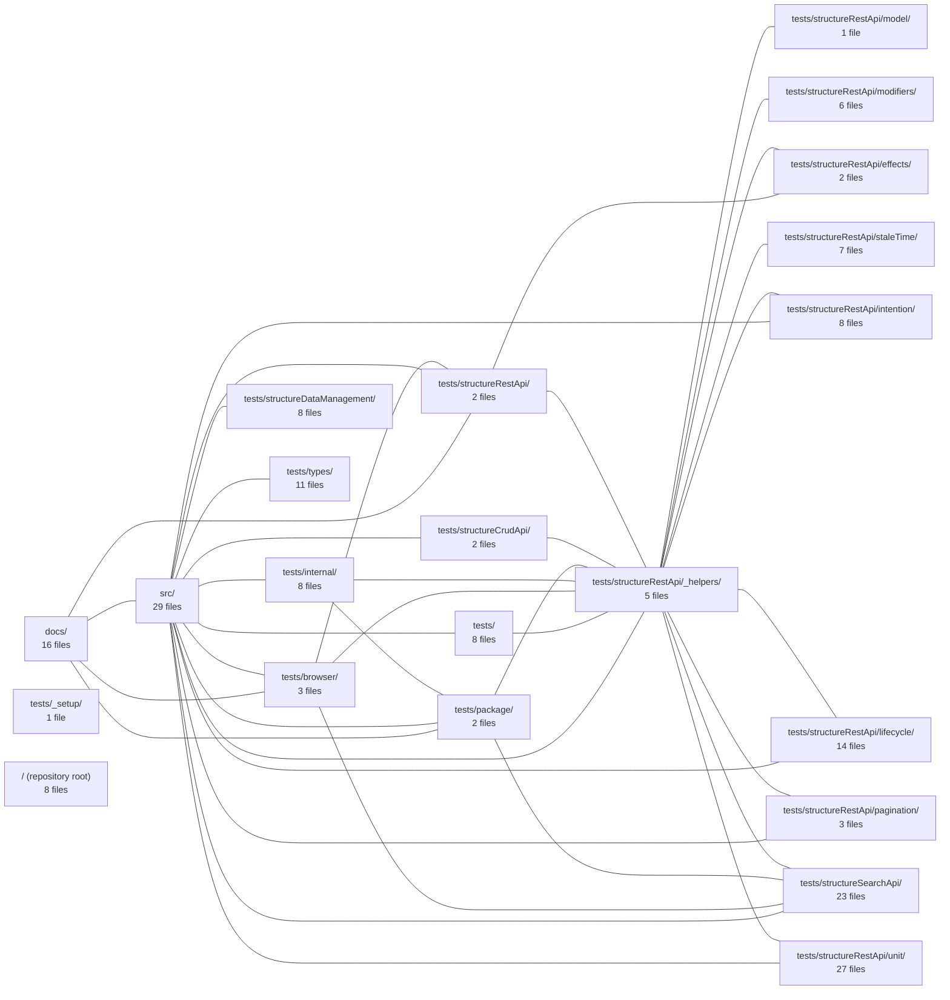

---
tags:
    - 2brain
    - 2brain/index
    - project/vue-toolkit
type: index
modules: 22
updated: 2026-09-28T23:23:52.994163+00:00
---

# vue-toolkit

`vue-toolkit` is a Vue.js utility library for structured API data management, covering REST endpoints, search, and CRUD workflows. Implementation resides in `src/`, with usage documentation in `docs/`. The test suite in `tests/` is organized first by API domain (REST, search, CRUD, data management) and then by concern—lifecycle, pagination, stale time, modifiers, effects, and unit-level checks—alongside dedicated browser and type-level test directories.

## Module map

## Modules

- [[vue-toolkit_docs|docs/]] — 16 files, 5 connected modules
- [[vue-toolkit_src|src/]] — 29 files, 16 connected modules
- [[vue-toolkit_tests|tests/]] — 8 files, 3 connected modules
- [[vue-toolkit_tests__setup|tests/_setup/]] — 1 file, 0 connected modules
- [[vue-toolkit_tests_browser|tests/browser/]] — 3 files, 6 connected modules
- [[vue-toolkit_tests_internal|tests/internal/]] — 8 files, 4 connected modules
- [[vue-toolkit_tests_package|tests/package/]] — 2 files, 6 connected modules
- [[vue-toolkit_tests_structureCrudApi|tests/structureCrudApi/]] — 2 files, 3 connected modules
- [[vue-toolkit_tests_structureDataManagement|tests/structureDataManagement/]] — 8 files, 2 connected modules
- [[vue-toolkit_tests_structureRestApi|tests/structureRestApi/]] — 2 files, 6 connected modules
- [[vue-toolkit_tests_structureRestApi__helpers|tests/structureRestApi/_helpers/]] — 5 files, 17 connected modules
- [[vue-toolkit_tests_structureRestApi_effects|tests/structureRestApi/effects/]] — 2 files, 3 connected modules
- [[vue-toolkit_tests_structureRestApi_intention|tests/structureRestApi/intention/]] — 8 files, 3 connected modules
- [[vue-toolkit_tests_structureRestApi_lifecycle|tests/structureRestApi/lifecycle/]] — 14 files, 3 connected modules
- [[vue-toolkit_tests_structureRestApi_model|tests/structureRestApi/model/]] — 1 file, 2 connected modules
- [[vue-toolkit_tests_structureRestApi_modifiers|tests/structureRestApi/modifiers/]] — 6 files, 2 connected modules
- [[vue-toolkit_tests_structureRestApi_pagination|tests/structureRestApi/pagination/]] — 3 files, 2 connected modules
- [[vue-toolkit_tests_structureRestApi_staleTime|tests/structureRestApi/staleTime/]] — 7 files, 1 connected module
- [[vue-toolkit_tests_structureRestApi_unit|tests/structureRestApi/unit/]] — 27 files, 3 connected modules
- [[vue-toolkit_tests_structureSearchApi|tests/structureSearchApi/]] — 23 files, 5 connected modules
- [[vue-toolkit_tests_types|tests/types/]] — 11 files, 2 connected modules
- [[vue-toolkit_ROOT|/ (repository root)]] — 8 files, 18 connected modules
