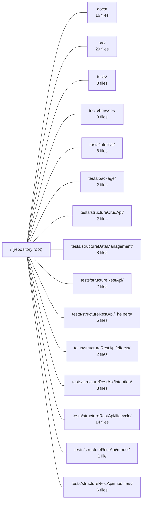

---
tags:
    - 2brain
    - 2brain/module
    - project/vue-toolkit
type: module
module: / (repository root)
files: 8
updated: 2026-09-28T23:18:05.735236+00:00
---

# / (repository root)

## Purpose

The repository root holds the build, quality, and packaging configuration that turns the `src/` source tree into the publishable `@guebbit/vue-toolkit` npm package (v5.0.0, ESM-only) and enforces project-wide coding standards across every sub-module.

## Key parts

- **Package identity & scripts** — `package.json` declares the npm manifest, dependency contracts, and the `build` / `test` / `publish` scripts that orchestrate every other tool in the repo.
- **TypeScript project configuration** — `tsconfig.json` is the base compiler config (strict mode, module resolution, `src/` → `dist/` output). Two derived configs specialise it: `tsconfig.vitest.json` loosens resolution rules for the test suite, and `tsconfig.types.json` extends the include set to cover `tests/types/` without emitting any build artefact.
- **Linting** — `eslint.config.ts` composes ESLint v9+ flat-config presets (Vue essential, Vue-TS, oxlint, unicorn) with house-style overrides for naming, JSDoc, and file conventions.
- **Mutation testing** — `stryker.conf.json` configures Stryker: which files are mutated, how the test runner is invoked, reporting format, and the score threshold that gates CI.
- **Project documentation** — `CLAUDE.md` (AI-assistant context) and `README.md` (npm badge + human-facing description) summarise what the library is and who it serves.

## How it connects

- **`src/`** — The root `tsconfig.json` compiles this directory into `dist/`; `package.json` exposes those build artefacts as the package's public entry points. ESLint and Stryker both target `src/` files.
- **`tests/`** (and all `tests/*` sub-directories) — `package.json` scripts invoke the test runner; `tsconfig.vitest.json` and `tsconfig.types.json` supply the TypeScript context those tests need; `stryker.conf.json` defines how mutants are verified against the suite.
- **`docs/`** — The root `package.json` publish metadata (version, ESM entry, type declarations) is what the documentation in `docs/` references when describing API contracts and installation instructions.

## Where to start

1. **`package.json`** — Read the `scripts` block and the `exports`/`peerDependencies` fields first; they define the entire build pipeline and the public API surface every other module relies on.
2. **`tsconfig.json`** — Understanding the strictness level, module-resolution strategy, and the `src/` → `dist/` mapping gives you the ground rules that govern every file you will edit in `src/` or `tests/`.

## Connected modules

[[vue-toolkit_docs|docs/]] · [[vue-toolkit_src|src/]] · [[vue-toolkit_tests|tests/]] · [[vue-toolkit_tests_browser|tests/browser/]] · [[vue-toolkit_tests_internal|tests/internal/]] · [[vue-toolkit_tests_package|tests/package/]] · [[vue-toolkit_tests_structureCrudApi|tests/structureCrudApi/]] · [[vue-toolkit_tests_structureDataManagement|tests/structureDataManagement/]] · [[vue-toolkit_tests_structureRestApi|tests/structureRestApi/]] · [[vue-toolkit_tests_structureRestApi__helpers|tests/structureRestApi/_helpers/]] · [[vue-toolkit_tests_structureRestApi_effects|tests/structureRestApi/effects/]] · [[vue-toolkit_tests_structureRestApi_intention|tests/structureRestApi/intention/]] · [[vue-toolkit_tests_structureRestApi_lifecycle|tests/structureRestApi/lifecycle/]] · [[vue-toolkit_tests_structureRestApi_model|tests/structureRestApi/model/]] · [[vue-toolkit_tests_structureRestApi_modifiers|tests/structureRestApi/modifiers/]] · … and 3 more

## Files

- `CLAUDE.md` — A published npm library (`@guebbit/vue-toolkit`): Vue 3 composables and Pinia stores built on
- `README.md` — 
- `eslint.config.ts` — Flat ESLint configuration (ESLint v9+ flat config format) for a Vue 3 + TypeScript project. It composes multiple presets (ESLint recommended, Vue essential, Vue-TS recommended, oxlint recommended, unicorn) and layers project-specific rule overrides on top, enforcing naming conventions, JSDoc discipline, file-naming style, and a set of house-style exceptions documented inline.
- `package.json` — Project manifest for `@guebbit/vue-toolkit` (v5.0.0), an ESM-only npm package that ships Vue 3 composables and Pinia stores for building CRUD screens. It declares the package identity, build/test/publish scripts, dependency contracts, and publish metadata that make the library consumable and verifiable.
- `stryker.conf.json` — Configuration file for [Stryker](https://stryker-mutator.io/), the mutation-testing framework. It defines which source files are mutated, how tests are executed against the mutants, how results are reported, and what score thresholds gate CI.
- `tsconfig.json` — TypeScript compiler configuration for the project. It defines how `tsc` compiles source files in `src/` into JavaScript and declaration files in `dist/`, and sets the strictness and module-resolution rules that all code in the repo must satisfy.
- `tsconfig.types.json` — TypeScript configuration for a type-checking-only program. It inherits the project's base `tsconfig.json` and widens the included file set to cover type tests under `tests/types`, without ever producing build output.
- `tsconfig.vitest.json` — A TypeScript configuration scoped to the test suite. It extends the project's base `tsconfig.json` and relaxes module-resolution rules so that type-aware tooling (linting, IDE diagnostics) resolves test-file imports the same permissive way `ts-jest` transpiles them at runtime.

---

[[vue-toolkit_INDEX|← vue-toolkit index]]
