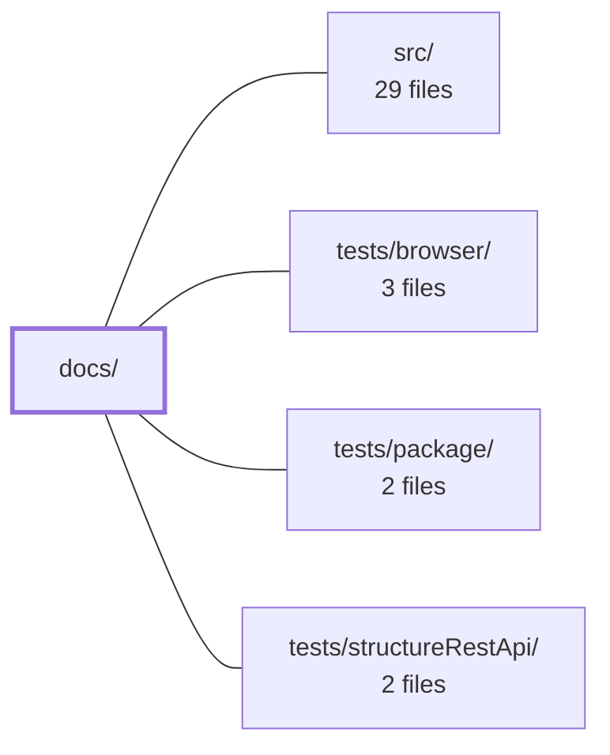

---
tags:
    - 2brain
    - 2brain/module
    - project/vue-toolkit
type: module
module: docs/
files: 16
updated: 2026-09-28T23:18:19.077458+00:00
---

# docs/

## Purpose

`docs/` is the VitePress-powered documentation site for `@guebbit/vue-toolkit`. It provides the navigation shell, per-API reference pages (composables, stores), and short guides (getting-started, migration, testing) that explain how to use the library.

## Key parts

- **Site shell** — `.vitepress/config.mts` defines site identity, nav/sidebar layout, and wires in `vitepress-plugin-mermaid` so Mermaid fences render as diagrams. `index.md` is the landing page.
- **Composable reference** (`composables/`) — One Markdown file per composable: `async-action`, `is-loading`, `liveness-probe`, `upload-progress` cover utility patterns; the `structure-*` set (`rest-api`, `search-api`, `data-management`, `crud-api`, `form-validation`) documents the higher-level CRUD and form-building layer.
- **Store reference** (`stores/`) — `core.md` (named loading flags) and `notifications.md` (toast messages), both Pinia stores.
- **Guides** (`guide/`) — `getting-started.md` for first use, `migration.md` for moving to the TanStack-Query-based `useStructureRestApi`, and `testing.md` for the project's layered test strategy.

## How it connects

- **`src/`** — Every composable and store page in `docs/` mirrors a module that lives in `src/`. The docs are the public API surface; changes in `src/` that alter a composable's signature or behaviour require a corresponding edit in `docs/composables/` or `docs/stores/`.
- **`tests/`** (`tests/browser/`, `tests/package/`, `tests/structureRestApi/`) — `docs/guide/testing.md` describes the three test layers and when each catches bugs, so it acts as the reader-facing counterpart to those directories.
- **Repository root** — The VitePress config at `docs/.vitepress/config.mts` is the entry point the root-level tooling (build scripts, CI) invokes to publish the site.

## Where to start

Read `docs/guide/getting-started.md` first — it frames what the library is, the composable-vs-store split, and links to the relevant reference pages. Then open `docs/composables/structure-rest-api.md` if you work with the CRUD layer; it is the most central API and the other `structure-*` pages build on it.

## Connected modules

[[vue-toolkit_ROOT|/ (repository root)]] · [[vue-toolkit_src|src/]] · [[vue-toolkit_tests_browser|tests/browser/]] · [[vue-toolkit_tests_package|tests/package/]] · [[vue-toolkit_tests_structureRestApi|tests/structureRestApi/]]

## Files

- `docs/.vitepress/config.mts` — VitePress site configuration for the `@guebbit/vue-toolkit` documentation. It defines the site identity, navigation structure, and sidebar layout, and wraps the config with `vitepress-plugin-mermaid` so that Mermaid diagram fences render as visual diagrams on pages that describe flows.
- `docs/composables/async-action.md` — Loading, data and error state for one async call, and the wrapper that drives it.
- `docs/composables/is-loading.md` — "Is anything of these resources busy?", across the whole app: true while any query or mutation
- `docs/composables/liveness-probe.md` — Watches whether something the app depends on is still answering, and says so with one boolean.
- `docs/composables/structure-crud-api.md` — A whole resource (list, filtered search, read, create, update, delete) declared from the API calls
- `docs/composables/structure-data-management.md` — The base primitive: a normalized `{ id -> record }` store with CRUD, selection state,
- `docs/composables/structure-form-validation.md` — Reactive form state with optional [Zod](https://zod.dev) schema validation and a submit-flow
- `docs/composables/structure-rest-api.md` — A REST resource on one [TanStack Query](https://tanstack.com/query) `QueryClient`. Every record,
- `docs/composables/structure-search-api.md` — Filtered, server-paginated search on top of [`useStructureRestApi`](./structure-rest-api). It **is**
- `docs/composables/upload-progress.md` — Progress state for one upload, and the wrapper that drives it — reactive percentage while the
- `docs/guide/getting-started.md` — `@guebbit/vue-toolkit` is a small set of Vue 3 composables and Pinia stores for building CRUD
- `docs/guide/migration.md` — `useStructureRestApi` is rebuilt directly on [TanStack Query](https://tanstack.com/query) as the
- `docs/guide/testing.md` — This project has several layers of tests, each catching a kind of bug the others can't see:
- `docs/index.md` — layout: home
- `docs/stores/core.md` — A small Pinia store (id `'core'`) for your own, non-server named loading flags: one place to track
- `docs/stores/notifications.md` — A Pinia store (id `'notifications'`) for toast-style messages.

---

[[vue-toolkit_INDEX|← vue-toolkit index]]
