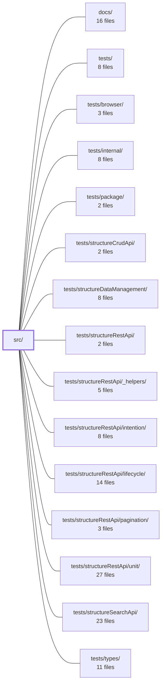

---
tags:
    - 2brain
    - 2brain/module
    - project/vue-toolkit
type: module
module: src/
files: 29
updated: 2026-09-28T23:18:39.313347+00:00
---

# src/

## Purpose

`src/` is the public source tree of the **structure** toolkit: a Vue 3 + TanStack Query library that gives teams a uniform, reactive layer for REST resources (reads, search, CRUD mutations, parent–child relations), plus a handful of app-level helpers (form validation, upload progress, liveness probing, toast notifications). All runtime logic lives in `src/internal/`; the composable APIs in `src/composables/` are the stable, versioned surface re-exported from `src/index.ts`.

## Key parts

- **Public composables (`src/composables/`)** – the API consumers import:
    - _Resource layer_: `structureRestApi` (type contract + entry point), `structureSearchApi` (applied-search / pagination), `structureCrudApi` (full CRUD on top of search), `structureDataManagement` (local record dictionary, selection, pagination, belongsTo).
    - _Form & UX helpers_: `structureFormValidation` (Zod-aware form state + server-error normalisation), `uploadProgress`, `asyncAction` (one-shot read wrapper), `isLoading` (layout-level "anything busy?" flag), `livenessProbe` (offline banner).
- **Internal engine (`src/internal/`)** – not part of the public API:
    - _Core resource_: `restResource` (assembles keys, record store, relations, three operation kinds), `resourceKeys` (canonical cache-key layout), `resourceMutations` (optimistic create/update/delete), `resourceActivity` (bridges TanStack cache events to Vue reactivity).
    - _Record & relation stores_: `queryRecordStore` (IRecordStore over TanStack Query), `parentRelations` (IRelationStore for belongsTo), `recordLookup`, `recordMutations` (mutation-in-flight checks).
    - _Cache hygiene_: `freshnessChecks`, `queryRemoval`, `scopeRegistry`, `settleCallbacks`, `tanstackQueryOptions` (whitelist guard).
    - _Small utilities_: `idEquality`, `identifierJoin`, `plainData`, `promiseTry`.
- **Pinia stores (`src/stores/`)** – app-wide singletons: `core` (flat boolean loading flags with prefix queries) and `notifications` (toast history + visibility).
- **Barrel entry (`src/index.ts`)** – re-exports every public composable and store; anything not listed here is internal.

## How it connects

- **`tests/` and its sub-directories** (`tests/structureRestApi/`, `tests/structureSearchApi/`, `tests/structureCrudApi/`, `tests/structureDataManagement/`, `tests/internal/`, `tests/package/`, `tests/types/`, `tests/browser/`) exercise every composable and internal module listed above, confirming behavioural contracts and the public type surface.
- **`docs/`** contains the user-facing documentation that mirrors the composable API described in `src/composables/`.
- **`/` (repository root)** holds the package manifest (`package.json`, `tsconfig`, build tooling) that wires `src/index.ts` as the published entry point and defines semver guarantees.

## Where to start

1. **`src/composables/structureRestApi.ts`** – reading its type definitions and the `useStructureRestApi` signature gives the highest-level picture of what a "resource" is and which options a caller supplies, without any runtime detail.
2. **`src/internal/restResource.ts`** – the file that actually assembles keys, the record store, relations, and the three operation kinds; tracing it shows how the public composable maps to TanStack Query under the hood.

Together these two files take a newcomer from "what I can call" to "what happens when I call it."

## Connected modules

[[vue-toolkit_ROOT|/ (repository root)]] · [[vue-toolkit_docs|docs/]] · [[vue-toolkit_tests|tests/]] · [[vue-toolkit_tests_browser|tests/browser/]] · [[vue-toolkit_tests_internal|tests/internal/]] · [[vue-toolkit_tests_package|tests/package/]] · [[vue-toolkit_tests_structureCrudApi|tests/structureCrudApi/]] · [[vue-toolkit_tests_structureDataManagement|tests/structureDataManagement/]] · [[vue-toolkit_tests_structureRestApi|tests/structureRestApi/]] · [[vue-toolkit_tests_structureRestApi__helpers|tests/structureRestApi/_helpers/]] · [[vue-toolkit_tests_structureRestApi_intention|tests/structureRestApi/intention/]] · [[vue-toolkit_tests_structureRestApi_lifecycle|tests/structureRestApi/lifecycle/]] · [[vue-toolkit_tests_structureRestApi_pagination|tests/structureRestApi/pagination/]] · [[vue-toolkit_tests_structureRestApi_unit|tests/structureRestApi/unit/]] · [[vue-toolkit_tests_structureSearchApi|tests/structureSearchApi/]] · … and 1 more

## Files

- `src/composables/asyncAction.ts` — Vue composable that wraps a single async call in reactive `data` / `error` / `loading` refs. It enforces "latest run wins" via a sequence counter so out-of-order responses are dropped, and it never rejects — failures resolve into the `error` ref, suiting read-style UIs where one dead panel is preferable to a thrown exception. Intended for one-shot payloads; identified/cached/mutated records belong in the `useStructure*` family.
- `src/composables/isLoading.ts` — Provides a single composable (`useIsLoading`) that answers "is anything of these resources busy right now?" at a layout or page level. It wraps TanStack Query's `useIsFetching` / `useIsMutating` counters and filters them by resource-key prefix, so a parent component can show a global spinner without tracking individual resource `isLoading` flags.
- `src/composables/livenessProbe.ts` — A Vue composable that tracks whether an external dependency (liveness endpoint, socket, CDN, etc.) is still reachable. It exposes a reactive `down` flag and drives re-probing on creation, on browser `online` events, and on a slow retry loop that runs only while the target is down. Designed to power a "you're offline" banner, not a high-frequency health monitor.
- `src/composables/structureCrudApi.ts` — A Vue composable (`useStructureCrudApi`) that turns a set of optional API callbacks (list, search, get, create, update, remove) into a complete, ready-to-use CRUD resource. It wires each supplied operation into a corresponding method on top of `useStructureSearchApi`, and rejects (with a named-error `Promise.reject`) any method whose operation was never provided. It exists so screens don't re-implement filter state, pagination, selection, or optimistic-write plumbing per resource.
- `src/composables/structureDataManagement.ts` — Provides the core client-side record-management composable (`useStructureDataManagement`): a reactive dictionary of records keyed by identifier, plus selection, "last inserted" tracking, client-side pagination, and parent↔child (belongsTo) relations. All reads and writes are routed through two pluggable stores (`IRecordStore`, `IRelationStore`) so the same logic works identically over a plain local `ref` or over a TanStack Query cache supplied by the REST layer.
- `src/composables/structureFormValidation.ts` — A Vue 3 composable that manages reactive form state (`form` / `formErrors` refs), optional Zod validation via a structurally-typed `safeParse` contract, and a submit flow with server-error normalization. It exists so that forms in the toolkit get consistent validation, error display, locale re-translation, and server-rejection handling without each app reimplementing the glue.
- `src/composables/structureRestApi.ts` — Public type contract and the `useStructureRestApi` entry point for a REST resource. It defines all option interfaces, per-call settings, watcher shapes, and the resource handle that consumers see, while delegating all runtime logic to `internal/restResource`. The file exists so the `.d.ts` surface is fully explicit and never references package internals.
- `src/composables/structureSearchApi.ts` — Adds filtered, server-paginated search on top of a REST resource. The screen follows the **applied search** — a detached, immutable copy of the filters taken when a search runs — so a live form bound to the same filters does not shift the visible list while the user types.
- `src/composables/uploadProgress.ts` — A Vue composable that exposes a single reactive `progress` ref (and a `track()` wrapper) for upload progress, decoupled from any specific HTTP client. Callers supply a one-time options builder; the composable handles clamping, idle/in-flight state, stale-report suppression, and guaranteed reset regardless of how the request resolves.
- `src/index.ts` — Package entry point (barrel file) that re-exports every public store and composable. It defines the public API surface under semver; anything not re-exported here (e.g. code under `src/internal/`) is internal and not covered by version guarantees.
- `src/internal/freshnessChecks.ts` — Provides pre-flight freshness checks that answer "would this REST call be served from cache, or hit the network?" using only the current Vue Query cache state—without issuing a network request. Each resource instantiates its own set of checks via `createFreshnessChecks`, which binds the resource's query keys, scope predicates, and default stale-time into ready-to-call predicates.
- `src/internal/idEquality.ts` — Defines the project's canonical notion of "same record id" and provides a deduplication helper built on it. The rule mirrors JavaScript object-key semantics: a number and its string form are one id (because `obj[1]` and `obj['1']` hit the same slot, and route params arrive as strings), while a symbol is only equal to itself. Centralizing this logic ensures every part of the system agrees on what "same id" means.
- `src/internal/identifierJoin.ts` — Provides a collision-free join for identifier values into a single composite ID. A plain `.join()` is ambiguous because different tuples can produce the same string (e.g. `['x|y','z']` and `['x','y|z']` both yield `'x|y|z'`). This module escapes each segment before joining so the result is unambiguously reversible for any delimiter.
- `src/internal/parentRelations.ts` — Implements `belongsTo` (parent → children) relations as a reactive view over a TanStack Query cache. It provides the `IRelationStore` implementation that `useStructureDataManagement` consumes, so UI code can read a merged child list and perform local link/unlink edits without a separate in-memory copy to keep in sync.
- `src/internal/plainData.ts` — Provides identity comparison and deep-copy utilities for plain-data values (filters, `dependsOn` snapshots, key segments). Two core operations: `stableKey` produces a canonical string so values compare by content rather than reference, and `detachedCopy` rebuilds a value so later mutations to the source (e.g. a bound form) cannot reach the copy.
- `src/internal/promiseTry.ts` — Provides a minimal polyfill for the ES2025 `Promise.try` API: it runs a callback synchronously inside a `Promise` executor so that any synchronous throw is converted into a promise rejection rather than escaping the caller's stack frame.
- `src/internal/queryRecordStore.ts` — Implements the `IRecordStore` seam backed by TanStack Vue Query: one query per record, one scope per resource. Provides O(1) read/write/remove/snapshot/restore operations, alias resolution, and a freshness model where only writes made inside `asFetched` (server answers) are stamped fresh—every other write is treated as a local guess that inherits the previous stamp (or `0` for new records).
- `src/internal/queryRemoval.ts` — Provides a safe way to remove queries from a TanStack Vue Query `QueryClient` without orphaning active `useQuery` watchers. Because TanStack does not notify an observer when its query leaves the cache (detaching it permanently from invalidation/focus events), this module resets observed queries in place rather than removing them.
- `src/internal/recordLookup.ts` — Shared lookup helpers that resolve an array of record ids into their stored records. Exists so every `belongsTo` view in the codebase uses a single, consistent id→record resolution strategy rather than reimplementing the filter-and-collect pattern inline.
- `src/internal/recordMutations.ts` — Answers "is record `id` currently being changed?" by reading TanStack Query's `MutationCache` directly, so a read and a mutation always agree on the same source of truth (one cache per `QueryClient`). It also provides an ordering check ("did this mutation start before this read?") using a high-resolution timestamp the mutation carries in its own `meta`, rather than TanStack's coarser `submittedAt`.
- `src/internal/resourceActivity.ts` — Bridges TanStack Query's non-reactive query/mutation caches to Vue's reactivity system. Subscribes to cache events and bumps per-kind data counters and status counters so that components and stores can reactively track when cached data changes or when operations are in flight, without polling.
- `src/internal/resourceKeys.ts` — Defines the canonical cache-key layout (`[resourceKey, kind, scope, ...parts, ...key]`) for every resource query, plus the predicate helpers that select entries by that layout. It exists so that key construction, scope matching, and alias-aware invalidation have a single source of truth shared across the resource layer.
- `src/internal/resourceMutations.ts` — Implements the write side (optimistic create / update / delete plus free-form commands) for a single resource. Each write runs as a one-shot TanStack `MutationObserver` so `isLoading` can track it, and update/delete share a single optimistic protocol built on TanStack's `onMutate` / `onSuccess` / `onError` / `onSettled` lifecycle.
- `src/internal/restResource.ts` — Core implementation of the `useStructureRestApi` composable. It assembles the key layout, in-flight tracking, record store, parent relations, and three operation kinds (one-shot reads, active reactive reads, mutations) on top of a single TanStack Vue Query `QueryClient`. It also produces the internal `engine` that `useStructureSearchApi` uses to build its `'search'` query kind.
- `src/internal/scopeRegistry.ts` — Tracks which `dependsOn` scope snapshots are still "live" (claimed by at least one active resource instance) for each `(QueryClient, resourceKey)` pair. Without this registry, two simultaneous instances of the same resource (e.g. side-by-side comparison panels) could each mistake the other's scope for abandoned and invalidate its data during start-up sweeps or `dependsOn` switches.
- `src/internal/settleCallbacks.ts` — Provides `onSuccess` / `onError` / `onSettled` callbacks for an active `useQuery`-based watcher. Because TanStack Vue Query has no per-query callback hooks, this module derives settlement events from the query cache and a key-change watcher, deferring callback invocation to a microtask so it never runs inside TanStack's own notify dispatch.
- `src/internal/tanstackQueryOptions.ts` — Whitelists the subset of TanStack Query options a caller is permitted to pass through `queryOptions`. It exists to prevent engine-owned options (e.g. `gcTime`, `select`) from leaking into `useQuery` and silently corrupting the cache layout that every read in the app relies on.
- `src/stores/core.ts` — A single Pinia setup store (`'core'`) that holds app-wide boolean loading flags in a flat `Record<string, boolean>`. It gives components, route guards, and composables one shared source of truth for "is this work in progress?" questions, with prefix-based querying so a single call can cover a whole module, a screen, or one button.
- `src/stores/notifications.ts` — A Pinia **setup store** that manages the application's toast notifications. It maintains an append-only `history` of all toasts ever added, exposes the currently visible subset as a computed `messages` array, and provides actions to add, show, hide, and permanently remove toasts. An optional per-message timeout auto-hides a toast after a set duration.

---

[[vue-toolkit_INDEX|← vue-toolkit index]]
