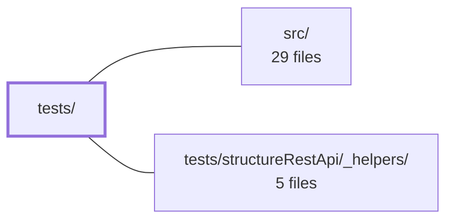

---
tags:
    - 2brain
    - 2brain/module
    - project/vue-toolkit
type: module
module: tests/
files: 8
updated: 2026-09-28T23:18:57.694331+00:00
---

# tests/

## Purpose

The `tests/` directory holds the project's unit and integration test suites (a mix of Jest and Vitest) that verify the reactive-state contracts, error-handling guarantees, lifecycle semantics, and edge-case behaviour of the composables and Pinia stores defined in `src/`.

## Key parts

- **Composable tests** — `asyncAction.spec.ts`, `isLoading.spec.ts`, `livenessProbe.spec.ts`, and `uploadProgress.spec.ts` each lock down one `use*` composable from `src/`: reactive loading/error/data state, prefix-based load detection, time-based probe throttling and teardown, and upload-progress lifecycle respectively.
- **Pinia store tests** — `core.spec.ts` exercises the `useCoreStore` loading-state API (set/clear/reset, prefix filtering); `notifications.spec.ts` covers the full add → show → hide → remove message lifecycle, computed getters, and auto-hide timeout edge cases.
- **Form-validation tests** — `structureFormValidation.spec.ts` verifies reactive form state, schema validation, deep-copy/detachment semantics, auto-hydration, and dirty-tracking; `structureFormValidation.serverErrors.spec.ts` black-boxes the internal `applyServerErrors` normalizer through its public entry point.
- **Sub-module: `structureRestApi/_helpers/`** — shared fixtures and utilities consumed by the structure-related API tests (see sibling directory).

## How it connects

- **`src/`** — every spec file imports the composable or store under test from `src/`. The tests never run in isolation; they assert the public API and observable side-effects of `src/` modules.
- **`tests/structureRestApi/_helpers/`** — provides shared mock data, fake HTTP clients, and assertion helpers that the structure-related specs (and likely other suites) reuse to keep setup DRY.
- **Repository root (`/`)** — supplies the Jest/Vitest configuration, global setup/teardown scripts, and shared type definitions that these specs rely on at runtime.

## Where to start

1. **`tests/core.spec.ts`** — the shortest suite; it shows the project's idiom for testing a Pinia store's loading-state API (set, clear, reset, prefix filter) in a few dozen lines.
2. **`tests/structureFormValidation.spec.ts`** — the richest single file; it demonstrates how the project tests composables with nested state, deep-copy guarantees, async hydration, and dirty-tracking, giving a newcomer a complete picture of the testing style before tackling the more specialised suites.

## Connected modules

[[vue-toolkit_ROOT|/ (repository root)]] · [[vue-toolkit_src|src/]] · [[vue-toolkit_tests_structureRestApi__helpers|tests/structureRestApi/_helpers/]]

## Files

- `tests/asyncAction.spec.ts` — Test suite for the `useAsyncAction` composable. It locks down the reactive state contract (data, error, loading), the never-reject / never-throw failure guarantee, race-condition safety on overlapping calls, the `resolveError` injection point for i18n, and the `reset` escape hatch.
- `tests/core.spec.ts` — Vitest unit tests for the `useCoreStore` Pinia store, covering its loading-state API: setting/clearing individual keys, resetting all, and the prefix-filtering behavior of `isLoading()`.
- `tests/isLoading.spec.ts` — Unit tests for the `useIsLoading` composable. Verifies that it reports whether _any_ resource whose `resourceKey` starts with one of the supplied prefixes is currently fetching or mutating, covers edge cases (non-string key segments, no prefixes, multiple prefixes, unrelated resources), and confirms that the underlying subscriptions are cleaned up when the component scope stops.
- `tests/livenessProbe.spec.ts` — Integration-style tests for the `useLivenessProbe` composable that verify its behavioural contract—probe only while down, probe slowly, maintain exactly one retry chain, and tear down cleanly via effect scopes—by asserting probe **call counts over simulated time** rather than just the `down` flag, since the failure mode (a background request storm) is invisible to type-level or single-probe checks.
- `tests/notifications.spec.ts` — Jest test suite for the `useNotificationsStore` Pinia store. It verifies the full message lifecycle (add, show, hide, remove, find), the computed `messages` getter, the default toast type, and the auto-hide timeout behavior (including edge cases like zero/negative timeouts and timers firing after removal).
- `tests/structureFormValidation.serverErrors.spec.ts` — Black-box tests for the server-error normalization logic inside `useStructureFormValidation`. Every assertion goes through the public `applyServerErrors` entry point (the normalizer itself is internal) to pin down how a rejected payload is split into per-field errors, form-level messages, and the boolean "did anything apply?" result.
- `tests/structureFormValidation.spec.ts` — Jest test suite for the `useStructureFormValidation` composable. It verifies reactive form state management, schema-based validation, deep-copy/detachment semantics for nested structures (plain objects, `Set`, `Map`), auto-hydration from an async source ref, and dirty-tracking — ensuring the composable never leaks shared object references between the caller, the baseline, and the live form.
- `tests/uploadProgress.spec.ts` — Jest test suite for the `useUploadProgress` composable. It verifies the full lifecycle of upload-progress tracking—idle transitions, in-flight reporting, percentage conversion, clamping, ownership of overlapping calls, the `enabled` toggle, and manual `report`/`reset` control—using a minimal fake options interface in place of a real HTTP client.

---

[[vue-toolkit_INDEX|← vue-toolkit index]]
