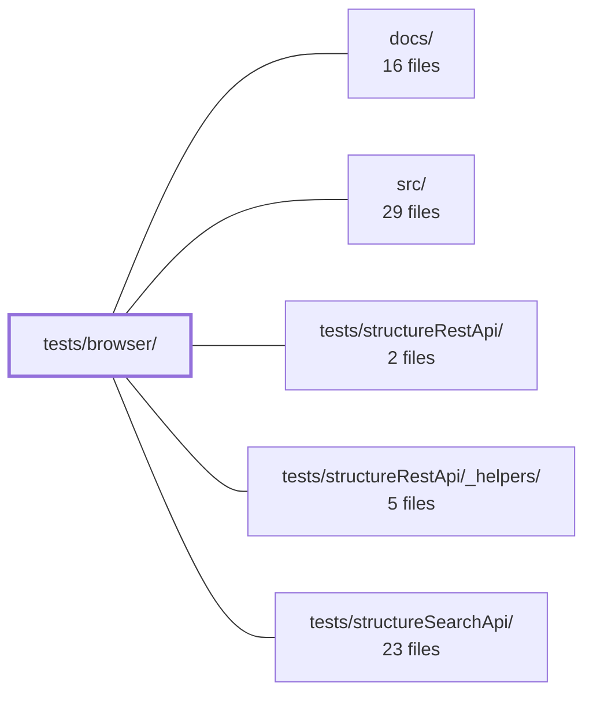

---
tags:
    - 2brain
    - 2brain/module
    - project/vue-toolkit
type: module
module: tests/browser/
files: 3
updated: 2026-09-28T23:19:24.252474+00:00
---

# tests/browser/

## Purpose

This module holds tests that exercise **browser-only** code paths in the TanStack Query client and Vue plugin — specifically the `focusManager`/`onlineManager` subscriptions, browser-default garbage-collection timing, and real Vue app mount/unmount lifecycle. These paths are skipped or behave differently under a plain Node/Jest environment (e.g. `client.mount()` is a no-op when `isServer()` is true), so they require a jsdom-simulated browser to verify.

## Key parts

- **`focus-online.spec.ts`** — Pins TanStack Query's `refetchOnWindowFocus` and `refetchOnReconnect` defaults and asserts that `useStructureRestApi` refetches stale active queries on focus-return / reconnection, while fresh or one-shot queries remain inert.
- **`gc.spec.ts`** — Confirms the browser `gcTime` default (5 min) vs. Node's `Infinity`, verifies that the three explicitly-`Infinity` query kinds (`target`, `parent`, `search`) survive unwatched past 5 minutes, that `all`/`any` kinds are collected, and that an active watcher blocks collection.
- **`plugin.spec.ts`** — Mounts a real Vue app via `createApp(...).mount(div)` to prove that `VueQueryPlugin` composable `effectScope()` calls are true children of the component scope and that `app.unmount()` cascades into them. This is the one path the shared `runInjected` harness intentionally shortcuts around.

## How it connects

- **`src/`** — The code under test: `useStructureRestApi`, `VueQueryPlugin`, and the `client` instance whose `mount()` / GC logic these specs exercise.
- **`tests/structureRestApi/` & `tests/structureSearchApi/`** — Sibling suites that cover the same APIs under Node, where the browser-specific branches (focus, GC, real mount) are deliberately not exercised. This module is the complementary set.
- **`tests/structureRestApi/_helpers/`** — Provides the shared `runInjected` harness. `plugin.spec.ts` explicitly bypasses that harness to test the real mount path; the other two files may still use its setup utilities.
- **Repository root (`/`)** — Supplies the jsdom test-environment configuration and project-level test runner setup these specs depend on.

## Where to start

Read **`gc.spec.ts`** first: it is the most self-contained and makes the browser-vs-Node `gcTime` split concrete in a few assertions. Then move to **`focus-online.spec.ts`**, which introduces the `focusManager`/`onlineManager` subscription model and explains _why_ a plain Node run would silently skip the code under test.

## Connected modules

[[vue-toolkit_ROOT|/ (repository root)]] · [[vue-toolkit_docs|docs/]] · [[vue-toolkit_src|src/]] · [[vue-toolkit_tests_structureRestApi|tests/structureRestApi/]] · [[vue-toolkit_tests_structureRestApi__helpers|tests/structureRestApi/_helpers/]] · [[vue-toolkit_tests_structureSearchApi|tests/structureSearchApi/]]

## Files

- `tests/browser/focus-online.spec.ts` — Pins TanStack Query's browser-side defaults (`refetchOnWindowFocus`, `refetchOnReconnect`) to ensure `useStructureRestApi` correctly refetches active, stale queries on focus return and reconnection, and correctly stays paused or non-reactive in the fresh / one-shot cases. It exists because these behaviors are untestable under a plain Node/Jest environment — `client.mount()` (the subscription to `focusManager`/`onlineManager`) is skipped when `isServer()` is true.
- `tests/browser/gc.spec.ts` — Verifies the **browser** garbage-collection path of the resource cache. TanStack Query reads `typeof window === 'undefined'` once at import time to pick its default `gcTime` (5 min in browser vs. `Infinity` in Node). This file confirms that under jsdom, the three explicitly-`Infinity` query kinds (`target`, `parent`, `search`) survive unwatched past 5 minutes, while the non-overridden kinds (`all`, `any`) are collected, and that an active watcher prevents collection.
- `tests/browser/plugin.spec.ts` — Exercises `VueQueryPlugin` inside a **real, mounted Vue app** (`createApp(...).mount(div)`) to verify that a composable's internal `effectScope()` calls are true children of the component scope and that `app.unmount()` cascades into them. This is the one code path that the shared `runInjected` harness deliberately shortcuts around; this file exists to prove that wiring works when a component is actually mounted and unmounted.

---

[[vue-toolkit_INDEX|← vue-toolkit index]]
