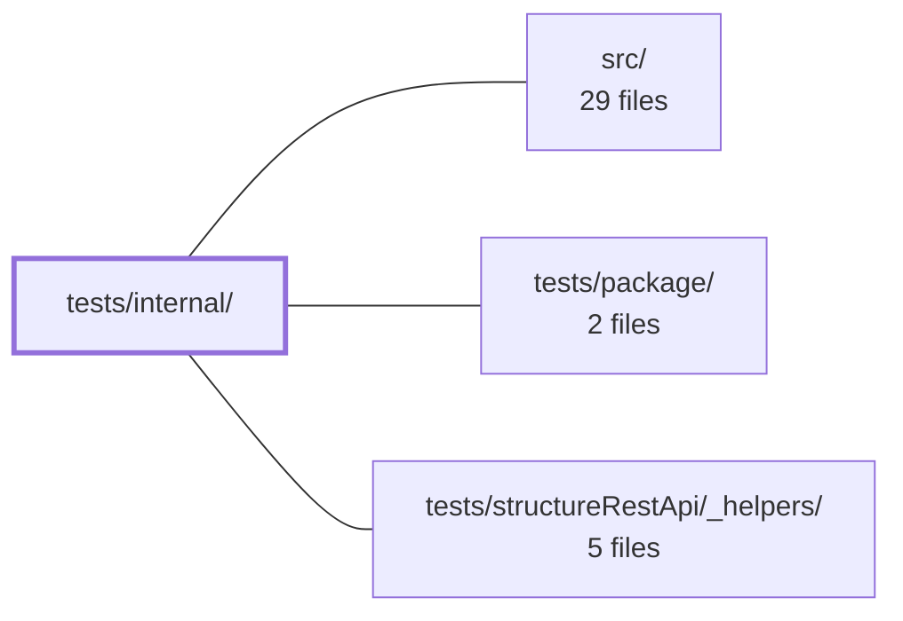

---
tags:
    - 2brain
    - 2brain/module
    - project/vue-toolkit
type: module
module: tests/internal/
files: 8
updated: 2026-09-28T23:19:42.217124+00:00
---

# tests/internal/

## Purpose

`tests/internal/` holds the focused unit and property-based test suites for the internal building blocks under `src/internal/`. Each spec targets a single helper or store, pinning down boundary conditions, invariant contracts, and lifecycle semantics that higher-level integration tests in other `tests/` directories exercise only indirectly.

## Key parts

- **Data-structure invariants**
    - `identifierJoin.spec.ts` – boundary cases for `joinIdentifiers` (backslashes, null/undefined entries, escaping threshold, multi-char delimiters).
    - `plainData.property.spec.ts` – `fast-check` property suite for `stableKey`, `hasKeyPrefix`, and `matchesAnyPrefix`, verifying order-independence and nesting safety.
    - `recordMutations.spec.ts` – classification rules for `recordMutationsOf` (which mutations change a record `id`) and the `canWrite` timing boundary.

- **Query store & cache semantics**
    - `queryRecordStore.spec.ts` – freshness flags, `asFetched` restore-on-throw, `clear`/`writeAll` refetch distinctions, and `snapshot`/`restore` stamp preservation.
    - `parentRelations.spec.ts` – scoped-view behaviour of `createQueryRelationStore`: per-parent/per-scope bucket targeting and idempotent child linking.
    - `scopeRegistry.spec.ts` – reference-counted claim/release lifecycle and per-`(QueryClient, resourceKey)` isolation for `scopeRegistryFor`.

- **Reactive & callback lifecycle**
    - `resourceActivity.spec.ts` – scoped re-evaluation and `EffectScope` disposal for `useResourceActivity`.
    - `settleCallbacks.spec.ts` – integration-level test of `watchSettled` against a real `QueryClient`, covering mid-fetch suppression and key-scoped re-fire.

## How it connects

- **`src/`** – Every spec in this module imports and exercises one or more functions/types from `src/internal/` (e.g. `plainData.ts`, `recordMutations.ts`, `settleCallbacks.ts`, `scopeRegistry.ts`, `useResourceActivity`, `queryRecordStore`). The tests exist to lock in the contracts those modules declare in their JSDoc.
- **`tests/package/`** – Supplies the shared test-runner configuration and package-level utilities that these specs rely on to execute (e.g. `fast-check` wiring, assertion helpers, or the `QueryClient` fixture factory).
- **`tests/structureRestApi/_helpers/`** – Provides reusable REST-structure test helpers (resource key builders, mock responses) that some of the store and callback specs consume to set up realistic `QueryClient` state without duplicating scaffolding.

## Where to start

1. **`plainData.property.spec.ts`** – It is the smallest file, uses a familiar property-testing idiom, and demonstrates the pattern of deriving test cases from the JSDoc invariants of the module under test. Reading it first shows how this directory maps specs to contracts.
2. **`scopeRegistry.spec.ts`** – It captures the reference-counting and isolation model that several other specs (parent relations, query record store) depend on conceptually, so understanding it early makes the remaining store-level tests easier to follow.

## Connected modules

[[vue-toolkit_ROOT|/ (repository root)]] · [[vue-toolkit_src|src/]] · [[vue-toolkit_tests_package|tests/package/]] · [[vue-toolkit_tests_structureRestApi__helpers|tests/structureRestApi/_helpers/]]

## Files

- `tests/internal/identifierJoin.spec.ts` — Unit tests for `joinIdentifiers` that target boundary cases the property-based spec (`tests/structureDataManagement/property.spec.ts`) doesn't reliably reach: literal backslashes in values, single `null`/`undefined` entries, the one-vs-two-value escaping threshold, and multi-character delimiters (including the escape character itself as a delimiter).
- `tests/internal/parentRelations.spec.ts` — Unit tests for `createQueryRelationStore` that verify the relation store is a scoped view over parent-list cache entries. They pin down which buckets a mutation touches (per-parent, per-scope) and that linking a child is idempotent regardless of whether the child already exists in any bucket or is linked to a different parent.
- `tests/internal/plainData.property.spec.ts` — Property-based test suite (via `fast-check`) that pins the invariants declared in `src/internal/plainData.ts` JSDoc across _generated_ inputs rather than hand-picked examples. It verifies that `stableKey`, `hasKeyPrefix`, and `matchesAnyPrefix` behave correctly regardless of key order, collection type, or structural nesting.
- `tests/internal/queryRecordStore.spec.ts` — Unit tests for the freshness bookkeeping of `queryRecordStore`. They verify that `asFetched` correctly restores its "fetched" flag (even on throw), that `clear`/`writeAll` have distinct refetch semantics, and that the `snapshot`/`restore` pair preserves a record's original `dataUpdatedAt` stamp and `isInvalidated` flag rather than resetting them to "now" / "valid".
- `tests/internal/recordMutations.spec.ts` — Unit tests for `src/internal/recordMutations.ts`, verifying two contracts: which mutation kinds count as "changing record `id`" (`recordMutationsOf`) and the boundary rule for when a prior read may still write after a mutation (`canWrite`). Exists to pin down the exact classification of `update`/`delete` vs. `create`, graceful handling of missing `mutationKey`/`meta`, and the "exactly simultaneous" edge case.
- `tests/internal/resourceActivity.spec.ts` — Unit tests for `useResourceActivity`, verifying that the data counter and status-counter computed re-evaluate only for events belonging to their own resource key (including hydration) and stop reacting once the owning `EffectScope` is disposed.
- `tests/internal/scopeRegistry.spec.ts` — Unit tests for `scopeRegistryFor`, verifying that scopes use reference-counted claim/release semantics: a scope stays live until every claim is released, each release token is one-shot, and registry state is isolated per `(QueryClient, resourceKey)` pair.
- `tests/internal/settleCallbacks.spec.ts` — Integration test for `watchSettled` (from `src/internal/settleCallbacks.ts`) that exercises the callback lifecycle against a **real** `QueryClient` instance. It verifies two invariants: (1) a cached settle never fires while the watched key is mid-fetch, and (2) `settleIfUnchanged` only re-fires for the key the watcher has already handled.

---

[[vue-toolkit_INDEX|← vue-toolkit index]]
