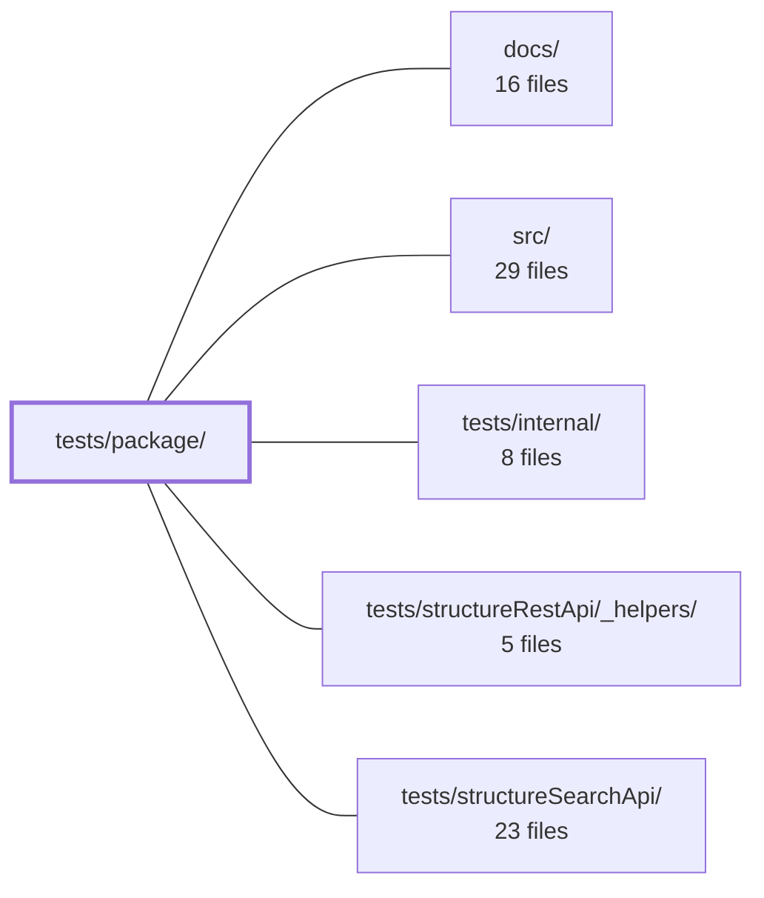

---
tags:
    - 2brain
    - 2brain/module
    - project/vue-toolkit
type: module
module: tests/package/
files: 2
updated: 2026-09-28T23:20:04.302087+00:00
---

# tests/package/

## Purpose

`tests/package/` contains the two guards that verify the **published artifact** is safe for external consumers: that no forbidden dependency leaks into the type surface and that the built `dist` actually works when imported by package name. It sits between the unit-level tests (`tests/internal/`) and real consumer usage, catching failure modes that only appear after a `npm pack` / install in a downstream project.

## Key parts

- **`dtsGuard.mjs`** – Post-build lint over every `.d.ts` under `dist/types/`. Fails the pipeline if a type import references `zod` (an optional peer), Vue internals (`@vue/reactivity`, `@vue/shared`), or any `internal/` path. Prevents silent consumer type-check breakage and API-contract leaks that are invisible until someone installs the package.
- **`smoke.mjs`** – A zero-bundler Node script that `import`s `@guebbit/vue-toolkit` exactly as a consumer would, then asserts (1) the runtime export surface matches the frozen `exports.json` list and (2) two core composables execute and return plausible data against the real `dist` output. Catches packaging / `exports`-map / ESM-CJS interop regressions.

## How it connects

- **`src/`** – The source that is compiled into `dist/`. Both scripts in this module validate _that_ output; any public-API change in `src/` must pass the dts guard and the smoke import before it can ship.
- **`/` (repository root)** – Owns the CI/build pipeline that runs `dtsGuard.mjs` as a post-build step and `smoke.mjs` as a verification task, and holds the `exports.json` contract file that `smoke.mjs` checks against.
- **`tests/internal/`** – Sibling test directory for unit-level coverage of individual modules. `tests/package/` complements it by testing the _packaged_ form rather than the in-repo source.
- **`tests/structureRestApi/`, `tests/structureSearchApi/`** – Sibling directories that exercise specific public API surfaces (REST and search) more deeply; the smoke test here is the lighter, faster gate that runs before those suites.

## Where to start

1. **`smoke.mjs`** – It is short, self-explanatory, and shows the exact consumer-facing contract (package name, expected exports, a real call). Reading it tells you what "done" means for a published build.
2. **`dtsGuard.mjs`** – Once you know what the surface _should_ be, this file shows the rules that keep the surface clean. Skimming its forbidden-import list is enough to understand the invariants you must preserve when touching `src/` types.

## Connected modules

[[vue-toolkit_ROOT|/ (repository root)]] · [[vue-toolkit_docs|docs/]] · [[vue-toolkit_src|src/]] · [[vue-toolkit_tests_internal|tests/internal/]] · [[vue-toolkit_tests_structureRestApi__helpers|tests/structureRestApi/_helpers/]] · [[vue-toolkit_tests_structureSearchApi|tests/structureSearchApi/]]

## Files

- `tests/package/dtsGuard.mjs` — A standalone guard script that scans every published `.d.ts` file under `dist/types/` and fails the build if a forbidden module is imported. It exists because two failure modes are invisible at publish time: `zod` (an optional peer) and `@vue/reactivity`/`@vue/shared` (Vue internals) can silently break a consumer's type-check, and `internal/` modules leaking into the public surface breaks the API contract.
- `tests/package/smoke.mjs` — A plain-Node (no bundler, no ts-jest) smoke test that imports the package **by its own name** (`@guebbit/vue-toolkit`) to load the built `dist` exactly as an external consumer would. It verifies that the public export surface matches the frozen `exports.json` list and that two core composables actually execute and return sensible data against the real build output.

---

[[vue-toolkit_INDEX|← vue-toolkit index]]
