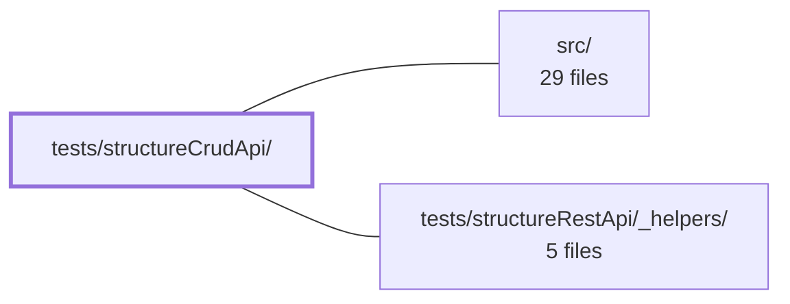

---
tags:
    - 2brain
    - 2brain/module
    - project/vue-toolkit
type: module
module: tests/structureCrudApi/
files: 2
updated: 2026-09-28T23:20:16.005691+00:00
---

# tests/structureCrudApi/

## Purpose

Test suite for the `useStructureCrudApi` composable. It validates the higher-level resource layer that sits above the raw REST/search API: correct delegation, filter-state management, caching behaviour, reset semantics, and error propagation. A dedicated spec also guards a subtle reference-equality invariant between the live and initial filter objects.

## Key parts

- **`core.spec.ts`** — The primary integration spec. Exercises `useStructureCrudApi` end-to-end: search delegation, filter state transitions, cache-hit/miss paths, `resetFilters()` restoring the initial snapshot, and error surfacing through callbacks (rather than silent swallowing).
- **`filters.spec.ts`** — Two focused tests asserting that `filters` and `initialFilters` are _never_ the same object reference. Prevents a class of regression where in-place form edits would mutate the "initial" snapshot, breaking resets or triggering spurious `watchList` search requests.

## How it connects

- **`src/`** — The composable and supporting resource code under test. The specs import `useStructureCrudApi` (and its collaborators) directly from the source tree, so any behaviour change in `src/` is exercised here.
- **`tests/structureRestApi/_helpers/`** — Shared test helpers (mock setup, factory functions, or assertion utilities) defined for the sibling `structureRestApi` suite and reused by the specs in this module to avoid duplication.

## Where to start

1. **`core.spec.ts`** — Read this first; it walks through the composable's public contract in a single, well-structured spec and shows how the test is wired to the source module.
2. **`filters.spec.ts`** — A short, self-contained read that clarifies the filter-reference invariant and why it matters for both `resetFilters()` and reactive search triggers.

## Connected modules

[[vue-toolkit_ROOT|/ (repository root)]] · [[vue-toolkit_src|src/]] · [[vue-toolkit_tests_structureRestApi__helpers|tests/structureRestApi/_helpers/]]

## Files

- `tests/structureCrudApi/core.spec.ts` — Integration-style spec for the `useStructureCrudApi` composable. It verifies that the higher-level resource layer correctly delegates to (and preserves) the underlying search/REST API, manages filter state, honours caching semantics, resets to initial filters, and reports errors through callbacks rather than swallowing them.
- `tests/structureCrudApi/filters.spec.ts` — Verifies the invariant that the live `filters` object and the `initialFilters` object are never the same reference. If they shared an object, in-place form edits would silently corrupt the "initial" state (breaking `resetFilters()`) and typing during `watchList` could produce spurious search requests. The two tests guard against that class of regression.

---

[[vue-toolkit_INDEX|← vue-toolkit index]]
