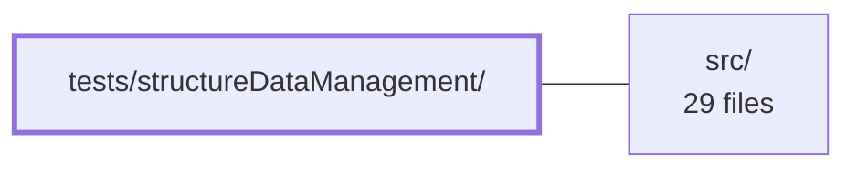

---
tags:
    - 2brain
    - 2brain/module
    - project/vue-toolkit
type: module
module: tests/structureDataManagement/
files: 8
updated: 2026-09-28T23:20:30.056966+00:00
---

# tests/structureDataManagement/

## Purpose

A comprehensive unit-test suite that locks down the observable contract of the `useStructureDataManagement` composable—covering its CRUD surface, pagination, identifier logic, parent–child relation handling, effect-timing guarantees, and dependency-injection boundaries. The tests exist to pin behavior before it reaches application code, so that the composable can be refactored with confidence.

## Key parts

- **Core CRUD & pagination** – `core.spec.ts` exercises the full create/read/update/delete surface, pagination math, selection tracking, and parent–child linking.
- **Edge cases & identifier logic** – `identifiers.spec.ts` targets fallback ID generation, multi-ID composition, create-vs-update semantics, the `create=false` guard, and `deleteRecord` idempotency; `boundaries.spec.ts` pins two specific boundary behaviors (ID generation when all fields are populated, and `pageSize` watcher reactivity).
- **Empty-state contract** – `defaults.spec.ts` verifies that omitting a parent or passing no children always yields empty collections (the `?? []` fallback paths).
- **Effect timing** – `effects.spec.ts` asserts _when_ computeds re-evaluate, guarding against over-eager recomputation and stale values that value-only tests can't catch.
- **Property-based invariants** – `property.spec.ts` uses fast-check to assert invariants across all inputs for five concern areas (ID creation, lookup, pagination, CRUD-vs-Map consistency, relation ops).
- **Store routing (DI boundaries)** – `recordStore.spec.ts` confirms every read/write goes through the injected `IRecordStore` (via jest spies, never internals); `relationStore.spec.ts` does the same for the `IRelationStore` and verifies independent local state when no store is supplied.

## How it connects

- **`src/`** – Every spec file imports `useStructureDataManagement` (and its interfaces `IRecordStore` / `IRelationStore`) from the source tree under `src/`. The tests are the behavioral contract that constrains implementation changes in that directory.
- **`/` (repository root)** – The suite relies on the root-level Jest configuration (test runner, module resolution, and fast-check setup) to execute. No further runtime coupling exists.

## Where to start

1. **`core.spec.ts`** – It walks the composable's full CRUD, pagination, and relation surface in one read, giving the broadest mental model of what the module under test is supposed to do.
2. **`recordStore.spec.ts`** – Reading this second clarifies the dependency-injection boundary: once you see how the composable talks to an `IRecordStore` through spies, the rest of the suite's assertions (defaults, identifiers, relations) make sense as special cases of that same contract.

## Connected modules

[[vue-toolkit_ROOT|/ (repository root)]] · [[vue-toolkit_src|src/]]

## Files

- `tests/structureDataManagement/boundaries.spec.ts` — Unit tests that pin down two boundary behaviors of the `useStructureDataManagement` composable: identifier generation when all expected fields are already populated, and the reactivity contract of `pageSize` (watchers should fire only on an actual value change).
- `tests/structureDataManagement/core.spec.ts` — Unit-test suite for the `useStructureDataManagement` composable. Exercises the full CRUD surface, pagination logic, selection tracking, and parent–child linking to lock down expected behavior before it reaches application code.
- `tests/structureDataManagement/defaults.spec.ts` — Verifies the "empty defaults" contract of `useStructureDataManagement`: when a parent has no stored children (or the argument is omitted entirely), every accessor and mutator returns an empty collection rather than creating a phantom entry. The suite isolates the `?? []` fallback paths inside the composable.
- `tests/structureDataManagement/effects.spec.ts` — Tests the **effect-timing contract** of `useStructureDataManagement` — i.e., _when_ its computeds re-evaluate, not _what_ they return. It guards against both over-eager recomputation (causing unnecessary re-renders) and stale values (causing wrong UI), regressions that value-only tests in `structureDataManagement.spec.ts` cannot catch.
- `tests/structureDataManagement/identifiers.spec.ts` — Unit tests for the edge-case branches of `useStructureDataManagement` that a happy-path suite would skip: fallback identifier generation (and its write-back onto the item), multi-identifier composition, `editRecord`/`editRecords` create-vs-update semantics, the `create=false` guard, and `deleteRecord` idempotency.
- `tests/structureDataManagement/property.spec.ts` — Property-based test suite (fast-check) for the `useStructureDataManagement` composable. Rather than hand-picked examples, it asserts invariants that must hold for _all_ inputs across five concern areas: single and composite identifier creation, ID-based record lookup, client-side pagination, CRUD sequence consistency against a plain `Map`, and parent/child relation operations.
- `tests/structureDataManagement/recordStore.spec.ts` — Tests that `useStructureDataManagement` routes every read and write exclusively through the injected `IRecordStore` instance, and that it never reaches into the store's internals. Each assertion checks _what the composable tells the store to do_ (via jest spies) rather than asserting on freshness or REST-layer semantics.
- `tests/structureDataManagement/relationStore.spec.ts` — Verifies the 4th parameter of `useStructureDataManagement` — the `IRelationStore` that mediates parent/child link reads and writes. Confirms that (a) all dictionary reads and writes are routed through the supplied store, and (b) when no store is passed, each composable instance builds its own independent local relation state.

---

[[vue-toolkit_INDEX|← vue-toolkit index]]
