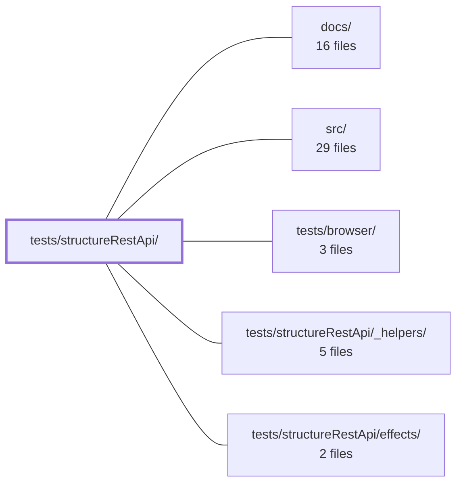

---
tags:
    - 2brain
    - 2brain/module
    - project/vue-toolkit
type: module
module: tests/structureRestApi/
files: 2
updated: 2026-09-28T23:20:43.781642+00:00
---

# tests/structureRestApi/

## Purpose

Test suite for the `useStructureRestApi` composable (implemented in `src/composables/structureRestApi.ts`). It verifies both that the REST-API layer behaves correctly structurally and that its caching mechanism returns accurate data—not merely that network calls were skipped.

## Key parts

- **`README.md`** – Documents the scope and intent of the test directory.
- **`served-value.spec.ts`** – Asserts the actual item values (e.g. the `role` field) returned on cache hits and refetches, catching caches that serve stale or garbage data while still passing simpler call-count assertions.
- **`_helpers/`** _(subdirectory)_ – Shared test utilities and fixtures used across the specs in this module.
- **`effects/`** _(subdirectory)_ – Specs focused on side-effect behaviour of the composable, complementing the data-correctness checks in the top-level spec files.

## How it connects

- **`src/`** – The composable under test (`src/composables/structureRestApi.ts`) is the production code these specs exercise.
- **`tests/structureRestApi/_helpers/`** – Provides the mock/setup helpers that specs in this directory import.
- **`tests/structureRestApi/effects/`** – Sibling specs covering effect-level concerns of the same composable.
- **`tests/browser/`** – A parallel test directory in the same top-level `tests/` tree; together they cover different integration surfaces of the application.
- **Repository root / `docs/`** – Contextual references for conventions and project documentation the tests follow.

## Where to start

1. **`README.md`** – one quick read to understand what the suite covers and why it exists.
2. **`served-value.spec.ts`** – the most instructive spec: it shows the testing philosophy (pin real data values, not just call counts) and the helper patterns you'll reuse when adding or extending tests.

## Connected modules

[[vue-toolkit_ROOT|/ (repository root)]] · [[vue-toolkit_docs|docs/]] · [[vue-toolkit_src|src/]] · [[vue-toolkit_tests_browser|tests/browser/]] · [[vue-toolkit_tests_structureRestApi__helpers|tests/structureRestApi/_helpers/]] · [[vue-toolkit_tests_structureRestApi_effects|tests/structureRestApi/effects/]]

## Files

- `tests/structureRestApi/README.md` — Tests for `useStructureRestApi` (`src/composables/structureRestApi.ts`, implemented under
- `tests/structureRestApi/served-value.spec.ts` — Verifies that the composable cache returns the **correct data** on cache hits and refetches, not merely that network calls were skipped. While other specs in this directory assert `mock.not.toHaveBeenCalled()`, this file pins the actual item values (e.g. `role` field) to catch a cache that would serve stale or garbage data while still passing call-count assertions.

---

[[vue-toolkit_INDEX|← vue-toolkit index]]
