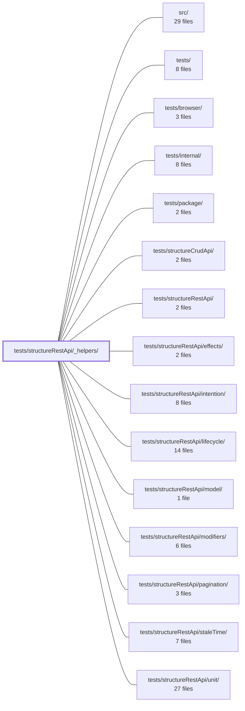

---
tags:
    - 2brain
    - 2brain/module
    - project/vue-toolkit
type: module
module: tests/structureRestApi/_helpers/
files: 5
updated: 2026-09-28T23:21:01.501959+00:00
---

# tests/structureRestApi/_helpers/

## Purpose

Shared test infrastructure for the `structureRestApi` spec suite. This module provides the fake network layer, fixture data, deterministic clock, and lifecycle harness that every sub-directory of specs (effects, intention, lifecycle, model, modifiers, pagination, staleTime, unit) imports so they can run without a real server or wall-clock timing.

## Key parts

- **Network simulation** — `fakeApi.ts` supplies lightweight `jest.fn`-based `apiCall` stubs for unit-level specs that only need to assert call counts and resolution values. `fakeServer.ts` is a stateful, in-memory REST server (Map-backed store with CRUD, search, and pagination) used by the `intention` scenario specs; it returns `() => Promise` thunks matching the `apiCall` contract and exposes a `calls` counter so tests can verify whether a request was actually issued.
- **Fixture data** — `fixtures.ts` defines the shared entity types and factory functions every spec uses to build predictable payloads. It is a plain module (not `*.spec.ts`) so Jest's `testMatch` pattern skips it during collection.
- **Lifecycle & teardown** — `harness.ts` provides composable factory helpers, a shared-instance registry, and a single `clearAllInstances()` call that tears down Vue effect scopes, TanStack Query listeners, and injected query clients. Every spec in the suite calls `afterEach(clearAllInstances)` to prevent cross-test leaks.
- **Deterministic time** — `time.ts` wraps Jest's fake-timer APIs with a fixed base timestamp and an async-advance helper, giving the `staleTime` and concurrency specs a flake-free way to cross `staleTime` windows.

## How it connects

- **`tests/structureRestApi/` (parent)** — This directory _is_ the `_helpers/` sub-folder; all sibling spec directories import from it.
- **Spec sub-directories** (`effects/`, `intention/`, `lifecycle/`, `model/`, `modifiers/`, `pagination/`, `staleTime/`, `unit/`) — Each consumes a subset of the helpers. `intention/` relies on `fakeServer.ts`; `staleTime/` relies on `time.ts`; the remaining suites use `fakeApi.ts` and `harness.ts`.
- **`src/`** — The `apiCall` contract that `fakeApi.ts` and `fakeServer.ts` simulate is defined in the application source; the helpers must stay in sync with that interface.

## Where to start

1. **`harness.ts`** — Understanding the factory/registry pattern and the `clearAllInstances` teardown contract makes the setup in every other spec file immediately readable.
2. **`fakeApi.ts`** — The simplest entry point into the mocked network layer; once you see how `apiCall` is shaped, reading `fakeServer.ts` and the `intention/` specs becomes straightforward.

## Connected modules

[[vue-toolkit_ROOT|/ (repository root)]] · [[vue-toolkit_src|src/]] · [[vue-toolkit_tests|tests/]] · [[vue-toolkit_tests_browser|tests/browser/]] · [[vue-toolkit_tests_internal|tests/internal/]] · [[vue-toolkit_tests_package|tests/package/]] · [[vue-toolkit_tests_structureCrudApi|tests/structureCrudApi/]] · [[vue-toolkit_tests_structureRestApi|tests/structureRestApi/]] · [[vue-toolkit_tests_structureRestApi_effects|tests/structureRestApi/effects/]] · [[vue-toolkit_tests_structureRestApi_intention|tests/structureRestApi/intention/]] · [[vue-toolkit_tests_structureRestApi_lifecycle|tests/structureRestApi/lifecycle/]] · [[vue-toolkit_tests_structureRestApi_model|tests/structureRestApi/model/]] · [[vue-toolkit_tests_structureRestApi_modifiers|tests/structureRestApi/modifiers/]] · [[vue-toolkit_tests_structureRestApi_pagination|tests/structureRestApi/pagination/]] · [[vue-toolkit_tests_structureRestApi_staleTime|tests/structureRestApi/staleTime/]] · … and 2 more

## Files

- `tests/structureRestApi/_helpers/fakeApi.ts` — Provides reusable fake `apiCall` implementations (all `jest.fn`-based) for the `structureRestApi` test suite. Each helper simulates a server round-trip so specs can assert call counts, control resolution timing, and verify data replacement without a real network.
- `tests/structureRestApi/_helpers/fakeServer.ts` — A stateful, in-memory REST server stub for the "intention" scenario specs. It simulates full CRUD plus search/pagination over a `Map`-backed store, returns `() => Promise` thunks that conform to the `apiCall` contract the code under test expects, and records every hit in a `calls` counter so tests can assert whether the network was (or was not) touched.
- `tests/structureRestApi/_helpers/fixtures.ts` — Shared type definitions and entity-factory helpers for the `structureRestApi` integration test suite. Exists as a plain (non-spec) module so Jest's `testMatch` pattern skips it, while giving every spec a consistent, predictable set of fixture data to build assertions against.
- `tests/structureRestApi/_helpers/harness.ts` — Test-harness module for the `structureRestApi` spec suite. It provides composable factories, a shared-instance registry, and a uniform teardown (`clearAllInstances`) so that Vue effect scopes, TanStack Query listeners, and injected query clients are deterministically torn down between tests. Every spec in this directory calls `afterEach(clearAllInstances)` to prevent cross-test leaks.
- `tests/structureRestApi/_helpers/time.ts` — A small fake-clock utility module for the `structureRestApi` staleTime and concurrency test suites. It wraps Jest's timer APIs with a fixed base timestamp and an async-advance helper so that specs can deterministically travel past `staleTime` windows without flakiness. It lives in `_helpers/` (not a `*.spec.ts`) so Jest's `testMatch` pattern skips it.

---

[[vue-toolkit_INDEX|← vue-toolkit index]]
