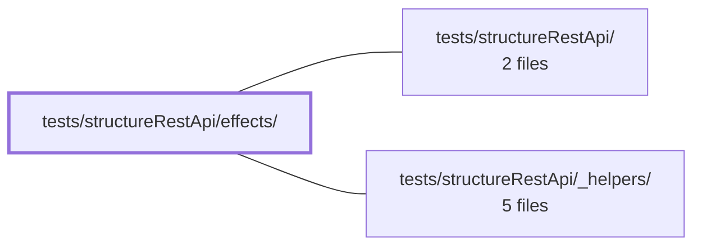

---
tags:
    - 2brain
    - 2brain/module
    - project/vue-toolkit
type: module
module: tests/structureRestApi/effects/
files: 2
updated: 2026-09-28T23:21:14.118719+00:00
---

# tests/structureRestApi/effects/

## Purpose

This module contains focused spec files that verify the `isLoading()` effect of the `structureRestApi` composable. It locks down two contracts: every fetch/mutate method must correctly toggle the loading flag, and concurrent requests must not cause the flag to flicker. Together they guard the loading-state semantics against regressions as the composable evolves.

## Key parts

- **`loading-per-method.spec.ts`** – A single table-driven spec that iterates over all 12 fetch and mutate methods on the composable and asserts the identical contract: `isLoading()` returns `true` while the request is in flight and `false` once it settles. Adding a new method without loading support fails immediately in this loop.
- **`loading-stability.spec.ts`** – Verifies that `isLoading()` emits exactly one `false→true→false` transition even when multiple fetches, mutations, or a mix overlap in time. It protects against a naive per-request boolean toggle that would drop to `false` prematurely. The test relies on TanStack Query's `isFetching()` / `isMutating()` counters as the single source of truth.

## How it connects

- **`tests/structureRestApi/`** – The parent test directory for the composable. This module is a sub-area within it, scoped specifically to the loading effect rather than to data shape or error handling.
- **`tests/structureRestApi/_helpers/`** – Shared fixtures, mocks, and setup utilities that these specs import to wire up the composable and simulate in-flight/settled requests.
- **`/` (repository root)** – Provides the actual `structureRestApi` composable (and its underlying TanStack Query wiring) that these tests exercise.

## Where to start

Read **`loading-per-method.spec.ts`** first: its parameterized table makes the full 12-method contract visible in one pass and shows how the composable is set up for testing. Then move to **`loading-stability.spec.ts`** to see how the same flag behaves under concurrency and why the TanStack Query counters are the authoritative signal.

## Connected modules

[[vue-toolkit_ROOT|/ (repository root)]] · [[vue-toolkit_tests_structureRestApi|tests/structureRestApi/]] · [[vue-toolkit_tests_structureRestApi__helpers|tests/structureRestApi/_helpers/]]

## Files

- `tests/structureRestApi/effects/loading-per-method.spec.ts` — Table-driven spec that asserts every fetch and mutate method on the composable correctly drives `isLoading()` — `true` while the request is in flight, `false` once it settles. It holds all 12 methods to the identical loading-state contract in a single parameterized loop, so adding a new method without loading support would immediately surface a failure.
- `tests/structureRestApi/effects/loading-stability.spec.ts` — Verifies that `isLoading()` produces exactly one `false→true→false` cycle under concurrent, overlapping requests (fetches, mutations, or a mix). It guards against a regression where a naive per-request boolean toggle would flicker off when the first request resolves while others are still in flight. The test relies on TanStack Query's `isFetching()`/`isMutating()` counters as the single source of truth.

---

[[vue-toolkit_INDEX|← vue-toolkit index]]
