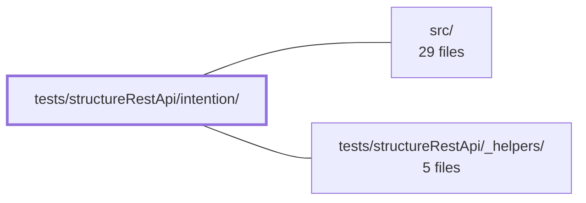

---
tags:
    - 2brain
    - 2brain/module
    - project/vue-toolkit
type: module
module: tests/structureRestApi/intention/
files: 8
updated: 2026-09-28T23:21:43.008288+00:00
---

# tests/structureRestApi/intention/

## Purpose

This module contains the **intention-layer** test suite for the structure REST API. Rather than testing individual endpoints or utility functions, every spec here asserts a _design contract_ the INTENTION layer is supposed to honor—cache-seeding between methods, invalidation semantics, resource isolation, optimistic-rollback behavior, and parent-relation invariants. The suite collectively pins the observable behavior of the cache/invalidation architecture so that refactors in `src/` cannot silently change how data flows between producers, consumers, and watchers.

## Key parts

- **Cache-seeding & sharing** — `cross-method-cache.spec.ts` proves that every producer method writes into the shared per-item cache; `shared-client.spec.ts` confirms that two composables on one `QueryClient` either share a bucket (same `resourceKey`) or stay namespaced apart (different keys); `resource-isolation.spec.ts` guards the boundary so no subscription, scan, or reset leaks across resources.
- **Invalidation & refetch** — `invalidation-refetch.spec.ts` asserts that an _active_ `watch*` subscription issues a genuine second API call on `invalidateQueries`; `list-invalidation.spec.ts` pins which cache entries (list, paginate, parent) go stale after create/update/delete while non-list entries stay fresh.
- **Full lifecycle & regressions** — `crud-lifecycle.spec.ts` walks the entire entity lifecycle against a stateful fake server, asserting both store state and exact round-trip counts (including optimistic rollback on server rejection); `deep-scan-regressions.spec.ts` encodes each race-condition or ordering bug found in the 5.0 deep-scan as an independent `it` block so re-introduction fails immediately.
- **Parent relations** — `parent-relations.spec.ts` covers `belongsTo`/`hasMany` semantics: per-parent tracking, de-duplication on refetch, unlink/move without mutating records, and server-specified child order.

## How it connects

- **`src/`** — Every spec in this directory imports the INTENTION-layer composables and query-client wiring from `src/`. The tests do not re-implement any caching logic; they drive the public API surface that `src/` exposes and assert on observable side-effects (network call counts, store snapshots, watch subscriptions).
- **`tests/structureRestApi/_helpers/`** — Shared fixtures (fake REST server setup, factory helpers for resources, `resourceKey` generators, and assertion utilities) live here and are consumed by nearly every spec in this module, keeping the test bodies focused on _what_ is being verified rather than _how_ the environment is wired.
- **Repository root** — Global test configuration (Vitest/Jest runner options, module resolution, path aliases for `src/`) is defined at the root and inherited by this suite.

## Where to start

1. **`crud-lifecycle.spec.ts`** — It is the most self-contained narrative: list → detail → update → create → delete, with explicit round-trip assertions and an optimistic-rollback branch. Reading it once gives you the mental model of the producer/consumer/invalidation flow that every other spec in this directory builds on.
2. **`cross-method-cache.spec.ts`** — Short and narrowly scoped, it isolates the single most important invariant (producers seed the cache, consumers read from it) without the surrounding lifecycle noise, making it an easy second read to lock in the contract.

## Connected modules

[[vue-toolkit_ROOT|/ (repository root)]] · [[vue-toolkit_src|src/]] · [[vue-toolkit_tests_structureRestApi__helpers|tests/structureRestApi/_helpers/]]

## Files

- `tests/structureRestApi/intention/cross-method-cache.spec.ts` — Verifies the cross-method cache-seeding contract: any "producer" method (fetchAll, fetchByParent, createTarget, updateTarget) writes items into the shared per-item target cache, so a later `fetchTarget` or `fetchMultiple` for those IDs resolves from cache without invoking the network. The final test additionally pins the return-value guarantee—that a warm `fetchTarget` returns the exact item a producer stored.
- `tests/structureRestApi/intention/crud-lifecycle.spec.ts` — End-to-end test that exercises the full entity lifecycle (list → detail → update → create → delete → verify-gone) against a stateful fake REST server. It asserts **both** the local store state and the exact number of server round-trips at each step, verifying that the cache layer eliminates redundant GETs. A second branch covers optimistic rollback when the server rejects an update or delete.
- `tests/structureRestApi/intention/deep-scan-regressions.spec.ts` — Regression guard suite for defects identified during the 5.0 deep-scan of the structure CRUD layer. Each `it` block encodes one specific race-condition or ordering bug (stale writes resurrecting deletes, cancelled reads settling watchers, cross-scope writes, etc.) so that a re-introduction of any of those defects fails the suite immediately.
- `tests/structureRestApi/intention/invalidation-refetch.spec.ts` — Verifies a core design intention: an **active** `watch*` subscription genuinely **refetches** (issues a second API call) when `queryClient.invalidateQueries` fires for its resource key — rather than merely marking data stale and waiting for the next manual refetch. This ensures that create/update/delete mutations on the same resource, or invalidation from another store sharing the same `queryClient`, automatically refresh a screen that is currently open, with no imperative refetch call.
- `tests/structureRestApi/intention/list-invalidation.spec.ts` — Pins the invalidation predicate for list-shaped cache entries: a `createTarget`, `updateTarget`, or `deleteTarget` must mark all / paginate / parent caches stale so the next fetch re-hits the server, while non-list caches (e.g. `fetchAny`) remain fresh. Search-query invalidation is intentionally out of scope (covered in `tests/structureSearchApi/intention/mutation-invalidation.spec.ts`).
- `tests/structureRestApi/intention/parent-relations.spec.ts` — Integration tests for the INTENTION layer's `belongsTo`/`hasMany` parent-relation API. Verifies that children fetched per parent are tracked in isolation, de-duplicated on refetch, unlinkable/movable without mutating the underlying records, and that server-specified child order is preserved.
- `tests/structureRestApi/intention/resource-isolation.spec.ts` — Verifies that two resources sharing a single `QueryClient` stay fully isolated from each other. Every mechanism that scopes by `resourceKey`—list views, parent/child links, loading state, invalidation, resets, and `dependsOn` teardown—is proven to respect the boundary. The file targets the class of bugs that single-resource tests cannot catch: a subscription or scan that forgets to filter by `resourceKey` would pass if nothing else is in the client.
- `tests/structureRestApi/intention/shared-client.spec.ts` — Verifies the cache-sharing semantics when two composables share a single `QueryClient`. It asserts that identical `resourceKey` values cause cache buckets to be shared (one fetch warms the other), while differing `resourceKey` values namespace them apart even on the same client instance.

---

[[vue-toolkit_INDEX|← vue-toolkit index]]
