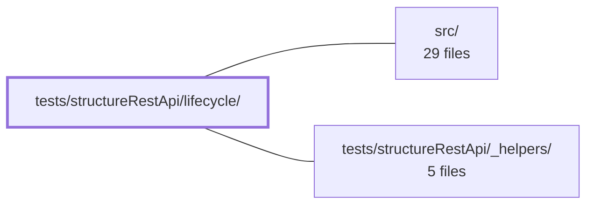

---
tags:
    - 2brain
    - 2brain/module
    - project/vue-toolkit
type: module
module: tests/structureRestApi/lifecycle/
files: 14
updated: 2026-09-28T23:22:01.648385+00:00
---

# tests/structureRestApi/lifecycle/

## Purpose

Spec suite covering every lifecycle behaviour of the `useStructureRestApi` composable: how it starts and tears down within a Vue effect scope, how it reacts when the `dependsOn` reactive value changes, how it enforces the `maxRecords` cache bound, how it guards against stale writes from cancelled contexts, how it integrates with Pinia setup stores, and how its read-only record view stays in lock-step with the shared `QueryClient`.

## Key parts

- **Scope-change & late-write guards** — `dependsOn.spec.ts`, `lateWrite.spec.ts`, `lateRollback.spec.ts`, `multiInstanceScope.spec.ts`. Together they lock in the contract that a `dependsOn` transition cancels and removes the old context's queries/records, that in-flight responses from the old context cannot write back, that rollback mutations obey the same rule, and that two live instances under different scopes don't evict each other.
- **maxRecords bound** — `maxRecords.spec.ts` (wipe-before-store, boundary conditions, interaction with lists and watchers), `maxRecords-crossing.spec.ts` (a single fetch that exceeds the cap must survive the scope wipe it triggers), `maxRecords-protection.spec.ts` (what the wipe must leave alone: aliases, watched targets, in-flight queries, scope isolation, `bound ≤ 0`).
- **Mutation races** — `mutationRace.spec.ts`. Full matrix of in-flight mutations racing concurrent reads, cross-instance visibility through a shared `QueryClient`, and two same-tick mutations on one id (rollback-to-snapshot, newer-mutation-wins).
- **Vue effect-scope contract** — `scope.spec.ts` (stopping the scope freezes the composable's reactive view without clearing the caller's `QueryClient`; composable also works scope-less) and `noScopeWarning.spec.ts` (deduped `console.warn` when instantiated outside an active scope).
- **View & hydration invariants** — `view.spec.ts` (the record view is a live, read-only projection of the `QueryClient`, not a separate copy) and `hydration.spec.ts` (persisted cache restored via `hydrate()` correctly propagates into `getRecord` / `itemList` despite `added`-only cache events).
- **Watched-removal safety** — `watchedRemoval.spec.ts` (reset/delete paths preserve watcher attachment so subsequent refetches still fire).
- **Pinia integration** — `piniaSetupStoreInjection.spec.ts` (composable resolves `QueryClient` via `inject()` both inside a component and outside via `app.runWithContext`; guards the `pinia >= 2.1` peer-dependency floor).

## How it connects

- **`src/`** — every spec here imports the composable and its supporting types directly from the source tree; the tests exist to pin the behavioural contract of that implementation.
- **`tests/structureRestApi/_helpers/`** — shared fixtures (mock `QueryClient` factories, reactive `dependsOn` helpers, assertion utilities) used across all lifecycle specs to avoid duplication.
- **Repository root** — Vitest / TypeScript configuration that determines how this directory is discovered and executed.

## Where to start

Read **`scope.spec.ts`** first: it establishes the single most foundational contract (the composable's relationship to the Vue effect scope and the caller-owned `QueryClient`) that nearly every other spec builds on. Then read **`view.spec.ts`**, which states the core design invariant — the record view is a live, read-only projection, not a copy — and explains _why_ the late-write, hydration, and watched-removal specs exist.

## Connected modules

[[vue-toolkit_ROOT|/ (repository root)]] · [[vue-toolkit_src|src/]] · [[vue-toolkit_tests_structureRestApi__helpers|tests/structureRestApi/_helpers/]]

## Files

- `tests/structureRestApi/lifecycle/dependsOn.spec.ts` — Spec for the `dependsOn` lifecycle option: verifies that changing the reactive value a resource depends on tears down (cancels + removes) all queries and records from the old context, that a new fetch starts clean, that active watchers re-fetch autonomously on change, and that late answers from the old context cannot clobber the new one.
- `tests/structureRestApi/lifecycle/hydration.spec.ts` — Verifies that `@tanstack/vue-query`'s `hydrate()` — the mechanism `persistQueryClient` uses to restore a cached state on app boot — correctly propagates data into the view layer (`getRecord`, `itemList`). It guards against a subtle bug where hydrated entries only fire an `added` cache event (never `updated`/`success`), and the record view's computed dictionary depends on a data counter that must increment on `added` events to avoid staying stale.
- `tests/structureRestApi/lifecycle/lateRollback.spec.ts` — Tests the late-write guard applied to **rollback** operations in the composable. The core rule under test: a rollback (restore-on-failure) is itself a write, so it must be discarded if `dependsOn` has changed before the in-flight mutation settles — otherwise the previous user's data would leak into the next user's view. Also covers optimistic-create placeholders and non-record API responses under the same guard.
- `tests/structureRestApi/lifecycle/lateWrite.spec.ts` — Verifies the **late-write guard**: a network response that resolves _after_ `dependsOn` has already changed must not write any data under the old context. Without this guard, a late write would silently resurrect queries that the `dependsOn` watcher already cancelled and removed, leaking stale data into memory.
- `tests/structureRestApi/lifecycle/maxRecords-crossing.spec.ts` — Verifies the lifecycle behavior when a single fetch exceeds the composable's `maxRecords` bound: the crossing write must survive the scope wipe it triggers, and only _new_ records count toward the bound. Without this guarantee the triggering call would cancel itself and resolve `[]` with an empty cache.
- `tests/structureRestApi/lifecycle/maxRecords-protection.spec.ts` — Complements `maxRecords.spec.ts` (which proves the bound _evicts_) by pinning the other half: what a wipe must leave alone. It locks in the invariants that alias entries don't count toward the bound, watched lists/targets and their backing records survive, in-flight queries are spared, scope isolation holds, and a bound ≤ 0 means "no bound."
- `tests/structureRestApi/lifecycle/maxRecords.spec.ts` — Tests the `maxRecords` lifecycle rule: a hard cap on how many records a resource keeps cached. Verifies the wipe-before-store backstop, its boundary conditions, its interaction with list caches, and its interaction with active watchers (`watchTarget`, `watchAll`).
- `tests/structureRestApi/lifecycle/multiInstanceScope.spec.ts` — Verifies that when two live instances share the same `resourceKey` (but sit under different `dependsOn` scopes), neither instance's start-up sweep nor its own scope-change drop accidentally evicts the other instance's cached data. It guards the "compare two shops side-by-side" and "master/detail on one scope" patterns described in the header comment.
- `tests/structureRestApi/lifecycle/mutationRace.spec.ts` — Verifies that in-flight mutations (`updateTarget`, `deleteTarget`) never corrupt the state produced by concurrent reads (`fetchAll`, `fetchTarget`, `fetchMultiple`) and vice-versa. Covers the full matrix of races: a mutation racing a scope-wide read, a by-id read racing the same record's mutation, cross-instance visibility via a shared `QueryClient`, and two same-tick mutations on one id (including rollback-to-snapshot and newer-mutation-wins ordering).
- `tests/structureRestApi/lifecycle/noScopeWarning.spec.ts` — Verifies the lifecycle contract that `useStructureRestApi` must emit a single `console.warn` (deduped per `resourceKey`) when instantiated outside an active effect scope, and must stay silent when instantiated inside one. The warning exists because, without a scope, the resource's `onScopeDispose` subscriptions (activity tracking, registry claim) are never torn down and leak for the QueryClient's lifetime with no caller-facing handle.
- `tests/structureRestApi/lifecycle/piniaSetupStoreInjection.spec.ts` — Verifies that `useStructureRestApi`, when called from inside a Pinia **setup-style** store, resolves its `QueryClient` via Vue's `inject()` mechanism in both supported lifecycle contexts: (1) within a mounted component's `setup()`, and (2) outside any component (e.g. from a router guard), where Pinia ≥ 2.1's `app.runWithContext` wrapper is required. It exists to guard the `pinia@>=2.1` peer-dependency floor.
- `tests/structureRestApi/lifecycle/scope.spec.ts` — Verifies the Vue effect-scope lifecycle contract of `useStructureRestApi`: stopping the owning scope freezes the composable's reactive view (unsubscribes its `QueryCache` listeners) without clearing the caller-owned `QueryClient`, and ensures the composable still functions when created outside any scope.
- `tests/structureRestApi/lifecycle/view.spec.ts` — Validates the core design invariant that the composable's record view is a _live, read-only projection_ of the shared `QueryClient` rather than a separate copy. Every test bypasses the composable's public API and mutates the `QueryClient` directly (or from a second instance), then asserts the view reflects the change. A second group of tests confirms that Vue's `readonly()` enforces immutability on both individual records and the dictionary object.
- `tests/structureRestApi/lifecycle/watchedRemoval.spec.ts` — Verifies that removing or resetting watched queries never strands their watcher. Because TanStack Query does not notify an observer when its query leaves the cache, the composable resets queries in place rather than deleting them. These tests confirm that `resetAll`, `resetRecords`, and a failed `deleteTarget` all preserve the watcher attachment so subsequent invalidation or refetch still fires.

---

[[vue-toolkit_INDEX|← vue-toolkit index]]
