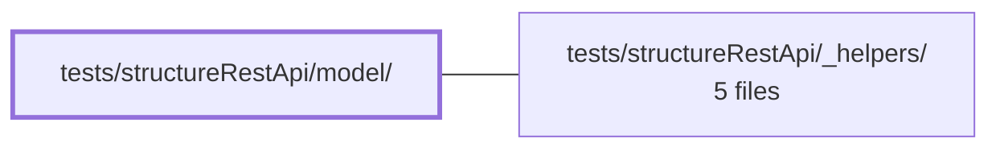

---
tags:
    - 2brain
    - 2brain/module
    - project/vue-toolkit
type: module
module: tests/structureRestApi/model/
files: 1
updated: 2026-09-28T23:22:11.045655+00:00
---

# tests/structureRestApi/model/

## Purpose

This module provides property-based (randomised) tests for the structure REST API model layer. It validates that cache and integrity invariants hold after arbitrarily generated sequences of API commands—reads, mutations, resets, and scope switches—by controlling settlement order with `fast-check`'s scheduler instead of real timers.

## Key parts

- **`commandSequence.property.spec.ts`** — The sole spec in this directory. It generates random command sequences (up to 15 steps) and asserts that cache/integrity invariants survive every interleaving. By using `fc.scheduler` to control when each promise settles, it generalises the hand-written race-condition specs (`lateWrite`, `lateRollback`, `dependsOn`) into many generated orderings.

## How it connects

- **`tests/structureRestApi/_helpers/`** — Supplies the shared test utilities (command builders, invariant assertions, scheduler wrappers, and model fixtures) that the spec imports to construct random sequences and check post-conditions.
- **`/` (repository root)** — Houses the production model code under test and any shared `fast-check` or test-runner configuration that the spec relies on.

## Where to start

Read `commandSequence.property.spec.ts` first—it is the only file here and defines the invariant set, the command alphabet, and the scheduling strategy in one place. If the helper names are unfamiliar, glance at `tests/structureRestApi/_helpers/` to see how commands are constructed and how invariants are asserted.

## Connected modules

[[vue-toolkit_ROOT|/ (repository root)]] · [[vue-toolkit_tests_structureRestApi__helpers|tests/structureRestApi/_helpers/]]

## Files

- `tests/structureRestApi/model/commandSequence.property.spec.ts` — Property-based test that generates random sequences of up to 15 API commands (reads, mutations, resets, scope switches) and asserts a set of cache/integrity invariants hold after every sequence settles. Settlement order is controlled by `fast-check`'s `fc.scheduler` rather than real timers, generalising the hand-written race specs (`lateWrite`, `lateRollback`, `dependsOn`) into many generated interleavings.

---

[[vue-toolkit_INDEX|← vue-toolkit index]]
