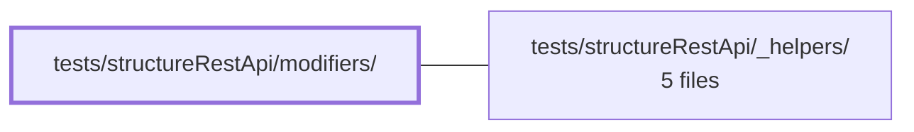

---
tags:
    - 2brain
    - 2brain/module
    - project/vue-toolkit
type: module
module: tests/structureRestApi/modifiers/
files: 6
updated: 2026-09-28T23:22:26.796251+00:00
---

# tests/structureRestApi/modifiers/

## Purpose

This module holds the spec suite for the **modifier options** on the structure REST API composable. Each spec pins down the contract of one modifier (`forced`, `isLoading`, `merge`, `partial`, and the partial-invalidation invariant) so that a future refactor cannot silently change how cached data is refreshed, merged, or flagged.

## Key parts

- **Forced refresh** — `forced.spec.ts` verifies that `forced: true` bypasses a still-fresh cache entry and, critically, _joins_ an in-flight request rather than firing a duplicate.
- **Loading state** — `loading.spec.ts` confirms `isLoading()` resets to `false` on rejection and behaves as a concurrent-fetch counter (one in-flight resolution must not clear state while another is pending).
- **Merge on record-target queries** — `merge-target.spec.ts` checks that `fetchTarget` / `watchTarget` with `merge: true` enriches the stored record, and that the resolved value is the merged record (not the raw payload) so TanStack writes the correct value back under the cache key.
- **Merge across all four mutations** — `merge.spec.ts` exercises the same enrich-vs-replace contract on `fetchAll`, `fetchTarget`, `fetchByParent`, and `updateTarget`, pairing each with a default-behavior (full replacement) case.
- **Partial list writes** — `partial.spec.ts` verifies that `partial: true` on `fetchAll` / `fetchByParent` merges partial payloads and does _not_ stamp records as "just fetched," keeping new-to-cache records stale.
- **Partial invalidation invariant** — `partial-invalidation.spec.ts` guards against a TanStack `setQueryData` side-effect: a local write must not clear a record's "invalidated" flag; only a full server fetch restores freshness.

## How it connects

- **Repository root (`/`)** — every spec in this directory imports the structure REST API composable from the main source tree. The specs are the behavioral contract for that composable's modifier surface; a change to the composable without updating these specs signals a contract violation.
- **`tests/structureRestApi/_helpers/`** — provides shared test utilities (mock API server setup, cache-state inspectors, request-interception helpers) that all six specs rely on to drive the composable in a deterministic, isolated environment.

## Where to start

Read **`merge.spec.ts`** first: it touches all four data-mutating operations and explicitly contrasts merge vs. replace, giving you a complete map of the composable's mutation surface in one file. Then read **`forced.spec.ts`** — it is short, self-contained, and illustrates the two caching invariants (bypass-fresh, join-in-flight) that every other modifier builds on top of.

## Connected modules

[[vue-toolkit_ROOT|/ (repository root)]] · [[vue-toolkit_tests_structureRestApi__helpers|tests/structureRestApi/_helpers/]]

## Files

- `tests/structureRestApi/modifiers/forced.spec.ts` — Tests the `forced: true` modifier option across every cached fetch method of the composable. Verifies two contracts: (1) a forced call bypasses a still-fresh cache entry and issues a new API call, and (2) a forced call **joins** an in-flight request for the same data rather than firing a second one.
- `tests/structureRestApi/modifiers/loading.spec.ts` — Verifies the `isLoading()` modifier's behaviour in two edge cases: (1) it must reset to `false` even when the underlying API call rejects, and (2) it must act as an in-flight **counter** (like TanStack Query's `isFetching()`/`isMutating()`) so that one concurrent fetch resolving does not clear the state while another is still pending.
- `tests/structureRestApi/modifiers/merge-target.spec.ts` — Verifies that the `merge: true` modifier on record-target queries (`fetchTarget`, `watchTarget`) merges a partial API response into the existing stored record instead of replacing it. It also confirms the default (no-merge) behavior is a full replacement. The critical invariant under test: the query's resolved value must be the _merged_ record, because TanStack writes that value back under the same key — resolving with the raw response would silently undo the merge.
- `tests/structureRestApi/modifiers/merge.spec.ts` — Verifies the `merge` modifier on the structure REST API composable. When `merge: true` is supplied, the stored record should be _enriched_ (fields absent from the server response are kept) rather than _replaced_. The spec exercises this contract across all four data-mutating operations: `fetchAll`, `fetchTarget`, `fetchByParent`, and `updateTarget`, and contrasts each with the default (non-merge) replace behavior.
- `tests/structureRestApi/modifiers/partial-invalidation.spec.ts` — Verifies the MODIFIER contract: a local write (partial list update, manual edit, optimistic mutation) must **not** clear a record's invalidated flag. Only a full server fetch should restore freshness. This guards against TanStack's `setQueryData` side-effect of resetting the "invalidated" state, which would cause the next `fetchTarget` to skip the server.
- `tests/structureRestApi/modifiers/partial.spec.ts` — Verifies that the `partial: true` modifier on list-fetch methods (`fetchAll`, `fetchByParent`) merges partial payloads into cached records instead of replacing them, and that it does **not** stamp records as "just fetched" — so new-to-cache records stay stale (a later `fetchTarget` still hits the API) while already-fresh records retain their freshness. Each partial case is paired with a default-behavior case to make the contrast explicit.

---

[[vue-toolkit_INDEX|← vue-toolkit index]]
