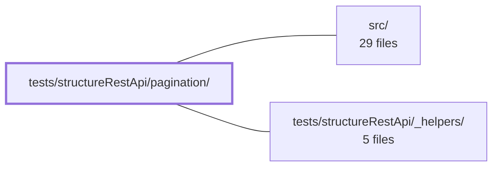

---
tags:
    - 2brain
    - 2brain/module
    - project/vue-toolkit
type: module
module: tests/structureRestApi/pagination/
files: 3
updated: 2026-09-28T23:22:38.046823+00:00
---

# tests/structureRestApi/pagination/

## Purpose

This module contains the dedicated test suites for every pagination strategy exposed by the structure-search REST composable: client-side (local) slicing after a full load, the `fetchPaginate` single-page API, and the server-side paging contract of `fetchAll`. Together they verify that page arithmetic, per-page caching, cross-page item accumulation, staleness tracking, and forced re-fetch behave correctly under each strategy.

## Key parts

- **`pagination.client.spec.ts`** — Exercises the "load once, page locally" path. After a single `fetchAll` call, it asserts that the `pageSize`, `pageCurrent`, `pageTotal`, `pageOffset`, and `pageItemList` computed properties slice and count the in-memory record set correctly.
- **`pagination.server.spec.ts`** — Covers the server-side paging contract of `fetchAll`: independent per-page freshness keys, cross-page accumulation into one item list, stale-time deduplication, forced re-fetch, and the empty-final-page edge case.
- **`pagination.paginate.spec.ts`** — Tests the `fetchPaginate` method (one page at a time, no filter layer). Verifies that each `(page, pageSize, key)` tuple is cached as its own bucket, fresh pages are not re-fetched, a forced bypass works, and items accumulate across pages into the shared item dictionary.

## How it connects

- **`src/`** — Every spec in this module imports the structure-search composable (and its pagination-related methods/properties) from the source tree and drives them with mocked REST responses. The tests are the acceptance contract for the pagination logic implemented under `src/`.
- **`tests/structureRestApi/_helpers/`** — All three specs reuse the shared test utilities (composable instantiation, mock-response factories, cache/state reset helpers) provided by this sibling directory so that pagination tests stay focused on page-specific behaviour rather than boilerplate setup.

## Where to start

1. **`pagination.client.spec.ts`** — It is the shortest suite and introduces the core composable properties (`pageItemList`, `pageTotal`, etc.) in the simplest "all data already loaded" scenario, giving a newcomer the mental model before the network-per-page variants appear.
2. **`pagination.server.spec.ts`** — Next, this spec extends the mental model to per-page caching and accumulation, which is the pattern shared by `fetchPaginate`; reading it before `pagination.paginate.spec.ts` makes the latter's assertions about independent bucket keys much easier to follow.

## Connected modules

[[vue-toolkit_src|src/]] · [[vue-toolkit_tests_structureRestApi__helpers|tests/structureRestApi/_helpers/]]

## Files

- `tests/structureRestApi/pagination/pagination.client.spec.ts` — Tests the **client-side (offline) pagination** mode of the composable: after a single `fetchAll` call loads every record, the `pageSize` / `pageCurrent` / `pageTotal` / `pageOffset` / `pageItemList` computed properties must slice and count correctly. Exists to guarantee the "load once, page locally" strategy before any server-side pagination is considered.
- `tests/structureRestApi/pagination/pagination.paginate.spec.ts` — Test suite for the `fetchPaginate` method on the structure-search composable. Verifies that server-side pagination (one page at a time, no filter layer) caches each `(page, pageSize, key)` tuple as an independent bucket, does not re-fetch a fresh page, supports a forced bypass, and accumulates items across pages into the shared item dictionary.
- `tests/structureRestApi/pagination/pagination.server.spec.ts` — Tests the server-side pagination contract of the `fetchAll` composable method: each page is fetched and freshness-tracked independently via a per-page key, and items from multiple pages accumulate in a single list. Verifies basic fetching, cross-page accumulation, stale-time deduplication, independent page caching, forced re-fetch, and the edge case of an empty final page.

---

[[vue-toolkit_INDEX|← vue-toolkit index]]
