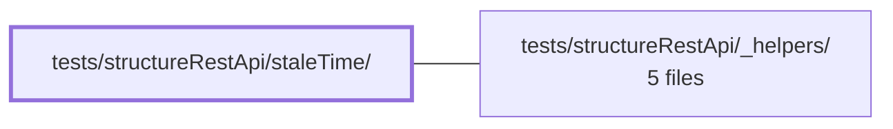

---
tags:
    - 2brain
    - 2brain/module
    - project/vue-toolkit
type: module
module: tests/structureRestApi/staleTime/
files: 7
updated: 2026-09-28T23:22:50.150010+00:00
---

# tests/structureRestApi/staleTime/

## Purpose

This module contains the spec suite that pins down the `staleTime` caching contract for the structure REST API composable. Every test drives a fake clock so timing is deterministic, and together the specs verify that each public method (fetch, check, mutate, paginate, concurrent) treats "fresh vs. stale" data correctly relative to the configured window.

## Key parts

- **Fetch-path specs** (`staleTime.get.spec.ts`, `staleTime.multiple.spec.ts`, `staleTime.search.spec.ts`) — cover the three GET-like fetch methods, the per-id freshness logic in `fetchMultiple`, and `fetchPaginate`. Each asserts cache-hit within the window and a network hit after it elapses, plus the per-call `staleTime` override.
- **Check-path spec** (`staleTime.check.spec.ts`) — mirrors the fetch specs but for the `check*` pre-flight methods (`checkTarget`, `checkAll`, `checkByParent`, `checkMultiple`), confirming they report the same fresh/stale boundary.
- **Mutation spec** (`staleTime.mutations.spec.ts`) — asserts the freshness side-effects of `createTarget`, `updateTarget`, and `deleteTarget`: seeding a fresh entry, resetting the stale clock, and immediate invalidation respectively.
- **Edge & concurrency specs** (`staleTime.zero.spec.ts`, `staleTime.concurrent.spec.ts`) — cover the `staleTime = 0` "never fresh" edge case and TanStack Query's deduplication / cache-hit behaviour under simultaneous requests.

## How it connects

All specs in this directory rely on shared setup utilities (mock server, fake-clock helpers, composable factory, etc.) provided by `tests/structureRestApi/_helpers/`. Those helpers define the HTTP mocking layer and the composable instantiation that every `staleTime.*` spec imports before writing its assertions.

## Where to start

1. **`staleTime.get.spec.ts`** — the simplest, most representative spec; reading it shows the fake-clock pattern, the composable setup via `_helpers`, and the "fresh → cache / stale → refetch" assertion style used throughout the module.
2. **`staleTime.zero.spec.ts`** — short and focused; understanding the `staleTime = 0` edge case clarifies the boundary semantics that the rest of the suite assumes.

## Connected modules

[[vue-toolkit_tests_structureRestApi__helpers|tests/structureRestApi/_helpers/]]

## Files

- `tests/structureRestApi/staleTime/staleTime.check.spec.ts` — Verifies that the pre-flight `check*` methods (`checkTarget`, `checkAll`, `checkByParent`, `checkMultiple`) report the same stale boundary as their `fetch*` counterparts: data just under `staleTime` is still valid (cache would be reused), data just past it is stale (fetch would hit the network). Also covers the per-call `staleTime` override on check methods.
- `tests/structureRestApi/staleTime/staleTime.concurrent.spec.ts` — Verifies TanStack Query's deduplication and cache-hit behavior under concurrency: that identical in-flight requests collapse to one API call, distinct-key requests each fire, and immediately-successive reads (including a POST-then-GET sequence) are served from cache without a second network call.
- `tests/structureRestApi/staleTime/staleTime.get.spec.ts` — Verifies that the composable's three GET-like fetch methods (`fetchAll`, `fetchTarget`, `fetchByParent`) respect the `staleTime` window: data is served from cache when elapsed time is under the threshold and re-fetched when it is past. Also exercises the per-call `staleTime` override, which can shorten or extend that window independently of the composable-level setting.
- `tests/structureRestApi/staleTime/staleTime.multiple.spec.ts` — Verifies that `fetchMultiple` applies per-id freshness: only stale ids trigger a network batch call while still-fresh ids are served from the local cache. Three scenarios cover the all-fresh, all-stale, and mixed-freshness cases.
- `tests/structureRestApi/staleTime/staleTime.mutations.spec.ts` — Verifies the freshness contract for the three mutation paths (`createTarget`, `updateTarget`, `deleteTarget`) under a fixed `staleTime`. Each describe block asserts a specific freshness side-effect: create seeds a fresh entry, update resets the stale clock, and delete invalidates the entry immediately. The tests use a fake clock so timing is deterministic and repeatable.
- `tests/structureRestApi/staleTime/staleTime.search.spec.ts` — Verifies that `fetchPaginate` respects the `staleTime` option: calls made within the window are served from cache (no second API hit), while calls made after the window elapses trigger a fresh API request. It isolates timing by driving a fake clock.
- `tests/structureRestApi/staleTime/staleTime.zero.spec.ts` — Verifies that a `staleTime` of `0` makes data _never fresh_—every `fetchAll`/`fetchTarget` call refetches from the API, and `checkAll`/`checkTarget` always report a miss. This edge case is not exercised by the default 1-hour staleTime suite, so it gets its own spec.

---

[[vue-toolkit_INDEX|← vue-toolkit index]]
