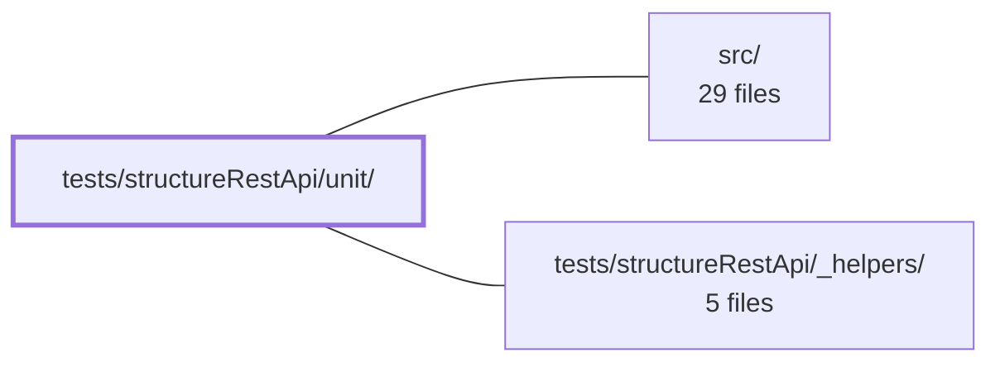

---
tags:
    - 2brain
    - 2brain/module
    - project/vue-toolkit
type: module
module: tests/structureRestApi/unit/
files: 27
updated: 2026-09-28T23:23:08.914259+00:00
---

# tests/structureRestApi/unit/

## Purpose

This module contains the unit-test suites for the `structureRestApi` composable — the generic REST resource abstraction in `src/`. Each `.spec.ts` file pins down the direct behavioural contract of one composable method (fetch, watch, mutate, loading, freshness, or infrastructure), exercising the public API in isolation with mocked network responses. Together they form the executable specification that any refactor or extension of the composable must satisfy.

## Key parts

- **Fetch contracts** — `fetchTarget`, `fetchTargetAlias`, `fetchMultiple`, `fetchAll`, `fetchByParent`, `fetchPaginate`, `fetchAny`. Each file verifies resolution shape, cache writes, `undefined`-entry skipping, error re-throw, and (where relevant) alias deduplication or parent isolation. Caching, merge, and stale-time semantics are deliberately deferred to sibling suites.
- **Watch (reactive) contracts** — `watchTarget`, `watchAll`, `watchByParent`, `watchAny`, plus `watchers.spec.ts` which locks down the _shared_ handle shape (`stop`, `refetch`, `suspense`, `error`) across all four. Covers immediate fire, reactive `enabled`/`key`, nullish-id no-ops, and stale-data retention on failed refetch.
- **Mutation (optimistic CRUD) contracts** — `createTarget`, `updateTarget`, `deleteTarget`, `mutateAny`. Verifies optimistic apply-and-confirm, rollback on rejection, concurrency with in-flight reads, `lastInsertedIdentifier` bookkeeping, mutation-key shape, and the non-invalidation contract of `mutateAny`.
- **Loading & saving state** — `loading`, `loading-key-tagging`, `loading-scope`, `isSaving`. Pin down the segment-prefix matching rule for `isLoading(key)`, the whole-resource `loading` boolean, `gcTime` defaults, and the per-record `isSaving(id)` spinner signal.
- **Freshness, caching & performance** — `check` (cold-cache / matching-key / cross-key invariants for every `check*` method), `failedRefetch` (cache preservation on network failure), `mergePerf` (asymptotic guard against O(N×M) sweeps).
- **Infrastructure & cross-cutting** — `fetchContext` (real `AbortSignal` wiring), `queryOptions` (TanStack Query option pass-through to `watch*` only), `setRecords`/`resetRecords` (escape-hatch direct cache writes), `defaults` (empty-array invariant for every `?? []` fallback).

## How it connects

- **`src/`** — Every spec file imports the composable(s) under test from `src/`. The tests never reach the network; they stub the HTTP layer and assert on composable public methods, internal cache state, and TanStack Query call metadata.
- **`tests/structureRestApi/_helpers/`** — Shared fixtures, mock-factory utilities, and query-key builders live here. Nearly every spec in this directory imports from `_helpers/` to construct realistic API responses, query keys, and composable instances without duplicating setup boilerplate.
- **`/` (repository root)** — Provides the project-level test runner configuration (Vitest/Jest config, path aliases, TS `tsconfig`) that these specs rely on to resolve imports and execute.

## Where to start

1. **`fetchTarget.spec.ts`** — The simplest single-method contract; reading it shows the mocking pattern, assertion style, and how the composable's public API surface is exercised.
2. **`watchers.spec.ts`** — The shared-contract file that applies to all four `watch*` methods. Understanding the handle shape and suspense semantics here gives you the vocabulary for the individual `watch*` specs and for how reactive state differs from one-shot `fetch*` calls.

## Connected modules

[[vue-toolkit_ROOT|/ (repository root)]] · [[vue-toolkit_src|src/]] · [[vue-toolkit_tests_structureRestApi__helpers|tests/structureRestApi/_helpers/]]

## Files

- `tests/structureRestApi/unit/check.spec.ts` — Unit tests for the pre-flight freshness-check methods (`checkTarget`, `checkAll`, `checkByParent`, `checkAny`, `checkPaginate`, `checkMultiple`). Each check reports whether a corresponding `fetch*` call has already primed the cache for a given query key. The file verifies three invariants: cold cache returns `false`, a matching prior fetch flips it to `true`, and a _different_ key (id, parentId, page, key array) never cross-reports another cache slot.
- `tests/structureRestApi/unit/createTarget.spec.ts` — Unit tests for the `createTarget` method of a generic composable, verifying its optimistic-create contract: resolving with the created item, handling an `undefined` API response, swapping a caller-supplied placeholder with the real record on success, rolling the placeholder back on failure, and updating `lastInsertedIdentifier` / `lastInsertedRecord`.
- `tests/structureRestApi/unit/defaults.spec.ts` — Unit tests verifying the "empty defaults" invariant: every defaulted array parameter and every `?? []` fallback in the resource composable must yield an empty result (empty array, empty lists, no phantom elements) when the argument or cache entry is absent.
- `tests/structureRestApi/unit/deleteTarget.spec.ts` — Unit tests for the `deleteTarget` method of the composable. Verifies the optimistic-delete contract: immediate local removal with the API ack, rollback (and invalidation) on failure, cancellation of a concurrent in-flight read of the same record, and correct mutation-key shape.
- `tests/structureRestApi/unit/failedRefetch.spec.ts` — Unit tests that verify the composable's cache-preservation semantics on failed network requests: a refetch that fails must keep the previously cached record/list intact, while a first-fetch failure that produced no data is cleaned up (unless an active watcher is observing the error).
- `tests/structureRestApi/unit/fetchAll.spec.ts` — Unit tests that pin down the direct contract of the `fetchAll` method on the composable: it resolves the item list, persists each entry into the internal dictionary by id, populates `itemList`, skips `undefined` entries, tolerates an empty array, and re-throws on network errors while preserving previously stored data. Caching, merge, partial, and forced-fetch behavior is deliberately out of scope here (covered under `staleTime/` and `modifiers/`).
- `tests/structureRestApi/unit/fetchAny.spec.ts` — Unit tests for the `fetchAny` generic wrapper, verifying its direct contract: resolving arbitrary async results, opt-in key-based caching, `forced` refresh, error propagation, no residual cache entry on failure, cancellation semantics, and `isLoading()` tracking.
- `tests/structureRestApi/unit/fetchByParent.spec.ts` — Unit test suite that pins down the direct contract of the composable's `fetchByParent` method: it must resolve items, store them, link them to the given parent, keep different parents isolated, skip `undefined` entries, and re-throw on API failure.
- `tests/structureRestApi/unit/fetchContext.spec.ts` — Unit tests that verify every read `apiCall` receives an `{ signal }` fetch context as its final argument. `signal` is a real `AbortSignal` (not a mere flag), and these tests confirm it starts un-aborted and is genuinely aborted when the owning read is cancelled—by a same-record mutation or by stopping a watcher scope—so downstream `fetch`/axios calls are truly cancelled.
- `tests/structureRestApi/unit/fetchMultiple.spec.ts` — Unit tests for the `fetchMultiple` "batch by id" contract of the composable. Verifies the core behavioral promises: empty/undefined id short-circuits, cold-cache single-call fetch with caching, error propagation, merge-vs-replace semantics, freshness stamping, and that the API call receives only the ids it actually needs (missing or stale), never the full requested set.
- `tests/structureRestApi/unit/fetchPaginate.spec.ts` — Unit tests for the `fetchPaginate` method, verifying its contract: it fetches a single page of server-side pagination results, resolves with the items, stores them on the composable, and handles empty pages without error. It intentionally does **not** test filter/search behaviour — that belongs to `useStructureSearchApi.fetchSearch`.
- `tests/structureRestApi/unit/fetchTarget.spec.ts` — Unit tests verifying the direct contract of the composable's `fetchTarget` method (the "single item" fetch). Covers resolution, undefined-when-missing, the id-less code path, error re-throwing, and an explicit guard that fetching does not pollute `lastInsertedIdentifier`.
- `tests/structureRestApi/unit/fetchTargetAlias.spec.ts` — Unit tests verifying that `fetchTarget` called with an alternate key (e.g. a slug) stores the record **once** under its own `id`, leaving only an alias pointer at the requested key. Ensures no divergent duplicate copies appear in `itemDictionary`/`itemList`, and that all write operations (`updateTarget`, `deleteTarget`, `editRecord`, `deleteRecord`) resolve through the alias to the single canonical record.
- `tests/structureRestApi/unit/isSaving.spec.ts` — Unit tests for the `isSaving(id)` method on the composable—a per-record pending signal intended for row-level spinners, distinct from the whole-resource `loading`/`isLoading` flag. Verifies its truthiness across update, delete, create, cross-resource, and failure scenarios.
- `tests/structureRestApi/unit/loading-key-tagging.spec.ts` — Verifies that the mutation methods (`createTarget`, `updateTarget`, `deleteTarget`) and the `watch*` family stamp their TanStack Query call's `meta` with the caller-supplied `key`, so that `isLoading(key)` returns `true` only for the specific operation the caller tagged—not for any arbitrary in-flight request on the same resource. Complements `loading.spec.ts`, which covers `fetchAny`.
- `tests/structureRestApi/unit/loading-scope.spec.ts` — Unit tests for the loading surface of a resource composable: the boolean `loading` flag (true while _any_ request for the resource is in flight) and `isLoading(key)` (resolves true when a call's key matches by **prefix**, the same rule used by `useIsLoading` and the core store). A second block asserts cache-lifetime defaults (`gcTime`) so that records, parent lists, and search pages never expire unobserved while other list kinds keep TanStack Query defaults.
- `tests/structureRestApi/unit/loading.spec.ts` — Unit tests for the `isLoading()` loading primitive on the composable API. Verifies that `isLoading()` (no args) and `isLoading(key)` correctly reflect in-flight queries and mutations by segment-prefix matching, and that they reset to `false` once the underlying call settles. Concurrency/ref-counting and rejection-path behaviour are deliberately excluded (see `modifiers/loading.spec.ts`).
- `tests/structureRestApi/unit/mergePerf.spec.ts` — Unit test that pins the asymptotic cost of a batch merge write over a large query cache. It asserts that merging 1 000 items over a 3 000-record cache does **not** trigger one full `findAll` sweep per item (the O(N × M) path), by counting `findAll` invocations rather than relying on wall-clock timing.
- `tests/structureRestApi/unit/mutateAny.spec.ts` — Unit tests for the `mutateAny` method on the structure-restApi composable. `mutateAny` is a one-shot TanStack mutation for commands that don't fit the record shape of `createTarget`/`updateTarget`/`deleteTarget`. These tests pin down its three behavioral contracts: it resolves/rejects with the API result, it contributes to `isLoading(key)` while in flight, and it does **not** auto-invalidate any cached lists on success.
- `tests/structureRestApi/unit/queryOptions.spec.ts` — Unit tests verifying that `queryOptions` (the five TanStack Query keys: `retry`, `retryDelay`, `refetchInterval`, `refetchOnWindowFocus`, `refetchOnReconnect`) correctly pass through to every **active** (`watch*`) query, that a watcher-level value overrides the resource-level default, and that the option never leaks into one-shot `fetch*` calls or clobbers engine-owned settings like `gcTime`.
- `tests/structureRestApi/unit/setRecords.spec.ts` — Unit tests for the `setRecords` / `resetRecords` escape-hatch methods on the composable record store. These methods bypass the REST fetch machinery entirely, writing directly into the internal dictionary. The suite verifies replacement semantics, the "local guess" (stale) freshness stamping applied to manually written records, and the deliberate scope difference between `resetRecords` and `resetAll`.
- `tests/structureRestApi/unit/updateTarget.spec.ts` — Unit tests for the `updateTarget` optimistic-update contract of the composable. Covers the happy path (apply + confirm), rollback semantics on rejection, concurrency with in-flight reads and deletes, freshness (staleness) guarantees around confirmed vs. unconfirmed writes, the mutation-key shape, and the empty-response edge case.
- `tests/structureRestApi/unit/watchAll.spec.ts` — Unit tests for the `watchAll` composable method. Verifies that it fires immediately on subscription, populates the item dictionary identically to `fetchAll`, exposes a working `stop()`/`refetch()` contract, filters `undefined` entries, and supports reactive `enabled` and `key` options. Scope is limited to the direct one-shape-at-a-time contract; invalidation/`dependsOn` reactivity is tested elsewhere.
- `tests/structureRestApi/unit/watchAny.spec.ts` — Unit tests for the `watchAny` composable method — the reactive (watch-based) counterpart of `fetchAny`. It verifies that `watchAny` correctly handles immediate fetches, reactive `enabled`/`key` inputs, independent key tracking, error surfacing, and the `stop`/`refetch` control surface. It exists to lock down the contract that makes `watchAny` structurally different from every other `watch*` method (it exposes a `data` ref over the raw result rather than an item dictionary).
- `tests/structureRestApi/unit/watchByParent.spec.ts` — Unit test suite for the `watchByParent` composable method — the reactive, always-active counterpart of `fetchByParent` scoped to a `belongsTo` parent. Verifies that it updates `parentHasMany`/`getListByParent` on initial fire and on cache invalidation without requiring an imperative refetch call, and that it correctly handles nullish parent ids, `enabled` gating, and reactive keys.
- `tests/structureRestApi/unit/watchTarget.spec.ts` — Unit tests for the `watchTarget` composable — the reactive (ref-driven) counterpart to `fetchTarget`. Verifies its reactive contract: immediate fire, eager selection, refetch on id change, nullish-id no-op semantics, callback signatures, and error-handling edge cases (stale-data retention on failed refetch, isolated idle placeholder).
- `tests/structureRestApi/unit/watchers.spec.ts` — Unit test suite that pins the **shared contract** of the four watcher methods (`watchTarget`, `watchAll`, `watchByParent`, `watchAny`) exposed by the structure composable. It verifies the handle shape (`{ stop, refetch, suspense, error }`), that failures land in `error` rather than as rejections, that settle callbacks fire on cache hits as well as after fetches, and that no fetch occurs without an id. The `suspense()` section additionally locks down SSR-friendly resolution semantics (resolve immediately on a disabled/id-less watcher instead of hanging).

---

[[vue-toolkit_INDEX|← vue-toolkit index]]
