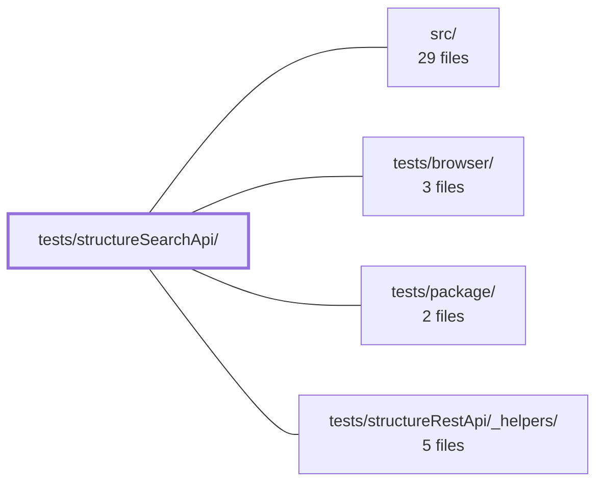

---
tags:
    - 2brain
    - 2brain/module
    - project/vue-toolkit
type: module
module: tests/structureSearchApi/
files: 23
updated: 2026-09-28T23:23:29.254518+00:00
---

# tests/structureSearchApi/

## Purpose

This module is the full test suite for the `useStructureSearchApi` composable. It covers unit-level method contracts, reactive lifecycle behaviour, cache-bucketing rules, modifier semantics, stale-time boundaries, and cross-composable cache interactions—pinning down the invariant that the search view is always a projection of the _last applied_ search, never the live filter state.

## Key parts

- **`_helpers/`** — `harness.ts` builds a tracked `useStructureSearchApi` instance bound to a mutable `filters` ref (re-exporting cleanup utilities from the `structureRestApi` harness); `seedPages.ts` writes cache entries directly into a `QueryClient` so specs can pre-lay-out page state without network calls.
- **`core.spec.ts`** — The central spec: asserts `pageItemList`, `totalItems`, and `pageTotal` are scoped to the last applied search, not to the shared item dictionary or the live filters ref.
- **`unit/`** — Focused method tests: `fetchSearch.spec.ts` (resolution shape, caching, error re-throw, page/pageSize application), `checkSearch.spec.ts` (cold/hot/distinct-page freshness), `watchSearch.spec.ts` (reactive watchers, `search()` API, lifecycle callbacks, `stop()`/`refetch()`), `searchHelpers.spec.ts` (`searchGet` input forms).
- **`intention/`** — Behavioural contracts at a higher level: `applied-search.spec.ts` (UI reflects applied search only), `cross-method-cache.spec.ts` (`fetchSearch` seeds the same per-item cache as `fetchAll`), `mutation-invalidation.spec.ts` (CRUD mutations invalidate the search-page cache), `search-journey.spec.ts` (search-as-you-type session asserting exact server round-trip counts).
- **`lifecycle/`** — Scope and teardown: `dependsOn.spec.ts` (scope-switch invalidation, `resetAll()`), `maxRecords.spec.ts` (exceeding the record cap wipes the search view), `mountedComponent.spec.ts` (watcher ordering across component boundaries).
- **`modifiers/`** — `forced.spec.ts` (bypass fresh cache) and `partial.spec.ts` (partial results do not stamp freshness on target records).
- **`search/`** — Cache-key dimensions: `params.spec.ts` (filter-object canonicalisation), `pagesize.spec.ts` (pageSize as a cache axis), `pages.spec.ts` (per-page independent caching and aggregation), `latestPage.spec.ts` (`totalItems` fallback to most-recently-updated cached page).
- **`staleTime/`** — `checkSearch.spec.ts` and `search.spec.ts`: boundary tests confirming `staleTime` controls the fresh/refresh transition.
- **`served-value.spec.ts`** — Asserts a cache hit returns the exact stored item values (order and fields), not merely a skipped network call.

## How it connects

- **`tests/structureRestApi/_helpers/`** — The search harness (`harness.ts`) re-exports the Jest-exit tracking and cleanup utilities defined in the REST-API helper suite, so both spec trees share the same global-state hygiene.
- **`src/`** — Every spec exercises composables and services that live in `src/` (`useStructureSearchApi`, the underlying `restApi`, the shared `QueryClient` instance).
- **`tests/structureRestApi/` (sibling suite)** — `cross-method-cache.spec.ts` verifies that `fetchSearch` and `fetchAll` (the REST-API composable) write to the same per-item target cache. `served-value.spec.ts` is explicitly the search-API counterpart to `tests/structureRestApi/served-value.spec.ts`.

## Where to start

1. **`_helpers/harness.ts`** — Read this first to understand how every spec in the module instantiates the composable, what `filters` ref they mutate, and what cleanup runs after each test.
2. **`core.spec.ts`** — This is the single spec that states the most important invariant (results scoped to the last applied search, not the live ref). Every other spec builds on or refines this contract.

## Connected modules

[[vue-toolkit_ROOT|/ (repository root)]] · [[vue-toolkit_src|src/]] · [[vue-toolkit_tests_browser|tests/browser/]] · [[vue-toolkit_tests_package|tests/package/]] · [[vue-toolkit_tests_structureRestApi__helpers|tests/structureRestApi/_helpers/]]

## Files

- `tests/structureSearchApi/_helpers/harness.ts` — Test helper for the `structureSearchApi` spec suite. Provides `makeSearchComposable`, a factory that builds a tracked `useStructureSearchApi()` instance (with its own internal `restApi` and `QueryClient`) bound to a mutable `filters` ref so tests can mutate filters mid-run. Re-exports the tracking/cleanup utilities from the `structureRestApi` harness so the search specs get the same Jest-exit hygiene for free.
- `tests/structureSearchApi/_helpers/seedPages.ts` — Test helper that writes search-cache entries directly into a TanStack Query `QueryClient`, letting a spec lay out the exact cache state a predicate must judge (scope, kind, filters, page, bucket key, `dataUpdatedAt`) without triggering a network fetch per entry.
- `tests/structureSearchApi/core.spec.ts` — Spec for the `useStructureSearchApi` composable. It verifies that `pageItemList`, `totalItems`, and `pageTotal` are scoped to the **last applied search** (the filters passed to `fetchSearch`), not to the whole-dictionary offline pagination of the underlying restApi or to the live `filtersSource` ref. The tests exist to guard against the subtle bug where a shared item dictionary causes one search's records to leak into another search's paginated view.
- `tests/structureSearchApi/intention/applied-search.spec.ts` — Intention tests that codify the behavioral contract of the search composable: the UI always reflects the **applied** search (the last resolved result), never the live filter state. The suite verifies that in-place filter edits trigger nothing, that `totalItems` and `pageItemList` persist across page/search transitions (flagged by `isPlaceholder`), and that cache fallbacks follow "most recently updated" semantics.
- `tests/structureSearchApi/intention/cross-method-cache.spec.ts` — Intention test verifying that `fetchSearch` (search-API composable) seeds the same shared per-item target cache that `fetchAll` (REST-API composable) seeds. Because both methods operate on the identical list-query protocol, a `fetchSearch` call should make a subsequent `fetchTarget(id)` resolve from cache without an additional API request.
- `tests/structureSearchApi/intention/mutation-invalidation.spec.ts` — Verifies that a successful `createTarget`, `updateTarget`, or `deleteTarget` mutation invalidates the search-page cache: an active `watchSearch` refetches the on-screen page (using the filters the watcher applied, not whatever the reactive `filters` ref now holds), and a page that was fetched without a watcher becomes stale so the next `fetchSearch` hits the server again.
- `tests/structureSearchApi/intention/search-journey.spec.ts` — Integration-level test that simulates a realistic search-as-you-type session against a fake server with a fake clock. It asserts the **exact number of server round-trips** at each step to verify that the search cache collapses redundant identical queries while still refetching once the stale window expires.
- `tests/structureSearchApi/lifecycle/dependsOn.spec.ts` — Verifies that search pages behave correctly under scope changes driven by `dependsOn` and under `resetAll()`. It asserts cache invalidation on scope switch, that a late-landing answer is not mis-cached into a sibling's still-active scope, that a cancelled `fetchSearch` never cross-contaminates totals, and that `resetAll()` empties the view and cache.
- `tests/structureSearchApi/lifecycle/maxRecords.spec.ts` — Verifies that when a `maxRecords` bound is crossed, the search API's page/index view (`searchGet` / `pageItemList` / `totalItems`) is fully wiped alongside all other cached queries. This exists to pin down the invariant that the search view is a **read-only projection over the same QueryClient** as the record store — there is no separate search index to prune independently.
- `tests/structureSearchApi/lifecycle/mountedComponent.spec.ts` — Tests the lifecycle contract of a search resource that is **built inside a mounted component's `setup()`** but **watched from code outside that component** (click handlers, awaited continuations, Pinia stores). Ensures Vue's pre-flush watcher ordering guarantees hold regardless of which component scope created the watcher.
- `tests/structureSearchApi/modifiers/forced.spec.ts` — Tests the `forced` modifier on the structure search API. Verifies that passing `{ forced: true }` bypasses a still-fresh cache entry and re-hits the API — both for a one-shot `fetchSearch` call and for a `search()` invocation inside a `watchSearch` session.
- `tests/structureSearchApi/modifiers/partial.spec.ts` — Tests the `partial` modifier on `fetchSearch`, verifying that partial search results are written into the target cache's records immediately but do **not** mark those records as freshly fetched. This ensures a subsequent `fetchTarget(id)` for a record that was only seen via a partial search still issues a real API call, preserving the invariant that only authoritative fetches stamp freshness.
- `tests/structureSearchApi/search/search.latestPage.spec.ts` — Tests the `totalItems` fallback logic in the search composable: when the current page (page 1) is still in flight, `totalItems` must resolve from the most recently updated cached page that belongs to the same applied search. The suite verifies the recency pick, tie-breaking, and the strict matching rules (filters, scope, kind, bucket key, data presence) that determine which cached pages are eligible.
- `tests/structureSearchApi/search/search.pages.spec.ts` — Vitest spec verifying the **per-page caching contract** of the search composable: each page of a query is fetched and cached independently, re-requesting a fresh cached page short-circuits the API, and the aggregated `itemList` / `pageTotal` reflect all loaded pages correctly.
- `tests/structureSearchApi/search/search.pagesize.spec.ts` — Verifies that `pageSize` participates in the search cache key: the same filters + page at different pageSizes produce independent cache buckets, repeated identical queries hit the cache, and `searchGet` only returns results that were fetched with the exact pageSize being queried.
- `tests/structureSearchApi/search/search.params.spec.ts` — Verifies that the search API's cache bucketing treats filter parameters as a stable dimension: identical filter objects (regardless of key order at any nesting depth) resolve to the same cache entry, while any difference in values or properties produces a distinct bucket. Covers flat primitives, arrays of primitives, and nested-object shapes (sort/range/geo-style).
- `tests/structureSearchApi/served-value.spec.ts` — Verifies that a **cache-hit** path in the search composable returns the exact item values (order, fields) that were originally stored, rather than merely asserting that a network call was skipped. This is the search-API counterpart to the REST-API spec at `tests/structureRestApi/served-value.spec.ts`.
- `tests/structureSearchApi/staleTime/staleTime.check.spec.ts` — Verifies that `checkSearch` reports the correct stale/valid boundary relative to the `staleTime` option: it must return `true` just under the threshold (cache is still fresh) and `false` just past it (cache is expired and a network fetch would occur).
- `tests/structureSearchApi/staleTime/staleTime.search.spec.ts` — Verifies that the `fetchSearch` method honours its `staleTime` configuration: a repeat request with identical filters, page, and pageSize is served from cache when it arrives within the window, but triggers a fresh API call once the window has elapsed.
- `tests/structureSearchApi/unit/checkSearch.spec.ts` — Unit tests for `checkSearch`, the pre-flight freshness guard that tells the caller whether a `fetchSearch` result for a given filter/page/pageSize tuple is already cached. It verifies the three core behaviors: cold cache returns `false`, the same parameters return `true` after a matching `fetchSearch`, and a different page is treated as a distinct cache bucket.
- `tests/structureSearchApi/unit/fetchSearch.spec.ts` — Unit tests for the `fetchSearch` method of the search composable. They verify the direct contract: resolving with `ISearchResult<T>` (items + server-reported `totalItems`), caching the fetched page, recording the page→ids mapping, handling empty sets, re-throwing errors without polluting the cache, preserving `totalItems` across cache hits, and correctly applying page/pageSize so `pageItemList` reflects the just-fetched page.
- `tests/structureSearchApi/unit/searchHelpers.spec.ts` — Unit tests for `searchGet`, verifying it returns an empty array when no matching cache entry exists and that it accepts both a live filters object and a pre-serialised string key. The file exists to lock down the two input forms the API exposes without exercising the full fetch lifecycle.
- `tests/structureSearchApi/unit/watchSearch.spec.ts` — Unit tests for the `watchSearch` method on the `useStructureSearchApi` composable. Verifies its reactive fetch behaviour (immediate run, page/pageSize watchers, applied-vs-live filter semantics), the on-demand `search()` / `search(true)` API, lifecycle callbacks (`onSuccess`, `onError`, `onSettled`), and `stop()` / `refetch()` edge cases.

---

[[vue-toolkit_INDEX|← vue-toolkit index]]
