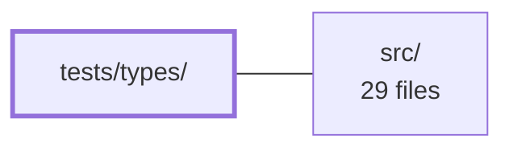

---
tags:
    - 2brain
    - 2brain/module
    - project/vue-toolkit
type: module
module: tests/types/
files: 11
updated: 2026-09-28T23:23:41.945733+00:00
---

# tests/types/

## Purpose

`tests/types/` is a suite of compile-time type tests (`.test-d.ts` files) that verify the public type contracts of the library's composables, stores, and API helpers. Each file is checked by `tsc` rather than a runtime test runner, so regressions in exported signatures, generic inference, or interface shapes fail the build before they reach consumers.

## Key parts

- **Shared fixture** — `_fixtures.ts` exports a single `IUser` record shape used by the type-test files that need a consistent user-object definition.
- **Composable type tests** — `asyncAction.test-d.ts`, `isLoading.test-d.ts`, `livenessProbe.test-d.ts`, and `uploadProgress.test-d.ts` each pin down the generic plumbing and public return/parameter types of their respective composables (data inference, promise rejection of invalid callbacks, progress-shape propagation, etc.).
- **Structure API type tests** — `structureCrudApi.test-d.ts`, `structureDataManagement.test-d.ts`, `structureRestApi.test-d.ts`, `structureSearchApi.test-d.ts`, and `structureFormValidation.test-d.ts` verify the explicit return interfaces (`IStructureCrudApi`, `IStructureDataManagementApi`, etc.), required-vs-optional injection members, context argument shapes, settings-object types, and generic inference from `initialData`.
- **Store & constant type tests** — `stores.test-d.ts` locks down the exact return shapes of `useCoreStore` and `useNotificationsStore` plus the `DEFAULT_INVALID_FIELD_SELECTOR` / `EToastType` constants.

## How it connects

- **`src/`** — Every file in this module imports public types and composables from `src/` to assert on them. The tests are the "contract" layer: they compile against `src/` and fail the build if a signature changes unintentionally.
- **`/` (repository root)** — The root-level `tsconfig` (and any `vitest` / `expect-type` configuration) determines how `.test-d.ts` files are type-checked. The test runner and compiler options that make this module work are configured at the root.

## Where to start

1. **`_fixtures.ts`** — Read this first to see the minimal shared type vocabulary the tests use.
2. **`structureRestApi.test-d.ts`** — It is representative of the pattern: `expect-type` assertions against a composable's return type, per-call argument shapes, and options object. Understanding this one file makes the remaining tests straightforward to follow.

## Connected modules

[[vue-toolkit_ROOT|/ (repository root)]] · [[vue-toolkit_src|src/]]

## Files

- `tests/types/_fixtures.ts` — Provides a shared `IUser` record shape that the type-level (`.test-d.ts`) test files import so they can write assertions against a consistent, single definition of a user object. It exists to keep that shape in one place rather than duplicating it across every type-test file.
- `tests/types/asyncAction.test-d.ts` — Type-level test (`.test-d.ts`) that verifies `useAsyncAction` correctly infers its `data` type and `run` signature from the wrapped action's parameters and return type. It ensures the generic plumbing of the composable is preserved through the public API.
- `tests/types/isLoading.test-d.ts` — Type-level test (via `expect-type`) that pins down the public type contract of `useIsLoading`. It exists to prevent regressions in the inferred return type or parameter types without needing a runtime test, since the composable's type surface is intentionally minimal.
- `tests/types/livenessProbe.test-d.ts` — Compile-time type test for `useLivenessProbe`. It asserts the public type contract of the probe's `down`, `check`, and `stop` members and verifies that the factory rejects non-Promise callbacks — all without executing any runtime code.
- `tests/types/stores.test-d.ts` — Compile-time type test (run by `tsc`, not a runtime test runner) that pins down the exact return shapes of the two Pinia setup stores (`useCoreStore`, `useNotificationsStore`) and the public constants `DEFAULT_INVALID_FIELD_SELECTOR` / `EToastType`. It exists to catch unintended changes to store signatures or exported types before they reach consumers.
- `tests/types/structureCrudApi.test-d.ts` — Compile-time type test (no runtime assertions) that pins down the public type contract of `useStructureCrudApi`. It verifies the required-ness of `operations` and `settings`, the distinct context argument types for read vs. write operations, the explicit `IStructureCrudApi` return interface, and the settings-object shape of the generated `createOne`/`updateOne`/`deleteOne` methods.
- `tests/types/structureDataManagement.test-d.ts` — Compile-time type test (no runtime assertions) that verifies the generic type contracts of `useStructureDataManagement`: the `K` type-parameter default and explicit overrides, the shape of the returned `IStructureDataManagementApi`, and the required-vs-optional member split in the `IRecordStore` / `IRelationStore` injection interfaces.
- `tests/types/structureFormValidation.test-d.ts` — Compile-time type assertions for `useStructureFormValidation`. The file verifies (without runtime execution) that the composable's generic `T` is correctly inferred from `initialData`, that `form` and `formErrors` expose the expected types, and that a zod schema whose shape mismatches `T` is rejected at the type level.
- `tests/types/structureRestApi.test-d.ts` — Compile-time type test for `useStructureRestApi`. Uses `expect-type` assertions (not runtime assertions) to lock down the public type contract of the composable: return-type inference, per-call argument shapes, required options, and the `IWatchHandle` surface. It exists so that any accidental type regression in the composable's signatures fails at build time rather than at consumer runtime.
- `tests/types/structureSearchApi.test-d.ts` — Type-level test file (no runtime assertions) that pins down the public type contract of `useStructureSearchApi`, ensuring the composable's return type, fetch contexts, watcher handle, and settings objects are shaped exactly as documented. It exists to catch unintended signature changes in the search API layer before they reach consumers.
- `tests/types/uploadProgress.test-d.ts` — Compile-time type tests (via `expect-type`) that verify the generic flow of `useUploadProgress`: the `TOptions` type parameter inferred from the `buildOptions` callback must propagate correctly to both `track`'s parameter type and `progress.value`'s runtime shape, while rejecting arbitrary shapes at the type level.

---

[[vue-toolkit_INDEX|← vue-toolkit index]]
