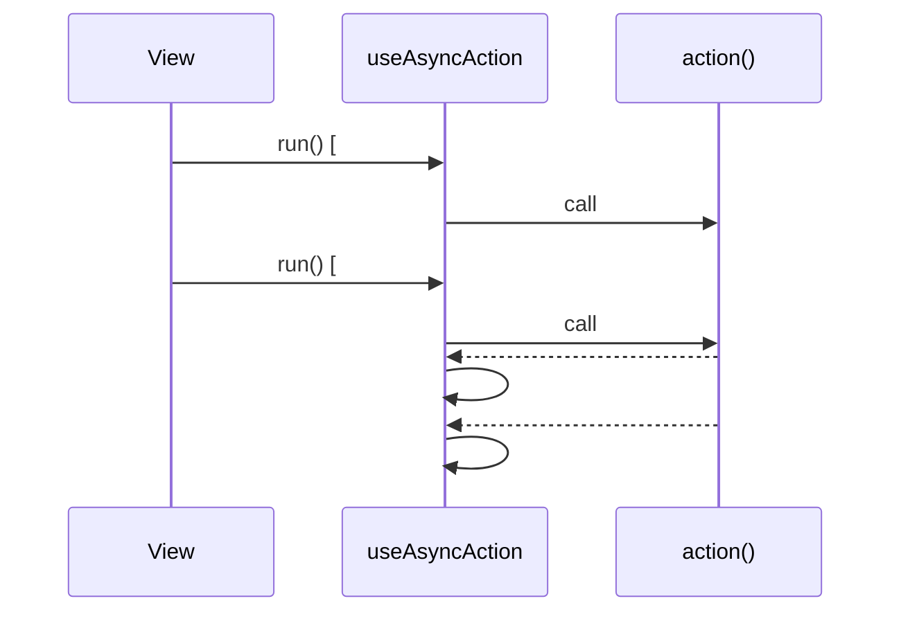

# useAsyncAction

Loading, data and error state for one async call, and the wrapper that drives it.

## Why it exists

The `useStructure*` family is about **records** — identified, cached, mutated, related to one
another. Plenty of calls are not that. A dashboard panel asks one endpoint one question and
renders the answer; there is no identity to key it by and nothing to cache it against.

`useStructureRestApi`'s `fetchAny` covers the loading half of that case, but keeps neither the
payload nor the failure as state. (`watchAny` does hold `data` and `error`, as an active, cached
query under a `key` of a resource.) So every screen writes the same block once per endpoint:

```ts
const health = ref<Health>()
const loadingHealth = ref(false)
const errorHealth = ref<string>()
```

Three refs, three endpoints, nine declarations and three near-identical `.then/.catch/.finally`
chains — and each one an opportunity to forget the `finally`, or to let a double-click overwrite a
fresh answer with a stale one.

## Never rejects

A failed call leaves its message in `error` and **still resolves**. That is the whole point on a
dashboard: one dead endpoint renders one error panel, while everything else on the page carries on
showing its data. A rejection would take the page down with it.

That makes this a composable for **reads**. A write whose outcome the user asked for and is owed
either way should reject and let the view answer with the toast it already writes — otherwise the
view ends up polling an error ref after the fact to work out which message to show.

`action` throwing synchronously, instead of returning a rejected promise, is treated the same as a
rejection: `error` is set and `loading` returns to `false`.

## Quickstart

```ts
import { useAsyncAction } from '@guebbit/vue-toolkit'

const {
    data: health,
    error: errorHealth,
    loading: loadingHealth,
    run: fetchHealth
} = useAsyncAction(() => getObservabilityHealth().then((response) => response.data), {
    fallbackErrorMessage: t('admin.error-load-health')
})
```

```vue
<v-skeleton-loader v-if="loadingHealth" />
<v-alert v-else-if="errorHealth" type="error">{{ errorHealth }}</v-alert>
<health-panel v-else :health="health" />
```

`run` forwards its arguments to the action, so a filtered call needs no closure:

```ts
const { data: audit, run: fetchAuditLogs } = useAsyncAction((filters: AuditFilters = {}) =>
    getAuditLogs(filters).then((response) => response.data)
)

fetchAuditLogs({ actor: 'admin', limit: 50 })
```

## Options

| Option                 | Default                | What it does                                                        |
| ---------------------- | ---------------------- | ------------------------------------------------------------------- |
| `initialData`          | `undefined`            | Value of `data` before the first success, and after `reset()`.      |
| `fallbackErrorMessage` | `undefined`            | Used when the rejection carries nothing readable. Already translated by you. |
| `resolveError`         | `extractErrorMessage`  | Turns a rejected value into the message to display.                 |

## Returns

| Name      | Type                                       | What it is                                          |
| --------- | ------------------------------------------ | ---------------------------------------------------- |
| `data`    | `Ref<T \| undefined>`                      | The last successful payload.                        |
| `error`   | `Ref<string \| undefined>`                 | The last failure's message.                         |
| `loading` | `Ref<boolean>`                             | True while the newest run is in flight.             |
| `run`     | `(...args) => Promise<T \| undefined>`     | Runs the action. Resolves with the payload, or `undefined` on failure. |
| `reset`   | `() => void`                               | Back to the pre-run state.                          |

## Error messages

The default resolver is `extractErrorMessage` from `@guebbit/js-toolkit`, which is what makes a
plain-object rejection work. This matters more than it sounds: an interceptor that normalises
failures rejects with an object literal rather than an `Error`, and anything testing
`instanceof Error` then reads a real API refusal as "nothing usable" and shows a generic fallback
while the API is saying exactly what went wrong.

The toolkit has no opinion about your locale, so when a rejection carries nothing at all the
result is `fallbackErrorMessage` — or an empty string if you supplied none. To apply an app-wide
rule instead, hand over your own resolver; it receives the per-call fallback as its second
argument, so both can still have a say:

```ts
const getErrorMessage = (error: unknown, fallback?: string) =>
    extractErrorMessage(error, fallback ?? t('api-errors.unknown'))

useAsyncAction(fetchHealth, { resolveError: getErrorMessage })
```

## Overlapping runs

Only the newest run may write. Click Refresh twice and the slow first request can land after the
fast second one; without a guard it overwrites fresh data with stale, and clears `loading` while
its successor is still in flight. Both are handled:

```ts
const slow = run() // resolves last
const fast = run() // resolves first
// data holds `fast`'s payload, and loading goes false when `fast` settles;
// `slow`'s late answer changes nothing (its run() resolves undefined)
```

`reset()` participates in the same rule, so a run started before it cannot write to the state it
just cleared.



## Types

| Type                        | Shape                                                | What it's for                                 |
| --------------------------- | ----------------------------------------------------- | ---------------------------------------------- |
| `IAsyncActionSettings<T>`   | `{ initialData?, fallbackErrorMessage?, resolveError? }` | The options object `useAsyncAction` takes. |
| `TErrorResolver`            | `(error: unknown, fallback?: string) => string`       | Shape of `resolveError`; see [Error messages](#error-messages). |
| `IAsyncAction<T, TArguments>` | `ReturnType<typeof useAsyncAction<T, TArguments>>`  | The whole return value, for a store or component prop that needs to name it. |

## Gotchas

- **A rejection with nothing readable, and no `fallbackErrorMessage` configured, sets `error` to
  an empty string** — not `undefined`. `v-if="error"` (or any other truthiness check) then reads
  it as "no error" and falls through to whatever the success state renders, even though the run
  failed. Check `loading` transitioning to `false` alongside `data` being unchanged if you need to
  detect failure without relying on `error`'s truthiness, or set `fallbackErrorMessage` (or a
  `resolveError` that never returns `''`) so `error` is always a non-empty message on failure.
