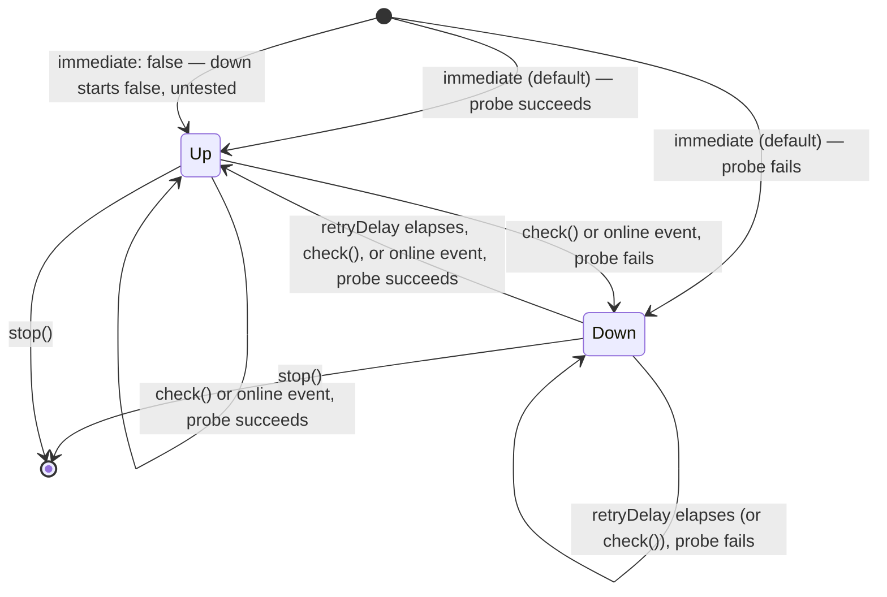

# useLivenessProbe

Watches whether something the app depends on is still answering, and says so with one boolean.

## Why it exists

A connectivity banner looks like five lines of code. It is five lines of code, and three of them
are decisions that are easy to get wrong in a way nobody notices for months:

- **probe only while down.** A healthy target polled every 30 seconds costs one request per user
  per interval, forever, to tell you what you already knew.
- **re-probe when the browser says `online`.** That event is the one moment a re-check is certain
  to be worth making.
- **keep exactly one retry chain.** This is the one that bites. Two `online` events while down and
  a naive implementation has two independent loops running, each spawning its own successor
  forever, with teardown able to cancel only the last one scheduled. The symptom is a background
  request storm that nobody attributes to a banner.

## Quickstart

What is being probed is your business — a liveness endpoint, a socket handshake, a `HEAD` against
a CDN. Anything that rejects when unreachable will do, and the resolved value is ignored, so an
existing call can be handed over as-is:

```ts
import { useLivenessProbe } from '@guebbit/vue-toolkit'

const { down } = useLivenessProbe(getHealth)
```

```vue
<v-banner v-if="down" icon="mdi-cloud-off">{{ t('api-offline') }}</v-banner>
```

## Lifecycle

One probe on creation, one on every `online` event, then a slow retry loop **only while down**,
which stops the moment a probe succeeds.

Teardown is automatic: created inside an effect scope — a component `setup`, a Pinia setup store,
a bare `effectScope` — it stops with that scope. Created outside one, `stop()` is yours to call.
`stop()` is idempotent, and a probe that outlives teardown cannot write to `down`.



`check()` is what every re-probe actually calls underneath — the retry loop and the `online`
listener are both just `check()` on a timer or an event, never a separate path. Calling it
yourself (a manual "retry now" button, say) re-probes exactly the same way, cancelling any pending
retry first. With `immediate: false`, `down` starts `false` (`Up`) without ever having actually
been checked — call `check()` yourself to know for sure before trusting it.

## Options

| Option       | Default      | What it does                                                          |
| ------------ | ------------ | ---------------------------------------------------------------------- |
| `retryDelay` | `30000`      | Milliseconds between retries **while down**. Never used while up.     |
| `immediate`  | `true`       | Whether to probe as soon as the composable is created.                |
| `target`     | `globalThis` | What to listen to for `online`. The only DOM this composable touches. |

## Returns

| Name    | Type                 | What it is                                                        |
| ------- | -------------------- | ------------------------------------------------------------------ |
| `down`  | `Ref<boolean>`       | True while the last probe failed.                                  |
| `check` | `() => Promise<void>` | Probe now, cancelling any pending retry. Never rejects.           |
| `stop`  | `() => void`         | Stop the retry chain and unsubscribe. Idempotent.                  |

`check` is what a "Retry" button binds to. It never rejects — an unreachable target is the state
this reports, not a failure of the report — so the promise is safe to `await` without a `catch`.

## Out-of-order probes

Only the newest probe may write to `down`. A slow failing probe interrupted by an `online` event
that finds the target back up would otherwise land a moment later and leave the banner up over a
working connection.

## SSR and node

`globalThis` is an `EventTarget` in a browser and not one under SSR or in a node test runner, so
the capability is checked rather than assumed. Where there is no `online` event the probe simply
never re-runs on its own, and nothing throws.

Pass a `target` of your own to drive the re-check from a different signal — or to assert the
wiring in a runner with no DOM at all:

```ts
const target = new EventTarget()
const { down } = useLivenessProbe(probe, { target })

target.dispatchEvent(new Event('online')) // re-probes
```

## Types

| Type                     | Shape                                              | What it's for                                    |
| ------------------------ | --------------------------------------------------- | ------------------------------------------------- |
| `ILivenessProbeSettings` | `{ retryDelay?, immediate?, target? }`             | The options object `useLivenessProbe` takes.       |
| `ILivenessProbe`         | `ReturnType<typeof useLivenessProbe>`              | The whole return value, for a store or component prop that needs to name it. |
