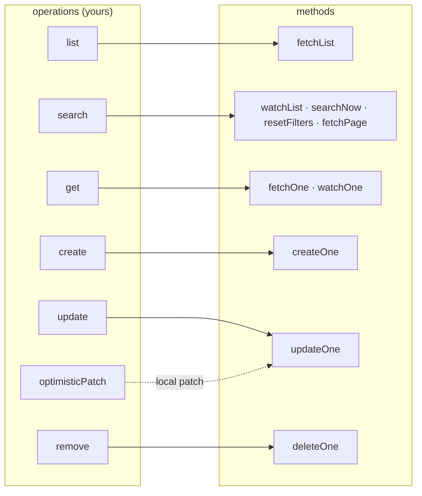
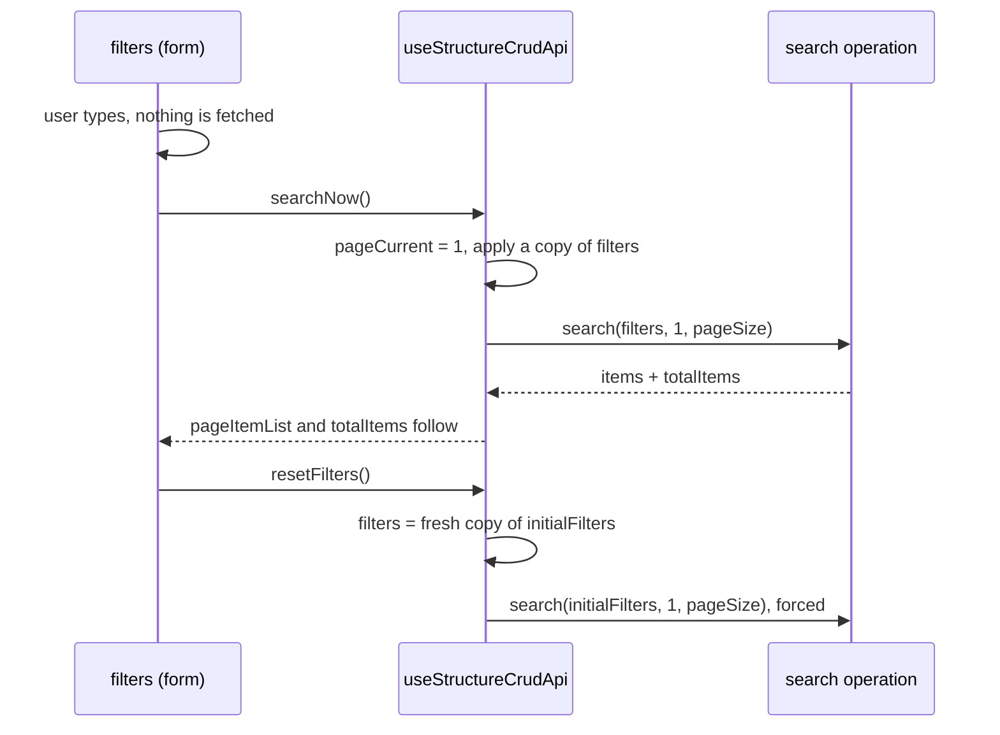

# useStructureCrudApi

A whole resource (list, filtered search, read, create, update, delete) declared from the API calls
that reach it. The highest-level entry point in the toolkit, and the one to start from.

It is [`useStructureSearchApi`](./structure-search-api) with the wiring done. That wiring is the
same for every resource of an app, so writing it per resource means stores that differ only in
which endpoint each one calls.

## Quickstart

```ts
import { defineStore } from 'pinia'
import { useStructureCrudApi } from '@guebbit/vue-toolkit'

interface IProductFilters {
    text?: string
    minPrice?: number
}

export const useProductsStore = defineStore('products', () => {
    const api = useStructureCrudApi<IProduct, string, IProductFilters>(
        {
            list: () => listProducts().then((r) => r.data.items),
            search: (filters, page, pageSize) =>
                listProducts({ ...filters, page, pageSize }).then((r) => ({
                    items: r.data.items,
                    totalItems: r.data.total
                })),
            get: (id) => getProductById(id).then((r) => r.data),
            create: (data) => createProduct(data).then((r) => r.data),
            update: (id, data) => updateProductById(id, data).then((r) => r.data),
            remove: (id) => deleteProductById(id)
        },
        { resourceKey: 'products', initialFilters: { text: '' } }
    )

    return { ...api }
})
```

That store is complete. A list screen reads its state through `storeToRefs` (destructuring the
store directly would lose reactivity) and its methods from the store itself:

```ts
import { storeToRefs } from 'pinia'

const store = useProductsStore()
const { filters, pageItemList, pageCurrent, pageTotal, totalItems } = storeToRefs(store)
const { watchList, searchNow, resetFilters, deleteOne } = store

const { error } = watchList()
```

```vue
<v-text-field v-model="filters.text" @keyup.enter="searchNow()" />
<v-btn @click="searchNow()">Search</v-btn>
<v-btn @click="resetFilters()">Reset</v-btn>

<ProductRow v-for="item in pageItemList" :key="item.id" :item="item" />
<span>{{ totalItems }} products</span>
<v-pagination v-model="pageCurrent" :length="pageTotal" />
```

A detail screen:

```ts
const store = useProductsStore()
const { selectedRecord } = storeToRefs(store)

const { error } = store.watchOne(() => route.params.id as string)
```

`watchList()` and `watchOne()` called in a component's `setup()` stop when that component
unmounts, even though the resource lives in the store.

## Operations

Each operation is a plain function returning a promise: you unwrap your HTTP client's envelope
inside it. That is the whole integration surface; no client, interceptor or response shape is
assumed.



| Operation         | Signature                                                                  | Powers                                                |
| ----------------- | -------------------------------------------------------------------------- | ----------------------------------------------------- |
| `list`            | `(context: IFetchContext) => Promise<(T \| undefined)[]>`                  | `fetchList`                                           |
| `search`          | `(filters: F, page: number, pageSize: number, context: IFetchContext) => Promise<ISearchResult<T>>` | `watchList`, `searchNow`, `resetFilters`, `fetchPage` |
| `get`             | `(id: K, context: IFetchContext) => Promise<T \| undefined>`               | `fetchOne`, `watchOne`                                |
| `create`          | `(data: C, options?: O) => Promise<T \| undefined>`                        | `createOne`                                           |
| `update`          | `(id: K, data: U, options?: O) => Promise<T \| undefined>`                 | `updateOne`                                           |
| `remove`          | `(id: K, options?: O) => Promise<unknown>`                                 | `deleteOne`                                           |
| `optimisticPatch` | `(data: U) => Partial<T>`                                                  | the patch `updateOne` applies locally (default: `data` itself) |

`ISearchResult<T>` is `{ items: (T | undefined)[], totalItems: number }`; the table above is
`IStructureCrudOperations<T, K, F, C, U, O>`, `useStructureCrudApi`'s first argument.

**Every operation is optional**, but the `operations` object is required. A read-only resource
supplies `list` and `get` and nothing else. A method whose operation is missing returns a rejected
promise, `Error('useStructureCrudApi - no "search" operation was supplied')`; on `watchList` and
`watchOne` that failure shows in `error` and `onError`.

`createOne`/`updateOne`/`deleteOne` each take one settings object, its `requestOptions` field
forwarded untouched to the operation as its own last argument — which is how per-call client
config (`onUploadProgress`, a client's own cancellation token) reaches a request:
`createOne(data, { requestOptions: { onUploadProgress } })`. `createOne` also exposes
`createTarget`'s `dummyData` (a placeholder rendered under a temporary id while the request runs)
and `updateOne` exposes `updateTarget`'s `merge`/`applyResponse`; all three take `key`, matched by
`isLoading(key)`. `list`, `search` and `get` take no `options`, but do receive `IFetchContext` — a
`{ signal }` (see [structure-rest-api](./structure-rest-api#reading)) — as their last argument,
which is the read-side equivalent for cancellation: forward `context.signal` to `fetch`/axios so an
abandoned read is genuinely cancelled.

### `optimisticPatch`

`updateOne` applies a patch to the local record before the server answers, and rolls it back if
the request fails. Usually the payload *is* that patch. Override it when the two differ, e.g. a
multipart form whose payload carries a `File` the record should never hold:

```ts
optimisticPatch: ({ imageUpload, ...fields }) => fields
```

## Filters and when a search runs



- `filters` is a `Ref<F>` holding a detached copy of `initialFilters`. A form may edit it in place:
  it never shares objects with `initialFilters`, so `resetFilters()` really returns to them.
- Editing `filters` fetches nothing and changes nothing on screen. What is shown follows the
  [applied search](./structure-search-api#the-applied-search); a page change fetches another page of
  it, without the edits.
- `searchNow()` applies the current filters from page 1: the Search button.
- `resetFilters()` restores `initialFilters` (default `{}`) and searches again from page 1,
  **forced**: a reset asks the server, not the cache that produced the state being reset.
- `watchList()`'s handle has its own `search()`, which applies the filters on the current page
  (see [`watchSearch`](./structure-search-api#watchsearch)).

As-you-type search is the screen's choice:

```ts
watchDebounced(filters, () => searchNow(), { debounce: 300, deep: true })
```

## API

`useStructureCrudApi<T, K, F, C, U, O, P>(operations, settings)`, both required.

Type parameters: `T` the record, `K` its id, `F` the filters, `C` the create payload (default
`Partial<T>`), `U` the update payload (default `Partial<T>`), `O` the per-call options of
`create`/`update`/`remove`, `P` a parent's id.

`settings: IStructureCrudApiOptions<F>` is everything [`useStructureRestApi`](./structure-rest-api#setup-options)
accepts (`resourceKey` required, `identifiers`, `staleTime`, `dependsOn`, `maxRecords`,
`queryClient`, ...) plus:

| Option           | Type | Default | Purpose                                                  |
| ---------------- | ---- | ------- | -------------------------------------------------------- |
| `initialFilters` | `F`  | `{}`    | Starting value of `filters`, and what `resetFilters()` returns to. |

Returns everything `useStructureSearchApi` returns (type `IStructureCrudApi<...>`, an exported,
explicit interface — not inferred), plus:

| Member                                  | Settings                                        | Behaviour                                                                          |
| --------------------------------------- | ----------------------------------------------- | ---------------------------------------------------------------------------------- |
| `filters`                               |                                                 | `Ref<F>`: the live filters. Read when a search is applied, never watched.          |
| `fetchList(settings?)`                  | `IFetchSettings` (all fields)                   | `fetchAll` over `list`. Resolves the records.                                      |
| `fetchPage(page = 1, pageSize = 10, settings?)` | `IFetchSettings` (all fields)           | `fetchPaginate` over `search({}, page, pageSize)`: one unfiltered page. Leaves the applied search alone and discards `totalItems`. |
| `watchList(settings?)`                  | `IWatchSearchSettings<T, F>`                    | `watchSearch` over `search`. Returns `{ stop, refetch, error, search }`; never rejects. |
| `searchNow(settings?)`                  | `IFetchSettings` (all fields)                   | `pageCurrent = 1`, then `fetchSearch` of the current filters. Resolves `{ items, totalItems }`; rejects on failure. |
| `resetFilters(settings?)`               | `IFetchSettings` (all fields)                   | `filters` back to a fresh copy of `initialFilters`, then `searchNow({ forced: true, ...settings })`. |
| `fetchOne(id, settings?)`               | `Pick<IFetchSettings, 'forced' \| 'merge' \| 'staleTime'>` | Selects `id`, then `fetchTarget` over `get`. On failure it rejects, and clears the selection if the selection is still `id`. |
| `watchOne(idSource, settings?)`         | `IWatchTargetSettings<T, K>`: `forced`, `merge`, `staleTime`, callbacks | `watchTarget` over `get`. Returns `{ stop, refetch, error }`.  |
| `createOne(data, settings?)`            | `ICreateOneSettings<T, O>`: `requestOptions`, `dummyData`, `key` | `createTarget` over `create`. Resolves the stored record.        |
| `updateOne(id, data, settings?)`        | `IUpdateOneSettings<O>`: `requestOptions`, `merge`, `applyResponse`, `key` | `updateTarget` over `update`, patching locally with `optimisticPatch(data)`. The operation's answer is stored as the record; an answer that is not a record object (`undefined`, `null`) keeps the patch. |
| `deleteOne(id, settings?)`              | `IDeleteOneSettings<O>`: `requestOptions`, `key` | `deleteTarget` over `remove`: removed locally first, restored on failure.          |

## Gotchas

- **`fetchOne` selects; `fetchTarget` does not.** `fetchOne` sets `selectedIdentifier` up front, so
  a record already cached renders at once. Use `fetchTarget` to load a record without making it
  the current one.
- **`update` resolves the updated record, or nothing.** `updateOne` stores its answer as the
  record; an answer that is not a record object (`undefined`, `null`, an array) keeps the
  optimistic patch instead. If your endpoint answers with
  something else (an acknowledgement), map it inside the operation, or call `updateTarget` with
  `applyResponse: false`.
- **`pageTotal` and `totalItems` come from the `search` operation's `totalItems`**, not a local
  count, and survive a cache hit.
- **A missing operation fails at call time, not at setup.** `{}` is a valid `operations` object.
- **Slug-addressed backends work.** `updateOne(id)`/`deleteOne(id)` pass `id` to the operation
  exactly as given — a slug included — and the cache resolves it to the real record on its own
  (see [`useStructureRestApi`'s alternate-key note](./structure-rest-api#reading)): no separate
  lookup needed first.
- Everything underneath is still there: reach for `fetchByParent`, `fetchTarget`, `searchGet` or
  `resetAll` on the same object when a screen needs something this layer does not wrap.
