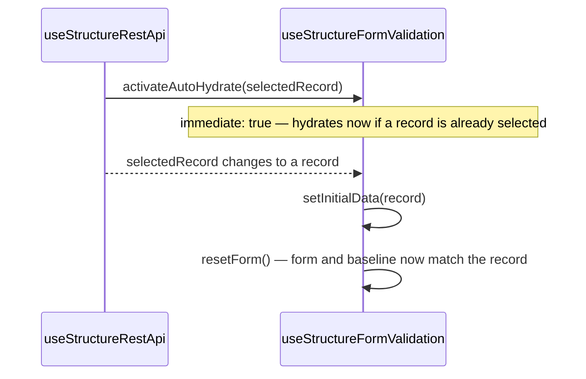
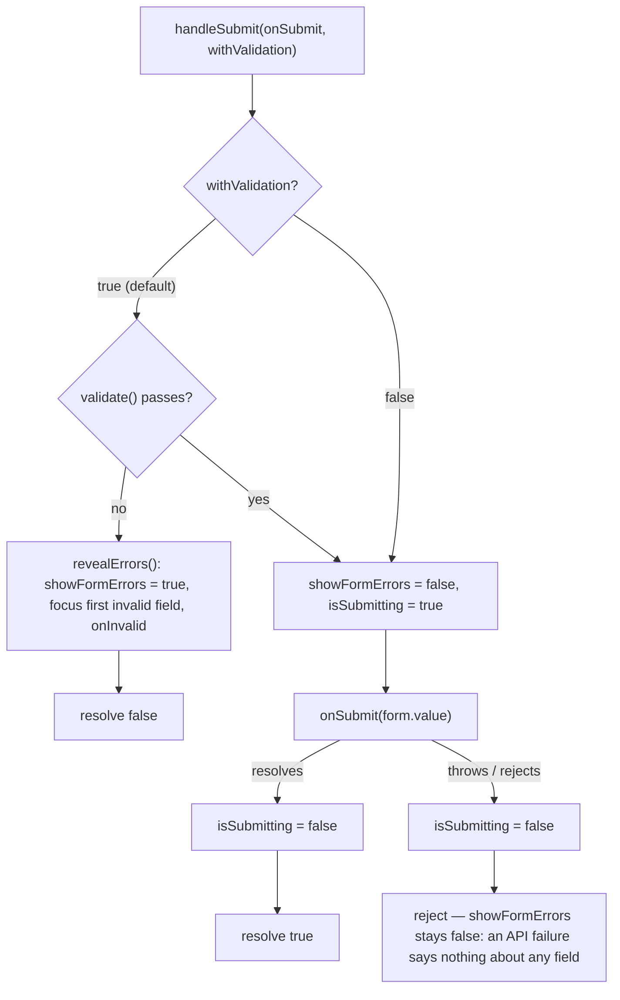

# useStructureFormValidation

Reactive form state with optional [Zod](https://zod.dev) schema validation and a submit-flow
wrapper (validate, then call your handler, tracking `isSubmitting` around it).

## Quickstart

```ts
import { z } from 'zod'
import { useStructureFormValidation } from '@guebbit/vue-toolkit'

interface ILoginForm {
    email: string
    password: string
}

const loginSchema = z.object({
    email: z.string().email('Invalid email address'),
    password: z.string().min(8, 'Password must be at least 8 characters')
})

const login = useStructureFormValidation<ILoginForm>({ email: '', password: '' }, loginSchema)

login.setForm({ email: 'jane@example.com', password: 'hunter22' })

await login.handleSubmit(async (data) => {
    // data is typed as ILoginForm, and already validated against loginSchema
    await api.post('/login', data)
})
```

`handleSubmit` validates first and skips calling your handler if validation fails — check the
return value (`true`/`false`) or read `login.formErrors.value` / `login.isValid.value` to drive
the UI.

## Translated messages, and errors already on screen

Two separate problems, and it is worth being clear about which is which.

**The next validation's language** is a schema concern. `schema` accepts a plain schema, a ref or
a getter, and `toValue` is applied inside `validate()` and nowhere else — so a plain schema whose
messages are *thunks* is resolved exactly as late as a getter would be:

```ts
const loginSchema = z.object({
    email: z.string().email({ error: () => t('login.email-invalid') }),
    password: z.string().min(8, { error: () => t('login.password-too-short') })
})

const login = useStructureFormValidation<ILoginForm>({ email: '', password: '' }, loginSchema)
```

Prefer this over `() => createLoginSchema(t)`. A getter that is accidentally *called* at the call
site — `createLoginSchema(t)` instead of `() => createLoginSchema(t)` — type-checks, runs, and
silently freezes the language; a thunk inside the schema module has no call site to get wrong.

**Errors already on screen** are not a schema concern at all. `validate()` copies resolved
*strings* into `formErrors`; once it has returned, those strings are inert text and the schema is
out of the picture. Switching language re-renders the labels and leaves the error under them in
the old language until the next keystroke or submit. `revalidateOn` fixes that by re-running the
schema over the unchanged data and refreshing only the schema-derived messages:

```ts
const { locale } = useI18n()

const login = useStructureFormValidation<ILoginForm>({ email: '', password: '' }, loginSchema, {
    revalidateOn: locale
})
```

It only fires for a form that currently has errors showing, so a pristine form does not sprout red
text because someone changed the language. `revalidateOn` takes any `WatchSource` or array of
them — it is not i18n-specific, and the toolkit deliberately knows nothing about vue-i18n.

It never touches an error `setFieldError` or `applyServerErrors` put on screen: those came from
the server or the caller, not from `form`, so a re-parse of `form` has nothing to say about
whether they still apply. A field with both a schema error and a server error keeps the server
one — the same "merge, don't replace" rule `applyServerErrors` itself follows (see below). Only an
explicit `validate()` call — a fresh submit attempt, which the server will answer again — clears
them.

## Showing errors, and the moment they appear

`showFormErrors` is the flag your template binds to, so that a form the user has not submitted yet
does not render red text under every empty required field:

```vue
<v-text-field
    v-model="form.email"
    :error-messages="showFormErrors ? formErrors.email : []"
/>
```

`handleSubmit` owns it end to end. A submit that fails validation turns it on; a submit that
passes turns it off; a handler that *throws* leaves it off, because a failed API call is not a
statement about any particular field. There is nothing to set at the call site:

```ts
const submit = () =>
    handleSubmit(async (data) => {
        await api.post('/login', data)
    }).catch(showTheErrorSomehow)
```

Revealing errors is more than flipping a boolean, which is why it is a method and not an
assignment. The fields only acquire their invalid markers once the flag has propagated, so
`revealErrors()` waits for the render before moving focus to the first invalid field — focusing
any earlier finds nothing, and the result is the bug where the message appears but the caret stays
put. Pass the form element to get that behaviour:

```ts
const formElement = ref<HTMLFormElement>()

const login = useStructureFormValidation<ILoginForm>({ email: '', password: '' }, loginSchema, {
    formElement,
    onInvalid: () => addMessage(t('form.fix-errors'))
})
```

Focus lands on `[aria-invalid="true"]` by default — the one invalid-field marker that is both
standard and authored, since a component rendering its own wrapper still has to set it for screen
readers. UI kits that mark the *wrapper* instead need their own selector, because focus has to go
somewhere focusable:

```ts
invalidFieldSelector:
    '.v-input--error input, .v-input--error textarea, .v-input--error select, .v-input--error [tabindex]'
```

Omit `formElement` entirely and `revealErrors` touches no DOM at all — which is what a form
rendered under SSR or in a node test needs. Call it directly whenever you validate by hand:

```ts
if (!validate()) return revealErrors()
```

## Errors the server found

Uniqueness, cross-record rules, "that coupon expired" — a schema cannot check any of it, so the
answer only ever arrives as a rejected request. `applyServerErrors` turns that answer into red
text under the right input instead of a generic toast:

```ts
const submit = () =>
    handleSubmit(async (data) => {
        await api.post('/signup', data)
    }).catch((error) => {
        if (!applyServerErrors(error, { onUnmapped: (messages) => addMessage(messages[0]) }))
            addMessage(t('form.unexpected-error'))
    })
```

It finds the errors wherever your HTTP layer left them — on the value itself, under `.data`, or
under `.response.data` for a raw axios error — in whichever of the three shapes that exist:

```ts
{ errors: { email: 'Already taken', password: ['Too short'] } }   // field map
{ errors: [{ field: 'email', message: 'Already taken' }] }        // list of objects
{ errors: ['Payment declined'] }                                  // form-level, no field
```

`field`, `name`, `param` and `path` are all read as the field name, so express-validator and Zod
issue lists work unchanged; nested paths collapse to their root field, exactly as `validate()`
already does. Use `map` when the API spells a field differently from the form
(`{ map: { user_email: 'email' } }`).

The return value is the part worth wiring up: `false` means the rejection carried nothing this
form could display, so the caller still owes the user a message. Anything with no field of its
own — form-level errors, and fields this form does not have — goes to `onUnmapped` rather than
being silently dropped.

It merges onto what is already showing rather than replacing it. An API that answered about one
field has said nothing about the others, and clearing them would be inventing an all-clear it
never gave.

## The baseline: reset, dirty, and hydration

`initialData` is only the *starting* baseline. `resetForm()` restores `form` to whatever the
current baseline is, and `isDirty` compares `form` against it — so a record fetched after the form
was created can replace what the form opened with, rather than dragging it along forever:

```ts
const edit = useStructureFormValidation<IUser>({ name: '', email: '' })

fetchOne(userId).then((user) => {
    edit.setInitialData(user) // new baseline; the live form is untouched
    edit.resetForm() // apply it: form now shows the fetched record, isDirty back to false
})
```

`activateAutoHydrate` does both steps for you, watching a reactive source and re-hydrating every
time it changes to a defined value. Built for `selectedRecord` from
[`useStructureRestApi`](./structure-rest-api), so an edit form always starts from whatever the
resource has cached — including a record that arrives after the form was created, or a switch to
editing a different one:

```ts
const edit = useStructureFormValidation<IUser>()
edit.activateAutoHydrate(users.selectedRecord) // hydrates now if already cached, and on every change
```



`activateAutoHydrate` returns the underlying `watch` handle, so calling it stops the hydration:

```ts
const stopHydrating = edit.activateAutoHydrate(users.selectedRecord)
stopHydrating() // the form keeps whatever it last hydrated to
```

## The submit flow



## API

`useStructureFormValidation<T>(initialData: T = {}, schema?: MaybeRefOrGetter<IValidationSchema<T>>, options?)`
— `schema` is optional; without one, `validate()` always passes.

`IValidationSchema<T>` is Zod's own `safeParse` contract, described **structurally** rather than
imported from `zod` — `zod` is an optional peer, and importing its types would break
type-checking for an app that has not installed it. Any real Zod schema (`z.object({...})`,
`ZodType<T>`) satisfies it as-is; there is nothing to wrap or convert.

`options`:

| Option                 | Type                                                | Purpose                                                                                 |
| ---------------------- | --------------------------------------------------- | --------------------------------------------------------------------------------------- |
| `revalidateOn`         | `WatchSource \| WatchSource[]`                      | Re-parses the schema over unchanged data when a source changes, but only while errors are on display; merges the result under any `setFieldError`/`applyServerErrors` errors rather than replacing them. See above. |
| `formElement`          | `MaybeRefOrGetter<IFieldContainer \| undefined \| null>` | The form, so `revealErrors` can focus the first invalid field. Omit it and no DOM is touched. |
| `invalidFieldSelector` | `string`                                            | Where to look for that field. Defaults to `DEFAULT_INVALID_FIELD_SELECTOR` (`[aria-invalid="true"]`). |
| `onInvalid`            | `(errors) => void`                                  | Called after a submit was rejected by validation, once the errors are on screen — the "please fix the highlighted fields" toast. |

| Property / method                      | Purpose                                                                                        |
| ------------------------------------------ | ---------------------------------------------------------------------------------------------------- |
| `form`                                   | Ref holding the reactive form data. Initialized as a detached copy of `initialData` (nested fields included), sharing no object with it. |
| `formErrors`                             | Ref — `Partial<Record<keyof T, string[]>>`, per-field error messages.                          |
| `formLevelErrors`                        | Ref — `string[]`, errors that belong to no single field: a root-level Zod issue (an empty `path` — a cross-field `.refine()` with no `path` option, say), or an `applyServerErrors` message naming no field the form has, when no `onUnmapped` catches it. |
| `showFormErrors`                         | Ref — whether errors should be rendered. Owned by `handleSubmit` / `revealErrors` / `applyServerErrors`. |
| `isSubmitting`                           | Ref — `true` while `handleSubmit`'s handler is running.                                         |
| `isValid`                                | Computed — `true` when `formErrors` has no keys **and** `formLevelErrors` is empty.             |
| `isDirty`                                | Computed — `true` when `form` differs from the baseline (compared via `JSON.stringify`). The baseline starts as `initialData`; `setInitialData`/`activateAutoHydrate` can replace it. |
| `setForm(data)`                          | Shallow-merges partial data into `form` (top-level keys only); the result is detached, sharing no nested object with `data`. |
| `resetForm()`                            | Restores `form` to the current baseline and clears `formErrors`. See [The baseline](#the-baseline-reset-dirty-and-hydration). |
| `setInitialData(data)`                   | Replaces the baseline `resetForm()`/`isDirty` use. Leaves the live `form` alone — call `resetForm()` (or use `activateAutoHydrate`) to apply it. |
| `activateAutoHydrate(source)`            | Watches `source` (e.g. `selectedRecord`); on every defined value, `setInitialData` + `resetForm`. Runs immediately if `source` already holds a value. Returns the `watch` handle. |
| `clearErrors()`                          | Clears all `formErrors` and `formLevelErrors`.                                                   |
| `setFieldError(field, errors)`           | Sets error message(s) for one field — accepts a string or a string array.                       |
| `clearFieldError(field)`                 | Removes errors for one field.                                                                    |
| `applyServerErrors(error, options?)`     | Attaches a rejection's errors to the fields they belong to (and unmapped ones to `formLevelErrors`, unless `onUnmapped` is given) and reveals them. Returns `false` when it found nothing to show. See above. |
| `validate()`                             | Runs `schema.safeParse(form.value)`, populates `formErrors` (and `formLevelErrors`, for root-level issues) on failure, returns a boolean. |
| `revealErrors()`                         | Turns `showFormErrors` on, waits for the render, focuses the first invalid field, calls `onInvalid`. |
| `handleSubmit(onSubmit, withValidation?)`| Validates (unless `withValidation` is `false`), then awaits `onSubmit(form.value)` with `isSubmitting` set around it. Owns `showFormErrors` throughout. Returns `true` on success, `false` on validation failure. |

## Types

| Type                             | Shape                                             | What it's for                                       |
| -------------------------------- | ----------------------------------------------------| ----------------------------------------------------- |
| `IApplyServerErrorsOptions<T>`  | `{ map?, onUnmapped? }`                           | The options object `applyServerErrors`'s second argument takes. |
| `IStructureFormValidationOptions<T>` | `{ revalidateOn?, formElement?, invalidFieldSelector?, onInvalid? }` | The options object `useStructureFormValidation`'s third argument takes. |
| `IFieldContainer`               | `{ querySelector(selectors) => unknown }`         | What `formElement` must structurally match — a DOM element satisfies it as-is; declared structurally so this composable never names a DOM type. |
| `IStructureFormValidation<T>`   | An explicit interface (not inferred)               | The whole return value, for a store or component prop that needs to name it. |
| `IValidationSchema<T>`          | `{ safeParse(data: unknown) => ... }`             | What `schema` must structurally match — Zod's own `safeParse` contract. See [API](#api) above. |
| `IValidationIssue`              | `{ path: PropertyKey[], message: string }`        | One entry of `safeParse`'s failure `error.issues` — Zod's own `ZodIssue` shape. |

## Gotchas

- **`handleSubmit` doesn't catch errors from your handler.** Only `isSubmitting` is guaranteed to
  be reset (in a `finally`) — if `onSubmit` throws or rejects, the promise from `handleSubmit`
  rejects too. Chain `.catch(...)` on the call (as in [Errors the server
  found](#errors-the-server-found) above) if you need to handle submit failures — that is the
  seam `applyServerErrors` is meant to sit in.
- **`applyServerErrors` only fills fields the form actually has.** A message naming a field absent
  from `form` cannot be highlighted, so it goes to `onUnmapped` when given, `formLevelErrors`
  otherwise — never dropped. If a message you expected under a field shows up in `formLevelErrors`
  instead, check that the field exists on the object you passed as `initialData` — a key that is
  only ever assigned later is not there yet when the rejection arrives.
- **Zod error grouping is top-level only.** Each issue is filed under `issue.path[0]` — a nested
  field like `address.city` collapses to the `address` key in `formErrors`, not
  `formErrors.address.city`. Fine for flat forms; for nested schemas you'll need to read
  `issue.path` yourself if you want per-nested-field messages. A root-level issue (an empty
  `path` — a cross-field `.refine()` with no `path` option, say) has no field to collapse to at
  all, so it goes to `formLevelErrors` instead.
- **`isDirty` is a `JSON.stringify` comparison** — it won't handle key-order-insensitive equality
  or non-serializable values (functions, `Date` instances, etc.) specially.
