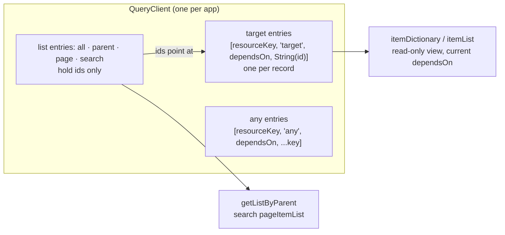
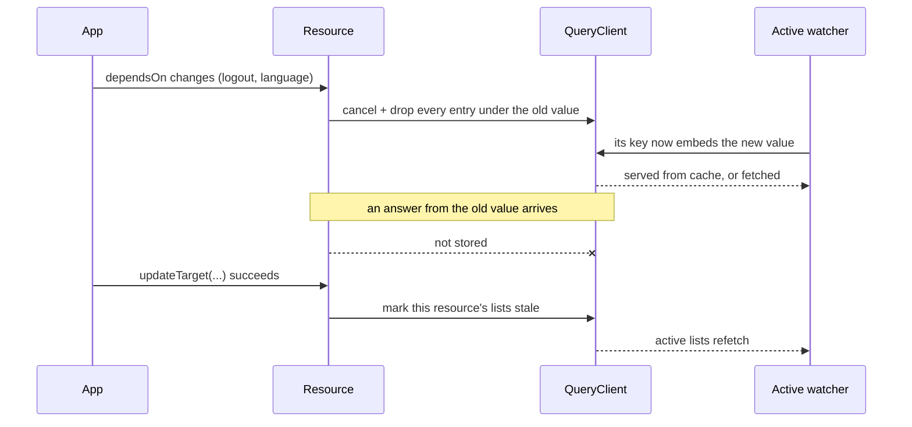

# useStructureRestApi

A REST resource on one [TanStack Query](https://tanstack.com/query) `QueryClient`. Every record,
list, page and search you fetch is a TanStack query; this composable adds normalization (one record,
one cache entry), a reactive read-only view over those entries, optimistic mutations with
rollback, and scoping by whose data it is (`dependsOn`). TanStack owns caching, request
de-duplication, staleness, invalidation and loading.

You pass your own already-parameterized fetch closure (`() => Promise<...>` around `axios`,
`fetch`, a generated client, anything). No HTTP client is assumed.

## Quickstart

App setup (`QueryClient` + `VueQueryPlugin`) is on [Getting Started](/guide/getting-started#app-setup).
Then, inside a component's `setup()` or a Pinia setup store:

```ts
import { useStructureRestApi } from '@guebbit/vue-toolkit'
import axios from 'axios'

interface IUser {
    id: number
    name: string
    email: string
}

// resourceKey is required: the first segment of every query and mutation this resource makes
const users = useStructureRestApi<IUser, number>({ resourceKey: 'users' })

// cached for `staleTime` (default 1 hour), de-duplicated across callers
await users.fetchAll(() => axios.get<IUser[]>('/api/users').then((r) => r.data))

users.itemList.value // IUser[]
users.getRecord(1) // IUser | undefined
users.loading.value // true while anything of this resource is in flight

// optimistic: the record changes now, and goes back if the request fails
await users.updateTarget(
    () => axios.put<IUser>('/api/users/1', { name: 'New name' }).then((r) => r.data),
    { name: 'New name' },
    1
)
```

Opening user 1's detail view afterwards (`fetchTarget(apiCall, 1)`) is a cache hit: `fetchAll`
and `updateTarget` both write the record's own cache entry.

Another store invalidates this resource through the shared client:

```ts
queryClient.invalidateQueries({ queryKey: ['users'] })
```

## One cache

Every entry of a resource lives under a key that starts with `resourceKey`, then says what the
entry holds (its **kind**), then which `dependsOn` value it was fetched under:



| Kind     | Key                                                                   | Holds                   | Filled by                                                        |
| -------- | --------------------------------------------------------------------- | ----------------------- | ---------------------------------------------------------------- |
| `target` | `[resourceKey, 'target', dependsOn, String(id)]`                      | one record              | `fetchTarget`, `watchTarget`, every list fetch, `createTarget`/`updateTarget`, `addRecord`/`editRecord` |
| `all`    | `[resourceKey, 'all', dependsOn, ...key]`                             | ids                     | `fetchAll`, `watchAll`                                           |
| `parent` | `[resourceKey, 'parent', dependsOn, String(parentId), ...key]`        | ids                     | `fetchByParent`, `watchByParent`, `addToParent`/`removeFromParent` |
| `page`   | `[resourceKey, 'page', dependsOn, pageSize, page, ...key]`            | ids                     | `fetchPaginate`                                                  |
| `search` | `[resourceKey, 'search', dependsOn, filters, pageSize, page, ...key]` | ids + `totalItems`      | [`useStructureSearchApi`](./structure-search-api)                |
| `any`    | `[resourceKey, 'any', dependsOn, ...key]`                             | whatever `apiCall` resolves | `fetchAny` with a `key`, `watchAny`                          |

- A list holds ids, never records: a record fetched by a list and by `fetchTarget` is one entry.
- Record and parent ids are keyed as strings: `5` and `'5'` (a route param) address the same
  entry, and relation ids compare as strings too. A raw `queryClient` call that addresses a record
  uses the string id: `queryClient.invalidateQueries({ queryKey: ['users', 'target', [], '1'] })`
  (`[]` is the default `dependsOn`).
- `itemDictionary` is a computed view of the `target` entries under the current `dependsOn`, so
  it follows anything that changes the cache, `queryClient.clear()` from elsewhere included.
- Calls with no stable identity (`fetchAny` without `key`, `fetchTarget` without an id,
  `fetchMultiple`'s batch) still run as queries, under a random `any` key that is dropped once
  they settle, so `isLoading` sees them.
- Two instances with the same `resourceKey` on the same client read and write the same entries
  when their `dependsOn` agrees; with different `dependsOn` values, they read and write disjoint
  entries and coexist rather than one dropping the other's cache. Each keeps its own selection and
  client-side pagination either way: see [dependsOn](#dependson).
- **Build a resource inside an effect scope** — a component's `setup()`, a Pinia setup store, or
  your own `effectScope()`. Its cache subscriptions are torn down through that scope; with none
  active there is nothing to stop them, and they leak for the `QueryClient`'s whole lifetime. A
  `console.warn` naming the `resourceKey` fires once if this happens.

## Setup options

`useStructureRestApi<T, K, P>(options)`, `options: IStructureRestApi`:

| Option        | Default                   | Purpose                                                                                                   |
| ------------- | ------------------------- | --------------------------------------------------------------------------------------------------------- |
| `resourceKey` | **required**              | First segment of every query and mutation key: what `invalidateQueries({ queryKey: [resourceKey] })` and `useIsLoading` address. |
| `identifiers` | `'id'`                    | The record field that identifies a record, or several fields (order matters) joined by `delimiter`.       |
| `delimiter`   | `'\|'`                    | Joins the values of multiple `identifiers` into one id.                                                   |
| `staleTime`   | `3_600_000` (1 hour)      | How long (ms) fetched data counts as fresh. A per-call `staleTime` overrides it.                          |
| `dependsOn`   | `() => []`                | The values this resource's data depends on (`() => [session.userId, locale.value]`). See [dependsOn](#dependson). |
| `maxRecords`  | `10_000`                  | Critical-mass backstop on cached records. `0` disables it. See [maxRecords](#maxrecords).                 |
| `queryClient` | `useQueryClient()`        | The client this resource lives on. The default needs an injection context (component `setup()`, or a Pinia setup store in an app with `VueQueryPlugin`); pass the client explicitly anywhere else. |

`T` is the record type, `K` its id type, `P` a parent's id type (for `fetchByParent` and the
relations).

## Reading

### One-shot reads

| Method                                                | Settings it reads                               | Resolves                                                      |
| ----------------------------------------------------- | ----------------------------------------------- | ------------------------------------------------------------- |
| `fetchAll(apiCall, settings?)`                        | `forced`, `merge`, `partial`, `staleTime`, `key` | the list's items                                             |
| `fetchByParent(apiCall, parentId, settings?)`         | `forced`, `merge`, `partial`, `staleTime`, `key` | the parent's children                                        |
| `fetchPaginate(apiCall, page = 1, pageSize = 10, settings?)` | `forced`, `merge`, `partial`, `staleTime`, `key` | the page's items (a plain server page, no filters)   |
| `fetchTarget(apiCall, id?, settings?)`                | `forced`, `merge`, `staleTime`                  | the stored record                                             |
| `fetchMultiple(apiCall, ids = [], settings?)`         | `forced`, `merge`, `staleTime`                  | the requested ids' records: fetched ones first, then cached   |
| `fetchAny(apiCall, settings?)`                        | `forced`, `staleTime`, `key`                    | whatever `apiCall` resolves                                   |

What they share:

- A cached entry that is still fresh is served without calling `apiCall`. Concurrent calls for
  the same entry join one request.
- A failure rejects. An entry that already held data keeps it (stale data still renders); an entry
  that failed before ever holding data is removed.
- A read the toolkit cancels itself (a `dependsOn` change, or an update or delete of that same
  record) resolves with what is cached instead of rejecting. Neither its answer, if it still
  arrives, nor one that arrives after `dependsOn` moved on, is stored.
- **A read never overwrites a record a newer mutation has touched.** Every write a `fetch*`/
  `watch*` call makes — a list read's items included — is dropped once an `updateTarget`/
  `deleteTarget` on that same id has started since the read began, or is still running. This holds
  even though a mutation only cancels its own record's in-flight read: a `fetchAll` or search page
  in flight when an unrelated record is mutated is never cancelled, and still stores every id it
  carries except the one being mutated.

Per method:

- **`fetchTarget`** with an id reads through that record's entry. Without an id there is nothing to
  look up, so it always asks the server, and stores the answer under the record's own id. An
  `undefined` or `null` answer is no record: nothing is stored, and with an id the entry is cached
  as "nothing" until it goes stale. `itemList` never holds `null`.
  - **Fetching by an alternate key** (`fetchTarget(apiCall, 'my-slug')` resolving `{ id: 7 }`)
    stores the record once, under `7` — its own id — never twice. The `'my-slug'` entry becomes an
    alias: `getRecord('my-slug')`, `selectedRecord` and everything else that reads through
    `getRecord` follow it to `7`'s record, one hop, so it never goes stale as a separate copy.
    `itemDictionary`/`itemList` only ever see the record once, under `7`.
- **`fetchMultiple`** asks the server only when some of `ids` are missing or stale, with one call
  of `apiCall` (it receives no arguments; build it from `checkMultiple(ids).expiredIds` to request
  just those). Resolves one slot per requested id, `[...expired, ...cached]` in that order, with
  `undefined` for an id the server did not return.
- **`fetchAny`** is for answers that are not records. With `key`, a normal cached read under
  `[resourceKey, 'any', dependsOn, ...key]`. Without, it always asks the server and caches nothing.

### Active reads (`watch*`)

Each `watch*` is a TanStack `useQuery` in its own effect scope: it fetches now, and again whenever
its key changes (an id, a parent id, `dependsOn`) or its entry is invalidated. It stops with the
component or store that created it, or with `stop()`.

| Method                                         | Arguments                                                                                   | Returns                                     |
| ---------------------------------------------- | ------------------------------------------------------------------------------------------- | ------------------------------------------- |
| `watchTarget(idSource, apiCall, settings?)`    | `idSource`: Ref or getter of `K \| undefined \| null`. `apiCall: (id) => Promise<T \| undefined>`. `settings: IWatchTargetSettings<T, K>`: `forced`, `merge`, `staleTime`, `onSuccess`, `onError`, `onSettled` | `IWatchHandle<T \| undefined>` |
| `watchAll(apiCall, settings?)`                 | `settings: IFetchSettings`: `forced`, `merge`, `partial`, `staleTime`, `key`                 | `IWatchHandle<(T \| undefined)[]>`          |
| `watchByParent(apiCall, parentId, settings?)`  | `apiCall: (parentId) => Promise<(T \| undefined)[]>`. `parentId`: a value, a Ref or a getter (re-runs when it changes). `settings: IFetchSettings` | `IWatchHandle<(T \| undefined)[]>`          |
| `watchAny(apiCall, settings)`                  | `settings`: `{ key, forced?, staleTime? }`. `key` is **required**: an active query needs a stable identity | `IWatchHandle<F \| undefined>` plus `data: ComputedRef<F \| undefined>` |

Each fetch sends what its own query was built from: `watchTarget`'s `apiCall` receives the id,
and `watchByParent`'s the parent id, of the query that is running, never a live value that has
moved on since.

Every watcher returns the same handle, `IWatchHandle<R>`:

| Field       | Meaning                                                                                                    |
| ----------- | ---------------------------------------------------------------------------------------------------------- |
| `stop()`    | Ends the watcher. Its entry stays cached (see [cache lifetime](#cache-lifetime)).                          |
| `refetch()` | Fetches now. Joins a fetch already running instead of restarting it. Resolves with the watched data as cached after the fetch: a failure leaves the previous data in place (and shows in `error`). **Never rejects.** |
| `error`     | `Readonly<Ref<unknown>>`: the last fetch's failure, `null` after a success.                                |

A watcher never rejects, so a failure shows only in `error`, and in `onError` on the watchers
that take callbacks (`watchTarget`, and `watchSearch` on the search layer). Those three callbacks
are `IWatchCallbacks<R, C>` — `onSuccess(result, context)`, `onError(error, context)`,
`onSettled(result, error, context)` — where `R` is what the watcher resolves and `C` is what it
was watching (an id for `watchTarget`, the filters for `watchSearch`). They run a microtask after
the fetch that triggered them settles, never synchronously inside TanStack's own notification of
it, so a callback that throws surfaces as an ordinary uncaught error and never corrupts the query
it was reporting on.

```ts
const userId = ref<number | null>(null)

const { error, refetch } = users.watchTarget(
    userId,
    (id) => axios.get<IUser>(`/api/users/${id}`).then((r) => r.data),
    { onError: (failure) => console.error(failure) }
)
// users.selectedRecord follows userId
```

`watchTarget` specifics:

- It **selects**: every non-nullish id becomes `selectedIdentifier` right away, so a cached record
  renders at once. A failed fetch clears the selection only when nothing is cached for that id
  either: a failed background refetch of a record already on screen leaves it selected, showing the
  stale data instead of blanking the screen over a transient error.
- A nullish id leaves the selection as it is and fetches nothing; `refetch()` then resolves
  `undefined` without calling `apiCall`.
- `onSuccess(record, id)`, `onError(error, id)`, `onSettled(record, error, id)` fire when a fetch
  of the watched record lands (it succeeds or fails), and once when the id switches to a record
  already cached and fresh with no fetch running (none runs then). That includes the first id.
- A fetch that never lands fires nothing: one cancelled by an update or delete, one still paused
  offline, one for an id the watcher has already left. A switch during a fetch fires once, not
  twice.

`forced: true` on a watcher means every mount and every key switch asks the server.

### Pre-flight checks

"Would this call be served from cache?", answered from the cache alone, without calling any API.
True when the entry is cached and fresh within `staleTime` (the call's, or the resource's). An
invalidated entry counts as stale. There is no `forced` variant: a forced call always fetches.

| Method                                                 | Asks about                                               |
| ------------------------------------------------------ | -------------------------------------------------------- |
| `checkTarget(id, { staleTime? })`                      | `fetchTarget(apiCall, id)`                               |
| `checkAll({ key?, staleTime? })`                       | `fetchAll`                                               |
| `checkByParent(parentId, { key?, staleTime? })`        | `fetchByParent`                                          |
| `checkPaginate(page = 1, pageSize = 10, { key?, staleTime? })` | `fetchPaginate`                                  |
| `checkAny(key?, { staleTime? })`                       | `fetchAny` with that key; always `false` without one     |
| `checkMultiple(ids = [], { staleTime? })`              | `fetchMultiple`: returns `{ cachedIds, expiredIds }`     |

## Writing

| Method                                               | Settings                            | Resolves                                   |
| ---------------------------------------------------- | ----------------------------------- | ------------------------------------------ |
| `createTarget(apiCall, dummyData?, settings?)`       | `key`                               | the stored record                          |
| `updateTarget<F = T>(apiCall, itemData, id?, settings?)` | `merge`, `key`, `applyResponse` | `apiCall`'s result (`apiCall: () => Promise<F>`) |
| `deleteTarget(apiCall, id, settings?)`               | `key`                               | `apiCall`'s result                         |
| `mutateAny(apiCall, settings?)`                      | `key`                               | `apiCall`'s result                         |

Each runs as a TanStack mutation keyed `[resourceKey, 'create' | 'update' | 'delete' | 'any', id?]`,
so `loading`, `isLoading` and `useIsLoading` see it.

- **`createTarget`**: `dummyData`, if given, renders at once under a temporary id and is removed
  when the call settles, whatever it resolved. On success the returned record is stored as freshly
  fetched (an empty answer stores nothing), and this resource's lists are marked stale.
- **`updateTarget`** and **`deleteTarget`** are optimistic, and share one protocol:
  1. Cancel the record's own in-flight read (a `fetchTarget` or `watchTarget` of that id) — its
     answer is never stored, so it cannot undo the edit or bring a deleted record back. Nothing
     else is cancelled: a list read of the scope keeps running (see the write guarantee above).
  2. Snapshot the record, then apply the change locally: `updateTarget` merges `itemData` into it,
     `deleteTarget` removes it. Both skipped if `dependsOn` changed in the meantime. The snapshot is
     taken right here, not when the call started — a same-tick sibling mutation on the same id may
     already have applied its own change by this point, and a later rollback returns to THAT, never
     to a value from before either call ran.
  3. Send the request. Once it settles, only touch the record if it still holds exactly this
     call's own change: a newer mutation on the same id owns it otherwise, so neither a failed
     older update nor a stale older success can undo what that newer one did. On failure the
     record goes back to its snapshot (removed, if it did not exist). Either way — a rollback, or a
     success skipped because a newer mutation now owns the record — the record is invalidated: the
     value left in place is a local guess, not server-confirmed, so an active watcher reconciles it
     on its own instead of trusting the guess as fresh.
  4. Once the request settles, success or failure, mark this resource's lists stale.
- **`updateTarget`** on success stores the response as the record's new, full data (`merge: true`
  merges it in instead). A response that is not a record object (`undefined`, `null`, an array, a
  primitive), or `applyResponse: false`, keeps the optimistic patch as the record. `id` defaults
  to the id inside `itemData`.
- **`mutateAny`**: a command with no record shape. Invalidates nothing; call
  `queryClient.invalidateQueries` yourself when it changes data.
- Marking the lists stale reaches every list kind (`all`, `parent`, `page`, `search`): active list
  watchers refetch now, the others on their next read.
- If `dependsOn` changes while a mutation runs, its result is not stored, its rollback is skipped
  and no list is marked stale: the old scope's data never lands in the new one.

## Loading

| Member            | Type                        | Meaning                                                                          |
| ----------------- | --------------------------- | -------------------------------------------------------------------------------- |
| `loading`         | `ComputedRef<boolean>`      | True while anything of this resource is in flight. Same as `isLoading()`.        |
| `isLoading(key?)` | `(key?: string[]) => boolean` | True while a query or mutation of this resource runs whose `key` **starts with** `key`. A plain function: call it inside a `computed`. |

`isLoading` matches by segment prefix: `isLoading(['dash'])` is true while a call made with
`key: ['dash', 'w1']` runs. With no argument it covers everything of the resource: every query
and mutation on the client whose first key segment is `resourceKey`.

A call's `key` comes from its settings. `fetchTarget`, `fetchMultiple` and `watchTarget` take no
`key` (a record has one cache entry, not a bucket per caller), so `isLoading(key)` never matches
them, by design: only `loading` / `isLoading()` see them.

```ts
const saving = computed(() => users.isLoading(['profile-form']))

users.updateTarget(save, patch, id, { key: ['profile-form'] })
```

For "is any of these resources busy" across the app, see [`useIsLoading`](./is-loading).

## Records and relations

Everything [`useStructureDataManagement`](./structure-data-management) returns is on the resource
too, backed by the cache (its `identifier` under the name `identifierKey`, listed further down):

| Member                                                         | Behaviour here                                                                                   |
| -------------------------------------------------------------- | ------------------------------------------------------------------------------------------------ |
| `itemDictionary`, `itemList`                                   | Read-only view of the records under the current `dependsOn`. Change records through the methods, never in place. |
| `getRecord(...idParts)`, `getRecords(ids)`                     | Read the view.                                                                                   |
| `addRecord(item)`, `addRecords`, `editRecord(data, id?, create?)`, `editRecords` | Local writes: stored, but a record's freshness does not move. A new record starts stale, an invalidated one stays invalidated, so the next `fetchTarget` asks the server. |
| `setRecords(items)`                                            | Replaces every record of the current scope; none counts as fetched. Marks the scope's lists stale without refetching them. |
| `deleteRecord(id)`                                             | Removes one record.                                                                              |
| `resetRecords()`                                               | Removes every record of the current scope, and marks its lists stale: active list watchers refetch (and bring their records back). |
| `selectedIdentifier`, `selectedRecord`                         | Selection. `watchTarget` sets it; `fetchTarget` does not.                                        |
| `lastInsertedIdentifier(s)`, `lastInsertedRecord`              | Last-inserted tracking.                                                                          |
| `pageCurrent`, `pageSize`, `pageTotal`, `pageOffset`, `pageItemList` | Client-side pagination over `itemList`. The search layer redefines `pageItemList`/`pageTotal`. |
| `parentHasMany`                                                | `ComputedRef<Record<P, K[]>>`: each parent's child ids, the union of all its `parent` buckets (see below), keyed by the parent id as a string. |
| `addToParent(parentId, childId)`                               | Adds the child to the parent's keyless entry, unless the parent already lists it.                |
| `removeFromParent(parentId, childId)`, `removeDuplicateChildren(parentId)` | Edit every bucket of that parent.                                                  |
| `getRecordsByParent(parentId?)`, `getListByParent(parentId?)`  | The records of `parentHasMany[parentId]` (by id / as a list, in the relation's order); ids with no cached record are skipped. No `parentId`: none. |

A parent's **buckets** are its keyless `parent` entry plus every `fetchByParent(..., { key })`
entry for it. Its children are the union of their ids, in first-seen order, without duplicates.
The relation editors write those entries directly and mark them stale, so the next
`fetchByParent` asks the server.

Plus the resource's identity and plumbing:

| Member                                  | Meaning                                                                          |
| --------------------------------------- | -------------------------------------------------------------------------------- |
| `resourceKey`, `maxRecords`             | The options, as resolved.                                                        |
| `identifierKey`                         | The identifier field name(s), joined by `delimiter`.                             |
| `createIdentifier(item, identifiers?)`  | The id of a record (fills a missing identifier with a random fallback).          |
| `queryClient`                           | The client, `markRaw`'d so it survives a Pinia setup store's `reactive()` wrapper. |
| `resetAll()`                            | Drops every entry of this resource under the current `dependsOn`, then refetches what active watchers show. |

## Settings reference

`IFetchSettings`, plus `IUpdateTargetSettings` for `updateTarget`. Each method reads only the
fields listed in its table above; its TypeScript signature accepts only those.

| Setting         | Default               | Meaning                                                                                              |
| --------------- | --------------------- | ---------------------------------------------------------------------------------------------------- |
| `forced`        | `false`               | Run with `staleTime: 0`: anything cached counts as stale, so the server is asked. A concurrent call for the same entry joins this request instead of racing it. On a watcher: every mount and key switch asks the server. |
| `merge`         | `false`               | Merge the fetched fields into the stored record instead of replacing it.                             |
| `staleTime`     | the resource's        | Freshness window (ms) for this call.                                                                 |
| `key`           | none                  | Extra segments appended to the cache key of a list, `fetchAny` or `watchAny` call: an independent bucket for the same call shape. Also what `isLoading(key)` matches, on queries and mutations alike. |
| `partial`       | `false`               | The answer holds partial records: merge them (never replace) and keep each record's freshness, so the next full `fetchTarget` still asks the server. List-shaped fetches only. |
| `applyResponse` | `true`                | `updateTarget` only: store the response as the record (a response that is not a record object is never stored). Turn off when the response is not the record (an acknowledgement, say). |

## dependsOn

`dependsOn` is a getter returning whose data this is: `() => [session.userId, locale.value]`.
Every call reads it when it starts and files its entries under that value. It has to read
reactive state (a ref, a store field) for a change to be noticed.



- Under the old value, everything is cancelled and dropped (records included), not merely marked
  stale: one user's data never shows for the next, and a language switch never mixes languages.
- An answer or rollback that arrives after the change is discarded.
- Active watchers switch to the new value on their own.
- When a resource is created, it drops every entry of its `resourceKey` cached under a
  `dependsOn` value **nothing still alive claims**: the scope changed while no instance was around
  to clean up after it. A value another live instance is currently showing is left alone — two
  instances of the same `resourceKey` under different `dependsOn` values (two shops compared side
  by side, a master/detail pair where only the detail's own `dependsOn` moves on) coexist rather
  than one wiping the other's cache out from under it on creation, or on a later `dependsOn`
  switch.

## Cache lifetime

- **Records and parent lists** (`target`, `parent`) are never garbage-collected: they stay cached
  while nothing watches them, because stale data is what renders while fresh data downloads. They
  leave only through `dependsOn` (a change, or the sweep when a resource is created),
  `resetRecords`/`resetAll`, `deleteRecord`/`deleteTarget`, `maxRecords`, or your own
  `queryClient` calls. `getListByParent` therefore keeps working after
  `fetchByParent`, with no watcher.
- **Everything else** (`all`, `page`, `search`, `any`) keeps your client's default `gcTime`:
  TanStack's is 5 minutes in a browser (unlimited on a server), unless your `QueryClient` sets
  another. So a search page or list fetched imperatively (`fetchSearch`, `fetchAll`,
  `fetchPaginate`, keyed `fetchAny`) **disappears 5 minutes after nothing observes it**: a search's
  `pageItemList` and `totalItems` empty out, and the next call asks the server again. A `watch*`
  observes its entry and keeps it alive while it runs. (The records a list fetched stay either
  way, so `itemList` is unaffected.)
- Stopping a scope (unmount, store disposal, `stop()`) ends subscriptions and watchers. It never
  removes cache entries.
- TanStack's own `hydrate()` (what `persistQueryClient` uses to restore a cache persisted on a
  previous visit) reaches the views like any other write: `getRecord`, `itemList` and the rest see
  a restored record right away, with nothing else needing to happen first.
- Removing an entry that an active watcher observes empties it in place instead, so the watcher
  stays attached. `resetAll()` then refetches what active watchers show (views empty, then the
  watched data comes back). `resetRecords()` refetches only active list watchers (it marks the
  lists stale), not a `watchTarget`. `deleteRecord`/`deleteTarget` and the `maxRecords` wipe
  refetch nothing themselves: a watcher fetches again on its next invalidation, window focus or
  key change.

## maxRecords

A critical-mass backstop, not an eviction policy: records are never evicted for being old.

- When a list-shaped fetch (`fetchAll`, `fetchByParent`, `fetchPaginate`, `fetchSearch`, their
  watchers), `fetchMultiple`, or `fetchTarget`/`watchTarget` fetching a record not cached yet is
  about to write, and the records cached under the current `dependsOn` plus the incoming **new**
  ones would exceed `maxRecords`, every other entry of the current scope is dropped first (records,
  lists, searches) — one detail page at a time crosses the bound exactly like a list does.
- Only records not cached yet count: refetching a list, or a record, that is already cached adds
  nothing, so it never triggers the wipe.
- The fetch that crosses the bound keeps its own entry: it resolves its items (or record) and
  caches it. Queries still fetching are spared too: their answers are on the way.
- **A record something is actively watching is never dropped by the wipe** — it still counts
  toward the bound, it is just never the one evicted. Dropping it would empty a detail view with
  nothing telling it to refetch.
- The mutations and `addRecord`/`editRecord` never trigger it: they write one record you already
  hold data for, not a batch of possibly-new ones.
- Harmless for server-paginated screens. An infinite-scroll screen rendering `itemList` sees the
  list collapse to the last batch: set `maxRecords: 0` and prune yourself if that matters.

## Gotchas

- **`watchTarget` selects, `fetchTarget` does not.** A watcher is bound to a screen's id, so what it
  watches *is* the current record. `fetchTarget` only stores: a prefetch or a background refresh
  must not steal the selection. Set `selectedIdentifier` yourself, or use
  [`useStructureCrudApi`](./structure-crud-api)'s `fetchOne`, which selects.
- **Records are read-only.** Write through `editRecord`/`updateTarget`, never by mutating a record
  you read back.
- **`partial: true`** for a list endpoint that omits detail-only fields: it merges, and does not
  make the fuller record look freshly fetched.
- **`fetchMultiple`'s `apiCall` gets no ids.** Use `checkMultiple` to learn which ones it will ask
  for.
- **Two *mutations* on the same record race by arrival order, not by which one you called first.**
  The write guard (see the guarantee above) protects a mutation from a *read*'s stale answer, not
  from another mutation on the same id: `updateTarget`'s success is guarded against a newer
  mutation (a concurrent `deleteTarget` can't be resurrected by a stale `updateTarget` success), but
  a `deleteTarget` that then itself *fails* still rolls back to whatever the record held right
  before it applied its own change — which, raced against another mutation, may be that mutation's
  own optimistic (not yet server-confirmed) value, not a server-confirmed one. The record is
  invalidated either way, so an active watcher reconciles it, but a one-shot caller with nothing
  watching sees that optimistic value until it reads again. Two mutations on the same record from
  two different call sites is not a pattern this library linearizes; a screen editing one record has
  one place doing the editing.
