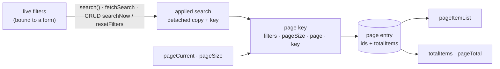
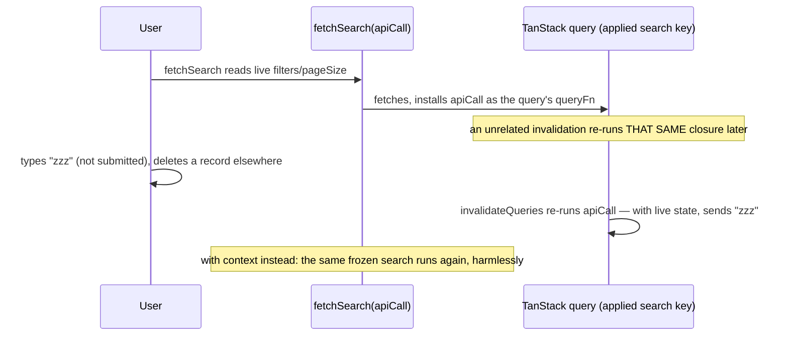

# useStructureSearchApi

Filtered, server-paginated search on top of [`useStructureRestApi`](./structure-rest-api). It **is**
a `useStructureRestApi` (same options, everything it returns passed through) plus:

- a `search` cache kind: one entry per page, holding the page's ids **and** the server's
  `totalItems`;
- an **applied search**, which decides what the screen shows;
- `watchSearch`, an active query that keeps the applied search's current page fetched.

You do not compose the two composables: use this one instead.

## Quickstart

```ts
import { ref } from 'vue'
import { defineStore } from 'pinia'
import { useStructureSearchApi } from '@guebbit/vue-toolkit'

interface IProductFilters {
    text?: string
    minPrice?: number
}

export const useProductsStore = defineStore('products', () => {
    // the live filters: a form edits them in place
    const filters = ref<IProductFilters>({})

    const api = useStructureSearchApi<IProduct, string, string, IProductFilters>(
        () => filters.value,
        { resourceKey: 'products' }
    )

    const { search, error } = api.watchSearch((appliedFilters, page, pageSize) =>
        listProducts({ ...appliedFilters, page, pageSize }).then((r) => ({
            items: r.data.items,
            totalItems: r.data.total
        }))
    )

    return { ...api, filters, search, searchError: error }
})
```

```vue
<script setup lang="ts">
import { storeToRefs } from 'pinia'

const { pageItemList, totalItems, pageCurrent, pageTotal } = storeToRefs(useProductsStore())
</script>

<template>
    <!-- the current page of the applied search -->
    <ProductRow v-for="item in pageItemList" :key="item.id" :item="item" />
    <span>{{ totalItems }} products</span>
    <v-pagination v-model="pageCurrent" :length="pageTotal" />
</template>
```

Changing `pageCurrent` or `pageSize` fetches the new page on its own. Editing `filters` does
nothing until `search()` runs.

Changing `pageSize` resets `pageCurrent` to 1 synchronously, in the same tick — a page number from
the old size rarely means anything under the new one. ⚠ Setting `pageCurrent` to something else
right after, in that same tick, keeps that value instead of being forced back to 1: useful for
restoring `?page=4&size=25` from a URL. Only one request ever goes out for a `pageSize` change: the
reset always lands before any query can see the old page at the new size.

## The applied search



- **Live filters** are whatever `filtersSource` produces. A form may edit them in place.
- **The applied search** is a detached copy of the filters, taken when a search is applied, plus
  the `key` it ran with. Plain objects and arrays are rebuilt and Vue proxies unwrapped, so later
  edits to the live filters never reach it.
- `pageItemList`, `totalItems` and `pageTotal` read the applied search's entry for the current
  `pageCurrent` and `pageSize`. Before anything is applied they are `[]`, `0` and `0`. While a
  page, size OR filters change is in flight and the current combination has not landed yet,
  `pageItemList` keeps showing whatever was shown a moment ago instead of dropping to `[]` — see
  [`isPlaceholder`](#totalitems-pagetotal-and-isplaceholder) below.
- Editing the live filters never changes what is shown and never fetches. A page change does not
  apply them either: it fetches another page of the **applied** search.
- Only these apply the live filters: `search()` on the `watchSearch` handle, `fetchSearch(...)`
  (with the filters it is given), and on [`useStructureCrudApi`](./structure-crud-api)
  `searchNow()` / `resetFilters()`. `watchSearch` with `immediate` (the default) also applies them
  once, at creation, when nothing is applied yet.

Binding a filter form straight to the live filters is therefore safe: typing never blanks or
moves the list. When to apply is the screen's decision: on submit, or as you type:

```ts
// on submit: back to page 1, then apply
const applyFilters = () => {
    pageCurrent.value = 1
    return search()
}

// as you type (watchDebounced from @vueuse/core)
watchDebounced(filters, applyFilters, { debounce: 300, deep: true })
```

## watchSearch

`watchSearch(apiCall, settings?)` returns `IWatchSearchHandle<T>`.

- `apiCall: (filters, page, pageSize, context) => Promise<{ items, totalItems }>` receives the
  **applied** filters, never the live ones: each fetch sends the filters, page and page size its
  own query was built from, even if `pageCurrent` or the applied search has moved on since.
  `context` is the same `{ signal }` read context every `apiCall` gets (see
  [structure-rest-api](./structure-rest-api#reading)).
- The active query follows the applied search, `pageCurrent` and `pageSize`. It re-runs when any
  of them changes, when its entry is invalidated (a mutation of this resource, or
  `invalidateQueries` from anywhere), and when `dependsOn` changes. It stops with the scope that
  created it, or with `stop()`.

`settings: IWatchSearchSettings<T, F>`:

| Setting                                         | Default | Meaning                                                                              |
| ----------------------------------------------- | ------- | ------------------------------------------------------------------------------------ |
| `immediate`                                     | `true`  | Search now with the current filters. `false`: the query stays disabled until `search()`. |
| `forced`, `merge`, `partial`, `staleTime`, `key` |         | As on [`useStructureRestApi`](./structure-rest-api#settings-reference). `key` is part of the search it applies. |
| `queryOptions`                                  |         | TanStack `useQuery` options for this call; overrides the resource's own default. See [TanStack option passthrough](./structure-rest-api#tanstack-option-passthrough). |
| `onSuccess(items, filters)`                     |         | After a successful fetch, or a switch to a page already cached and fresh.            |
| `onError(error, filters)`                       |         | After a failed fetch.                                                                |
| `onSettled(items, error, filters)`              |         | After either.                                                                        |

The callbacks receive the applied filters. They fire when a fetch of the watched page lands (it
succeeds or fails), once when the page or the applied search switches to data already cached and
fresh with no fetch running (none runs then), and once when `search()` finds the page already
shown cached and fresh. A fetch that never lands fires nothing: one cancelled by an update or
delete of this resource, one still paused offline, one for a page the watcher has already left. A
switch during a fetch fires once, not twice.

The handle:

| Field            | Meaning                                                                                              |
| ---------------- | ---------------------------------------------------------------------------------------------------- |
| `search(forced?)` | Applies the live filters and fetches the current page. If that page is cached and fresh (and not `forced`) it settles without a fetch, `onSuccess` included. On a watcher created with `forced`, every search is forced: `search(false)` does not lift it. Resolves `{ items, totalItems }`, or `undefined` on failure. Leaves `pageCurrent` alone. |
| `refetch()`      | Fetches the current page of the applied search now, joining a fetch already running. Resolves `{ items, totalItems }` as cached after the fetch: a failure leaves the previous page in place (and shows in `error`). Before any search is applied (`immediate: false`), resolves the empty result without calling `apiCall`. |
| `suspense()`     | For SSR: resolves once the current page is cached — cached and fresh already, or after the fetch that gets it there. Call it in `onServerPrefetch` (see [`useStructureRestApi`'s SSR section](./structure-rest-api#ssr)). Before any search is applied (`immediate: false`), resolves the empty result without fetching. |
| `error`          | `Readonly<Ref<unknown>>`: the last fetch's failure, `null` after a success.                          |
| `stop()`         | Ends the watcher. Its pages stay cached.                                                             |

Neither `search()`, `refetch()` nor `suspense()` rejects: a failure shows in `error` and
`onError`, and only `search()` resolves `undefined` for it.

## totalItems, pageTotal and isPlaceholder

`apiCall` resolves `{ items, totalItems }`. The total is stored next to the page's ids, so a page
served from cache still has it.

- `totalItems` is the applied search's total for the current page. While a new page loads, it
  shows the applied search's most recent total from any of its cached pages; failing that, the
  last total actually shown on screen (see `isPlaceholder`) — so the pager does not vanish on a
  page, size OR filters change.
- `pageTotal` is `Math.ceil(totalItems / pageSize)`.
- An API that reports no total can resolve `totalItems: 0` (or the item count).
- `isPlaceholder` is `true` exactly while `pageItemList` is showing a placeholder — whatever was
  shown a MOMENT AGO, kept on screen because the current page/size/filters combination has not
  landed yet — and `false` once the real current page is cached, including an empty one. Unlike
  TanStack's own `keepPreviousData`, the fallback is not limited to the applied filters' own pages:
  applying filters that have never been fetched before still keeps the previous search on screen
  instead of dropping to `[]`, exactly like a plain page change does. `false` also on a genuinely
  empty first load: nothing has ever been shown yet to fall back to, so `pageItemList` is `[]` for
  a different reason than a placeholder. The placeholder itself is cleared — never shown across —
  a `dependsOn` change or a `resetAll()`, so one user's or one language's rows never flash onto
  another's screen. Dim the list or hold off an empty-state message while it is `true`:
  ```vue
  <div :class="{ 'opacity-50': isPlaceholder }">
      <ProductRow v-for="item in pageItemList" :key="item.id" :item="item" />
  </div>
  ```

## fetchSearch

`fetchSearch(apiCall, filters = {}, page = 1, pageSize = 10, settings?)`, with
`apiCall: (context: ISearchFetchContext<F>) => Promise<{ items, totalItems }>` and `settings`:
`forced`, `merge`, `partial`, `staleTime`, `key`.

- Makes `filters` (and `settings.key`) the applied search, replacing whatever was applied,
  `watchSearch`'s included: an active `watchSearch` then follows it.
- Resolves `{ items, totalItems }` for the page it was asked for, from cache on a hit.
- Also applies `page` and `pageSize` to `pageCurrent`/`pageSize`, synchronously: `pageItemList`/
  `totalItems` show the very page this call fetched, never a page left over from before it, and no
  frame in between shows the old page at the new size.

`context` is `{ filters, page, pageSize, signal }` — the search this call was asked for, FROZEN at
the moment it started, plus the `{ signal }` every read context has:

```ts
api.fetchSearch(
    (context) =>
        listProducts(
            { ...context.filters, page: context.page, pageSize: context.pageSize },
            { signal: context.signal }
        ).then((r) => ({ items: r.data.items, totalItems: r.data.total })),
    filters.value,
    2,
    20
)
// api.pageCurrent.value === 2, api.pageSize.value === 20, api.pageItemList shows that page
```

Read the search from `context`, not from live `filters`/`pageCurrent`/`pageSize` refs. TanStack
keeps the last `apiCall` a query was given and re-runs THAT closure on an unrelated invalidation
(another mutation on this resource, `invalidateQueries` from elsewhere) — not on a fresh call from
you. A closure reading live state then asks the server with whatever is in the refs at that later
moment, not the search it was originally asked to run, and the answer is still stored under the
OLD key. `context` is immune to this: its fields are a snapshot, so a re-run asks the same
question again. An `apiCall` typed on the plain `{ signal }` read context still compiles — it just
has to ignore the extra fields.



- Nothing observes a page fetched this way: in a browser it is dropped 5 minutes later (see
  [cache lifetime](./structure-rest-api#cache-lifetime)), and `pageItemList`/`totalItems` empty
  out with it. A screen should use `watchSearch`.

## Reading the cache

| Method                                                          | Purpose                                                                                     |
| --------------------------------------------------------------- | ------------------------------------------------------------------------------------------- |
| `searchGet(filters, page = 1, pageSize = 10, { key? })`         | The cached items of one page, without fetching. `filters` is an object; `key` must match the one the page was fetched with. |
| `checkSearch(filters = {}, page = 1, pageSize = 10, { key?, staleTime? })` | Would that `fetchSearch` be served from cache?                                   |
| `isPageCached({ key?, staleTime? })`                            | `checkSearch` for the **live** filters and the current `pageCurrent`/`pageSize`: would applying the edited filters fetch? |
| `isPaginateCached({ key?, staleTime? })`                        | `checkPaginate(pageCurrent, pageSize)`, for `fetchPaginate`.                                |

A search page's key embeds its filters as a canonical string — order-independent, sensitive to
every value and property, the same canonicalization every cache key in the toolkit uses. Pass
`searchGet`/`checkSearch` the filters object itself; there is no need to (and no public way to)
build that string by hand.

## API

`useStructureSearchApi<T, K, P, F>(filtersSource, settings)` returns `IStructureSearchApi<T, K, P,
F>` — an exported, explicit interface (not inferred).

| Parameter       | Type                | Purpose                                                                                |
| --------------- | ------------------- | -------------------------------------------------------------------------------------- |
| `filtersSource` | `WatchSource<F>`    | Ref, computed or getter producing the live filters. Read when a search is applied (and by `isPageCached`), never watched. |
| `settings`      | `IStructureRestApiOptions` | The resource's options, as on [`useStructureRestApi`](./structure-rest-api#setup-options). `resourceKey` is required. |

Returns everything `useStructureRestApi` returns, with these redefined or added:

| Member                                                           | Meaning                                                              |
| ---------------------------------------------------------------- | -------------------------------------------------------------------- |
| `pageItemList`                                                   | `ComputedRef<T[]>`: items of the applied search's current page, or whatever was shown a moment ago while the current one has not landed yet. |
| `isPlaceholder`                                                  | `ComputedRef<boolean>`: `true` exactly while `pageItemList` is showing that fallback. |
| `pageTotal`                                                      | `ComputedRef<number>`: `Math.ceil(totalItems / pageSize)`.           |
| `totalItems`                                                     | `ComputedRef<number>`: the applied search's server-reported total.   |
| `watchSearch`, `fetchSearch`                                     | See above.                                                           |
| `searchGet`, `checkSearch`, `isPageCached`, `isPaginateCached`   | See [Reading the cache](#reading-the-cache).                         |

## Gotchas

- **`pageSize` is part of the cache key.** Page 2 of 10 is not page 2 of 25. Changing `pageSize`
  also sets `pageCurrent` back to 1 (on this composable and `useStructureCrudApi`).
- **Filters are plain data.** They are compared by content (canonical JSON), so keep them to
  objects, arrays, primitives, Dates, Sets and Maps — two searches whose filters hold different
  Sets (a multi-select's `Set<string>`, say) land in different cache entries, not one shared key.
- **`resetAll()`** drops this resource's search pages with everything else; an active
  `watchSearch` then fetches its page again. It also clears `isPlaceholder`'s fallback, exactly
  like a `dependsOn` change does — neither ever leaks a wiped or previous-scope search onto the
  screen as a placeholder.
- **A watcher never rejects.** Read `error` or pass `onError`, or a failed search goes unnoticed.
