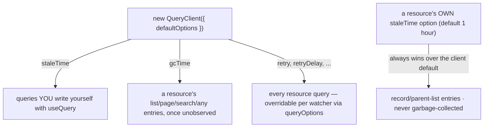

# Getting Started

`@guebbit/vue-toolkit` is a small set of Vue 3 composables and Pinia stores for building CRUD
screens: a normalized record store, a REST layer built directly on
[TanStack Query](https://tanstack.com/query) — one shared cache for records, lists, searches,
freshness and loading, with optimistic mutations and automatic rollback — Zod-backed form
validation, and two small Pinia stores (toasts, named loading flags).

## Install

```bash
npm install @guebbit/vue-toolkit @tanstack/vue-query pinia
```

### Peer dependencies

The package expects these already in your project:

| Package               | Version         |
| ---------------------- | --------------- |
| `vue`                 | `^3.4`          |
| `pinia`               | `^2.1 \|\| ^3 \|\| ^4` |
| `@tanstack/vue-query` | `^5.103`        |
| `zod`                 | `^4.4.3` (optional) |

`zod` is optional: only [`useStructureFormValidation`](/composables/structure-form-validation)
needs it, so install it (`npm install zod`) if you use that composable.

`pinia`'s floor is `2.1`, not `2.0`: building a resource inside a Pinia SETUP store (`defineStore('x', () => useStructureRestApi(...))`) relies on `useQueryClient()` finding the client `VueQueryPlugin` provided through Vue's injection — a setup store's own setup function did not run inside an injection context before `2.1`.

`@tanstack/vue-query` is a peer, not a regular dependency: install it yourself, once, and every
resource in your app shares the one `QueryClient` you create. Do **not** also install
`@tanstack/query-core` directly — `vue-query` depends on an exact version of it internally, and a
second copy at another version in your own `package.json` is a real failure (a client built from
the wrong copy silently never fetches).

### App setup

```ts
import { createApp } from 'vue'
import { createPinia } from 'pinia'
import { QueryClient, VueQueryPlugin } from '@tanstack/vue-query'

const queryClient = new QueryClient({
    defaultOptions: {
        queries: { staleTime: 60 * 60 * 1000, gcTime: 60 * 60 * 1000, retry: false, networkMode: 'always' }
    }
})

const app = createApp(App)
app.use(createPinia())
app.use(VueQueryPlugin, { queryClient })
```

Every `useStructureRestApi`/`useStructureSearchApi`/`useStructureCrudApi` call either takes this
client explicitly via its own `queryClient` option, or finds it through injection
(`useQueryClient()`, which also works inside a Pinia setup store). There is no private,
toolkit-owned client — one shared client per app is what makes cross-resource cache invalidation
possible at all.

What the client's `defaultOptions` reach:

- `staleTime`: only your own `useQuery` calls. A resource always sets its own (its `staleTime`
  option, 1 hour by default).
- `gcTime`: a resource's list, page and `any` entries, once nothing observes them (TanStack's
  default is 5 minutes in a browser). Records, parent lists and search pages never expire — see
  [cache lifetime](/composables/structure-rest-api#cache-lifetime).
- `retry`: every resource query. Unset, a `watch*` query retries a failure 3 times in a browser
  (so it reaches `error`/`onError` only after the retries) while a one-shot `fetch*` call does not
  retry; `retry: false` makes watchers report a failure at once too.



A resource's records and parent lists never read `gcTime` at all — they live for the
`QueryClient`'s lifetime (or until a scope/`dependsOn` change removes them), regardless of what the
client default says. See [cache lifetime](/composables/structure-rest-api#cache-lifetime).

## What to use, and when

- **[`useStructureDataManagement`](/composables/structure-data-management)** — the base: a
  normalized `{ id -> record }` store with CRUD, selection, client-side pagination, and
  `hasMany`/`belongsTo` bookkeeping. Reach for this when you already have the data and just need
  somewhere reactive to put it.
- **[`useStructureRestApi`](/composables/structure-rest-api)** — everything above, backed by a
  TanStack `QueryClient`: fetch methods that cache, deduplicate, react to invalidation, and support
  optimistic mutations with automatic rollback. Reach for this when the data comes from a REST
  API — it's the composable most apps will use directly.
- **[`useStructureSearchApi`](/composables/structure-search-api)** /
  **[`useStructureCrudApi`](/composables/structure-crud-api)** — filtered/paginated search, and a
  whole resource (list/search/read/create/update/delete) declared as the API calls that reach it.
- **[`useIsLoading`](/composables/is-loading)** — "is any of these resources busy?" across the
  whole app, for a layout-level indicator that isn't tied to one resource.
- **[`useStructureFormValidation`](/composables/structure-form-validation)** — reactive form
  state with optional Zod validation and a submit-flow wrapper.
- **[`useAsyncAction`](/composables/async-action)** — one async call wrapped in `data`/`error`/
  `loading` refs, "latest run wins" against an overtaken response. Reach for this for a plain
  read that isn't a whole REST resource.
- **[`useLivenessProbe`](/composables/liveness-probe)** — a `down` flag for something the app
  depends on, fed by a caller-supplied probe: probes on creation, on the browser's `online`
  event, and on a slow retry loop only while down.
- **[`useUploadProgress`](/composables/upload-progress)** — a single `progress` ref fed by your
  HTTP client's own progress callback, client-agnostic.
- **[`useNotificationsStore`](/stores/notifications)** — toast messages, as a Pinia store.
- **[`useCoreStore`](/stores/core)** — a global named-loading-flags store, for your own
  (non-server) loading flags shared across components instead of ad-hoc local refs.

Each reference page documents the full API and the gotchas that matter in practice.
