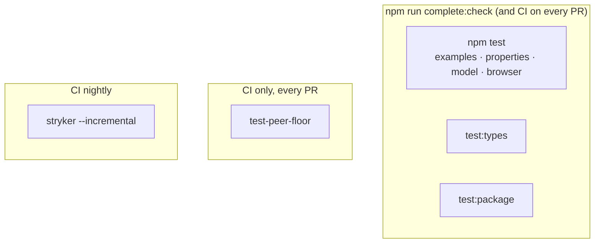

# Testing

This project has several layers of tests, each catching a kind of bug the others can't see:

- **The Jest suite** (`npm test`) — example-based tests. The REST/search/CRUD composables run
  against a small stateful in-memory fake server (`tests/structureRestApi/_helpers/fakeServer.ts`),
  asserting both the local store state _and_ the number of server round-trips at each step; the
  networking-free composables and stores (`useStructureDataManagement`, the Pinia stores,
  `useAsyncAction`, `useLivenessProbe`, `useUploadProgress`) have no server to fake and are
  exercised directly.
- **Property-based tests** (`*.property.spec.ts`, part of `npm test`) — generated inputs and
  generated command sequences, checked against invariants instead of hand-picked examples.
- **Type-level tests** (`npm run test:types`) — the public types themselves, checked with `tsc`.
- **Built-package and peer-floor tests** (`npm run test:package`, and a CI-only job) — does `dist`
  actually load, and does the toolkit work on the oldest version of each peer it declares support
  for?
- **A browser-mode suite** (`tests/browser/`, part of `npm test`) — behaviour TanStack only has in
  a browser (garbage collection, refetch on focus/reconnect), untestable under Jest's default Node
  environment.
- **Mutation testing** (`npm run test:mutation`, and a nightly CI job) — a meta-test that measures
  how good every layer above actually is at catching bugs.



The example-based suite tells you the code works on the cases you thought of. Properties and the
model-based suite tell you it works on cases you didn't think to write down. The type-level suite
tells you the public API's *shape* hasn't quietly changed. The package and peer-floor tests tell
you it works once actually installed, not just inside this repo. The browser suite tells you it
works somewhere Jest's default environment can't check. Mutation testing tells you whether all of
the above would actually *notice* a bug. You want all of them.

## Example-based tests

`npm test` runs everything under `tests/**/*.spec.ts` (Jest + ts-jest). Specs are grouped by
composable, one folder each (`tests/structureRestApi/`, `tests/structureDataManagement/`, ...).
Only REST and search need shared factories and a fake server, so only `tests/structureRestApi/`
and `tests/structureSearchApi/` have a `_helpers/` folder — see `tests/structureRestApi/README.md`
for the layout and conventions it follows; `tests/structureSearchApi/` mirrors it. Every other
suite's fixtures are small enough to live inline in the spec files themselves.

## Property-based tests

Some bugs only show up on an input nobody thought to write down — an empty string, a value that
contains the delimiter you're about to join with, a page size of zero. [`fast-check`][fast-check]
generates hundreds of inputs per run and asserts an **invariant** — a property that must hold for
_every_ input — rather than one hand-picked example per test.

```ts
// A property, not an example: for ANY prefix and rest, hasKeyPrefix must say yes.
fc.assert(
    fc.property(fc.array(fc.jsonValue()), fc.array(fc.jsonValue()), (prefix, rest) => {
        expect(hasKeyPrefix([...prefix, ...rest], prefix)).toBe(true);
    })
);
```

**Where:** `tests/**/*.property.spec.ts` — `npx jest property` runs just this layer.
`tests/internal/plainData.property.spec.ts` and `tests/structureDataManagement/property.spec.ts`
cover the pure logic (id generation, client-side pagination, the plain belongsTo relations, a
sequence of `addRecord`/`editRecord`/`deleteRecord` calls checked against a plain `Map` model).

**Setup:** `tests/_setup/fastCheck.ts`, loaded once via Jest's `setupFiles`, configures every run:

- `FC_NUM_RUNS` (default 50) — how many generated cases each property tries. Crank it locally when
  hunting a rare counterexample: `FC_NUM_RUNS=1000 npx jest property`.
- `FC_SEED` — pins fast-check's random generator to reproduce one exact run.

**Replaying a failure:** a failing property prints its own `seed`, e.g.
`{ seed: -419356043, path: "0:0:0" }`. Rerun with that seed set —
`FC_SEED=-419356043 npx jest property` — to deterministically reproduce the same run, shrink
included, without touching the test file.

### Model-based tests: generated command sequences

The REST engine's hardest bugs are races between promises that settle out of order — a fetch that
lands after a `dependsOn` switch, an update whose response arrives after a delete. Hand-written
specs (`tests/structureRestApi/lifecycle/`) pin down the races someone thought of.
`tests/structureRestApi/model/commandSequence.property.spec.ts` generalises that idea: it generates
random *sequences* of calls (`fetchTarget`, `updateTarget`, `deleteTarget`, a `dependsOn` switch,
…) and settles their server responses in an order fast-check's [`scheduler`][fc-scheduler] picks —
and shrinks, when a sequence fails, to the smallest reordering that still fails. See that file's
header comment for exactly which invariants it checks and the two race conditions it documents as
contract limitations instead of asserting past (`docs/composables/structure-rest-api.md`'s
Gotchas).

## Type-level tests

A composable's *type signature* is part of its public API: a return type quietly widening from
`IUser | undefined` to `IUser | undefined | null`, or a generic default changing, is a breaking
change `npm test` cannot see — the runtime behaviour may be identical. `tests/types/*.test-d.ts`
files, checked with [`expect-type`][expect-type] under `tsc -p tsconfig.types.json` (a plain `tsc`
run, not ts-jest — `isolatedModules` transpilation can pass a type test by skipping the type-check
entirely), cover every export of `src/index.ts`:

```ts
// Inference: getRecord(1) on a resource typed <IUser, number> is IUser | undefined.
expectTypeOf(resource.getRecord(1)).toEqualTypeOf<IUser | undefined>();

// Refusal: resourceKey is required, with no random fallback.
// @ts-expect-error -- resourceKey is required, with no random fallback
useStructureRestApi<IUser, number>({});
```

Run it with `npm run test:types`. It is part of `complete`/`complete:check` and the CI `build` job.

## Built-package and peer-floor tests

Every layer above runs against `src/`, through ts-jest — never against what actually ships. Two
more checks close that gap:

- **`npm run test:package`** — `publint --strict` (do `exports`/`main`/`types` point at files that
  exist and that `files` includes?), `attw --pack . --profile esm-only` (do the types resolve
  under every resolution mode?), and `tests/package/smoke.mjs`: a plain-Node script with no
  bundler and no ts-jest transform, importing the package **by its own name** — Node resolves that
  through `package.json#exports`, the same way any consumer's `import` would, so this is what
  actually catches a broken `dist`. It also doubles as the **public-API guard**:
  `tests/package/exports.json` is the frozen list of runtime exports, and removing one fails this
  script, forcing a deliberate edit to that list plus a **BREAKING** CHANGELOG line.
- **The `test-peer-floor` CI job** (`.github/workflows/ci.yml`) installs the exact floor of each
  declared peer (`vue`, `pinia`, `@tanstack/vue-query`, `zod`) and runs the whole Jest suite against
  it. Nothing else in this repo ever runs against anything but the latest of each — dev tooling
  wants a newer Vue, so this is the only place "does the declared floor actually work?" gets
  answered.

## Browser-mode suite

TanStack decides "server or browser" once, at import time (`typeof window === 'undefined'`).
Jest's default environment is Node, so **every** query there behaves like a server: `gcTime`
defaults to `Infinity` (a browser default of 5 minutes), and `VueQueryPlugin` never calls
`client.mount()` (so nothing ever reacts to a window focus or reconnect event). Three real
contracts are simply untestable under Node:

- `tests/browser/gc.spec.ts` — records and belongsTo lists carry an *explicit* `gcTime: Infinity`
  and survive; lists/searches/`fetchAny` answers fall back to TanStack's own 5-minute default and
  get collected once nothing watches them.
- `tests/browser/focus-online.spec.ts` — an active, stale `watch*` refetches when
  `focusManager`/`onlineManager` report focus or the connection returning; a fresh watcher and a
  one-shot `fetch*` don't.
- `tests/browser/plugin.spec.ts` — a resource built inside a real, mounted component
  (`createApp(...).mount(div)`, no `@vue/test-utils`) finds its client through injection, and
  `app.unmount()` stops its watchers.

Each file opens with a docblock instead of a global config split:

```ts
/**
 * @jest-environment @stryker-mutator/jest-runner/jest-env/jsdom
 */
```

That's Stryker's own coverage-instrumented wrapper around `jest-environment-jsdom`, not the plain
package — mutation testing needs it to collect coverage under jsdom at all (see Mutation testing,
below); it behaves exactly like plain `jsdom` for `npm test`. `jest.config.cjs` and
`stryker.conf.json` stay untouched — only these three files opt into jsdom.

## Mutation testing

### Why example-based tests aren't enough

A passing test suite doesn't mean the tests are good. A test can pass for the wrong reason: it
might only check a value the code happens to produce anyway, mock away the very thing it claims to
verify, or never exercise a branch at all. A suite full of tests like that is **green but blind** —
it goes on passing even after someone breaks the code.

You can't see this by reading the coverage number either. Line coverage says a line _ran_ during
the tests; it says nothing about whether any assertion would _fail_ if that line were wrong. 100%
coverage with zero real assertions is entirely possible.

Mutation testing is how you measure the thing coverage can't: **do the tests actually catch
bugs?**

### What is a mutation?

A **mutation** is a small, deliberate change to the source code — a single edit that _should_ be a
bug. The mutation-testing tool makes thousands of these, one at a time, and re-runs the test suite
against each mutated copy of the code.

Each mutation is a tiny "what if this line were wrong?" experiment. Some real examples from this
codebase (all of these were tried automatically):

```ts
// src/composables/structureDataManagement.ts — original
const identifier = Array.isArray(identifiers) ? identifiers.join(delimiter) : identifiers;

// mutated: the array branch is disabled ("what if we forgot composite keys?")
const identifier = false ? identifiers.join(delimiter) : identifiers;
```

```ts
// src/internal/restResource.ts — original
if (cached.length + incoming <= maxRecords) return; // under the bound: keep everything

// mutated: the boundary moves ("what if exactly maxRecords already triggered the wipe?")
if (cached.length + incoming < maxRecords) return;
```

Typical mutation categories:

| Category                    | Example change                                  |
| ---------------------------- | ------------------------------------------------ |
| **Conditional**              | `if (cond)` → `if (true)` / `if (false)`         |
| **Equality / relational**    | `a === b` → `a !== b`, `>` → `>=`, `<` → `<=`     |
| **Logical operator**         | `a && b` → `a \|\| b`                             |
| **Arithmetic**               | `a + b` → `a - b`                                 |
| **String / object literal**  | `'target'` → `''`, `{ ... }` → `{}`               |
| **Optional chaining**        | `onSuccess?.()` → `onSuccess()`                   |
| **Return / block removal**   | dropping a `return` or emptying a function body   |

Each mutated copy of the code is called a **mutant**.

### Killed, survived, and what the score means

After running the suite against a mutant, there are two outcomes:

- **Killed** ✅ — at least one test _failed_. Good: the tests noticed the bug. That mutant is dead.
- **Survived** ❌ — every test still _passed_ despite the bug. Bad: this is a hole in your tests.
  Something the code does is not actually verified by any assertion.

Two special cases:

- **No coverage** — no test even ran the mutated line, so it couldn't possibly be killed. A
  survivor by omission.
- **Timeout** — the mutation sent the code into an infinite loop; counted as killed (the tests
  would clearly have caught it).

The **mutation score** is simply:

```
mutation score = killed / (total mutants)
```

A survivor is a concrete, actionable to-do: it points at an exact line and an exact change that
your tests don't defend against. You either add a test that kills it, or conclude it's an
_equivalent mutant_ (see below) and leave it.

#### Equivalent mutants

Not every survivor is a real gap. Some mutations produce code that behaves _identically_ to the
original — no test can kill them because there is nothing to catch. Classic examples: flipping
`<` to `<=` on a loop bound that can never hit the boundary, or blanking a `console.warn` message
string that no test asserts on. These are **equivalent mutants**, and a mutation score of 100% is
usually neither achievable nor worth chasing because of them. Aim high, then judge the remaining
survivors case by case.

### What is Stryker?

[**Stryker**](https://stryker-mutator.io/) is the mutation-testing framework this project uses (the
JavaScript/TypeScript implementation, `@stryker-mutator/core`). It's the tool that does everything
described above: it parses the source, generates the mutants, runs the existing Jest suite against
each one, and reports which survived.

To keep this fast, Stryker doesn't re-run the whole suite for every mutant. With
`coverageAnalysis: "perTest"` it first records which tests touch which code, then for each mutant
runs _only_ the tests that could possibly kill it.

### Running it locally

```bash
npm run test:mutation               # full run
npm run test:mutation:incremental   # skip mutants unchanged since the last incremental run
```

Configuration lives in [`stryker.conf.json`](https://stryker-mutator.io/docs/stryker-js/configuration/).
It mutates everything under `src/` (except the barrel `src/index.ts`) and drives the project's
existing `jest.config.cjs`. When it finishes it prints a per-file summary and writes a browsable
HTML report to `reports/mutation/mutation.html` — open that to see each surviving mutant inline
with the source, which is the fastest way to decide "real gap or equivalent mutant?". `reports/` is
gitignored: the score doesn't live in git, only in the report and in this page.

A full run against an early `5.0.0` snapshot scored **84.33%** (1429 killed / 2 timed out / 251
survived, of 1699 covered mutants; 1756 total), against a `thresholds.break` of 81 — from before the
write guard (`writeGuard.ts`, then the weakest-scoring file at 57%) was replaced by
`recordMutations.ts`'s `canWrite`, asked directly of TanStack's own `MutationCache` (see
`internal/resourceMutations`'s module header). Re-run locally (`npm run test:mutation`) for a
current score; `parentRelations.ts` (76% in that same snapshot) is worth a look regardless.

> The full run mutates the whole `src/` tree and takes a few minutes. While iterating, scope it to
> one file with `npx stryker run --mutate "src/composables/structureDataManagement.ts"`.

### Running it in CI

`.github/workflows/mutation.yml` runs `stryker run --incremental` nightly (and on demand via
`workflow_dispatch`) — not on every PR, and not part of the required `ci` gate: a full mutation run
is too slow to block a merge on. `--incremental` keeps `reports/stryker-incremental.json` between
runs (restored from a GitHub Actions cache) so only mutants touched since the last run are
re-tested. `thresholds.break` in `stryker.conf.json` fails the job once the score drops below that
number, with a couple of points of headroom for run-to-run noise. `FC_SEED` is set for the job, so
the property-based layer above stays deterministic under mutation — a mutant must be caught (or not)
the same way on every run, not depending on which random inputs that run happened to draw.

### What a surviving mutant tells you

A surviving mutant is a change to the code that no test notices: it points at behaviour nothing
pins down, which is exactly where a bug can sit unseen. `createIdentifier`, for instance, accepts a
custom identifier as `string | string[]`. A suite that only ever passes the array form lets a
mutant in the single-string branch survive, and would let a real bug there pass just as quietly.
The test that kills the mutant is the test that would catch the bug.

That's the whole point: **a test that can't fail can't protect you.** Mutation testing finds the
tests that can't fail.

[fast-check]: https://fast-check.dev/
[fc-scheduler]: https://fast-check.dev/docs/tutorials/detect-race-conditions/
[expect-type]: https://github.com/mmkal/expect-type
